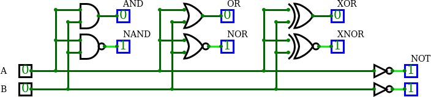

# Lab 1: Git version-control system, Online simulator

#### Table of contents

1. [Lab prerequisites](#Lab-prerequisites)
2. [GitHub](#GitHub)
3. [Linux terminal](#Linux-terminal)
4. [Online simulator](#Online-simulator)
5. [Synchronize git](#Synchronize-git)
6. [Ideas for other tasks](#Ideas-for-other-tasks)


## Lab prerequisites

1. Create an account on [GitHub](https://github.com/) server.


## GitHub

1. In GitHub, create a new public repository titled **Digital-electronics-1**. Initialize a README and [MIT license](https://choosealicense.com/licenses/mit/).

2. Use [How to make the perfect Readme.md on GitHub](https://medium.com/swlh/how-to-make-the-perfect-readme-md-on-github-92ed5771c061), [Basic writing and formatting syntax](https://help.github.com/en/articles/basic-writing-and-formatting-syntax) or [Mastering Markdown](https://guides.github.com/features/mastering-markdown/) articles and add the following parts in your README file.
    * Headers
    * Emphasis
    * List
    * Table


## Linux terminal

1. Try basic commands in the Linux terminal:

| **Command** | **Description** |
| :-: | :-- |
| `Ctrl+Alt+T` | Open Linux terminal in Ubuntu based distributions |
| `Tab` | Automatic completion what you are typing or suggest options to you |
| `Up/Down` | Browse command history |
| `ls` | List directory contents |
| `cd` | Change the current directory (change to parent directory: `cd ..`) |
| `mkdir` | Make directories |
| `pwd` | Print name of current/working directory |
| `clear` | Clear the terminal screen |
| `touch` | Create an empty file (if it does not exist) |
| `cp` | Copy files and directories |
| `mc` | GNU Midnight Commander (file manager) |

2. In the lab, make your own home folder within `Documents`, and with help of `git` command create a local copy of your public repository:

    ```bash
    $ cd
    $ pwd
    /home/lab661

    $ cd Documents/
    $ mkdir your-name
    $ cd your-name/
    $ pwd
    /home/lab661/Documents/your-name

    $ git clone https://github.com/your-github-account/Digital-electronics-1
    $ cd Digital-electronics-1/
    $ ls
    LICENSE  README.md
    ```

3. Download `Docs` folder from [teacher's repository](https://github.com/tomas-fryza/Digital-electronics-1) and copy it to your `Digital-electronics-1` local repository.

    ```bash
    $ ls
    Docs  LICENSE  README.md
    ```

4. Make a new folder `Labs/01-gates` and create an empty file `README.md`.

    ```bash
    $ mkdir Labs
    $ cd Labs/
    $ mkdir 01-gates
    $ cd 01-gates/
    $ touch README.md
    $ ls
    README.md
    ```


## Online simulator

1. Use online digital circuit simulator [CircuitVerse](https://circuitverse.org/), launch the simulator, draw and verify basic two-input logic gates.

2. Run any text editor, such as Visual Studio Code, open `Digital-electronics-1/Labs/01-gates/README.md` file, create/complete tables with logical values, and add a screenshot from the simulator.

    

    | **A** | **NOT** |
    | :-: | :-: |
    | 0 | 1 |
    | 1 | 0 |

    | **A** | **B** | **AND** | **NAND** |
    | :-: | :-: | :-: | :-: |
    | 0 | 0 | 0 | 1 |
    | 0 | 1 |  |  |
    | 1 | 0 |  |  |
    | 1 | 1 |  |  |

    | **A** | **B** | **OR** | **NOR** |
    | :-: | :-: | :-: | :-: |
    | 0 | 0 | 0 | 1 |
    | 0 | 1 |  |  |
    | 1 | 0 |  |  |
    | 1 | 1 |  |  |

    | **A** | **B** | **XOR** | **XNOR** |
    | :-: | :-: | :-: | :-: |
    | 0 | 0 | 0 | 1 |
    | 0 | 1 |  |  |
    | 1 | 0 |  |  |
    | 1 | 1 |  |  |

3. Use online simulator and verify De Morgan's laws.

   

    &nbsp;

    
    
    &nbsp;
    
    
    
    &nbsp;

    | **A** | **B** |**C** |  |  |  |
    | :-: | :-: | :-: | :-: | :-: | :-: |
    | 0 | 0 | 0 |  |  |  |
    | 0 | 0 | 1 |  |  |  |
    | 0 | 1 | 0 |  |  |  |
    | 0 | 1 | 1 |  |  |  |
    | 1 | 0 | 0 |  |  |  |
    | 1 | 0 | 1 |  |  |  |
    | 1 | 1 | 0 |  |  |  |
    | 1 | 1 | 1 |  |  |  |

    > Equations and symbols were generated by [Online LaTeX Equation Editor](https://www.codecogs.com/latex/eqneditor.php) as an Encoded URL link.
    >


## Synchronize git

1. Use `cd ..` command in Linux terminal and change the working directory to `Digital-electronics-1`. Then use [git commands](https://github.com/joshnh/Git-Commands) to add, commit, and push all local changes to your remote repository. Check the repository at GitHub web page for changes.

    ```bash
    $ pwd
    /home/lab661/Documents/your-name/Digital-electronics-1/Labs/01-gates

    $ cd ..
    $ cd ..
    $ pwd
    /home/lab661/Documents/your-name/Digital-electronics-1

    $ git status
    $ git add <your-modified-files>
    $ git status
    $ git commit -m "[LAB] Adding 01-gates lab"
    $ git status
    $ git push
    $ git status
    ```


## Ideas for other tasks

1. Use online digital circuit simulator, draw the logic diagram according to figure, complete the truth table, and determine the circuit function.

    

    | **A** | **B** | **Q3** | **Q2** | **Q1** | **Q0** |
    | :-: | :-: | :-: | :-: | :-: | :-: |
    | 0 | 0 |  |  |
    | 0 | 1 |  |  |
    | 1 | 0 |  |  |
    | 1 | 1 |  |  |

    > Figure was created in online [draw.io](https://www.draw.io/) diagram editor.
    >

2. Try different online simulators, such as [Logicly](https://logic.ly/), [simulatorIO](https://simulator.io/), [LogicEmu](https://lodev.org/logicemu/), or find others, and compare them.
