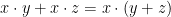
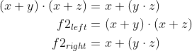

# Lab 1: Introduction to Git and VHDL


<p align="center">
  The Study of Modern and Developing Engineering BUT<br>
  CZ.02.2.69/0.0/0.0/18_056/0013325
</p>


### Learning objectives

After completing this lab you will be able to:
  * Use markdown README files
  * Create git repository
  * Understand basic structure of VHDL files

In this laboratory exercise, you will learn how to use the git versioning system, write the markdown readme file, use the Windows/Linux console terminal to work in the lab, and then how to compose a basic VHDL code using the online development tool.


### Table of contents
* [Preparation tasks](#preparation)
* [Part 1: GitHub](#part1)
* [Part 2: Local repository](#part2)
* [Part 3: EDA Playground](#part3)
* [Experiments on your own](#experiments)
* [Lab assignment](#assignment)


<a name="preparation"></a>
## Preparation tasks (done before the lab at home)

1. If you don't have yet, create your account on [GitHub](https://github.com/).
2. If you don't have Google or Facebook account, register your account on [EDA Playground](https://www.edaplayground.com/login).
3. For future synchronization of local folders with GitHub, download and install [git](https://git-scm.com/).


<a name="part1"></a>
## Part 1: GitHub

GitHub is a code hosting platform for collaboration and version control. GitHub lets you (and others) work together on projects.

In GitHub, create a new public repository titled **Digital-electronics-1**. Initialize a README and [MIT license](https://choosealicense.com/licenses/mit/).

Use one of the available git manuals, such as [1](https://medium.com/swlh/how-to-make-the-perfect-readme-md-on-github-92ed5771c061), [2](https://help.github.com/en/articles/basic-writing-and-formatting-syntax), or [3](https://guides.github.com/features/mastering-markdown/), and add the following sections to your README file.

   * Headers
   * Emphasis (italics, bold)
   * Lists (ordered, unordered)
   * Links
   * Table
   * Listing of VHDL source code (with syntax highlighting)


<a name="part2"></a>
## Part 2: Local repository

Run Git Bash (Windows) of Terminal (Linux) and create your own home folder inside `Documents`.

```bash
## Windows Git Bash:
$ cd d:/Documents/
$ mkdir your-name
$ cd your-name/

## Linux:
$ cd
$ cd Documents/
$ mkdir your-name
$ cd your-name/
```

With help of `git` command, clone a local copy of your public repository.

```bash
## Windows Git Bash or Linux:
$ git clone https://github.com/your-github-account/Digital-electronics-1
$ cd Digital-electronics-1/
$ ls
LICENSE  README.md
```

Download `Docs` folder from [this repository](https://github.com/tomas-fryza/Digital-electronics-1) and copy it to your `Digital-electronics-1` local repository.

```bash
## Windows Git Bash or Linux:
$ ls
Docs  LICENSE  README.md
```

Create a new working folder `Labs/01-gates` for this exercise.

```bash
## Windows Git Bash or Linux:
$ mkdir Labs
$ cd Labs/
$ mkdir 01-gates
```


<a name="part3"></a>
## Part 3: EDA Playground

EDA Playground is a cloud-based service that runs in your browser. Open the [Example of basic gates](https://www.edaplayground.com/x/5L92). Take a look at the basic parts of the VHDL source code, such as [entity](https://github.com/tomas-fryza/Digital-electronics-1/wiki/Entity), [architecture](https://github.com/tomas-fryza/Digital-electronics-1/wiki/Architecture), and testbench. Use button **Run** to run the simulation and log in to your account using **Log In (save edits)**.

Most common VHDL operators are shown in the table.

| **Operator** | **Description** |
| :-: | :-- |
| `<=` | Value assignment |
| `and` | Logical AND |
| `nand` | Logical AND with negated output |
| `or` | Logical OR |
| `nor` | Logical OR with negated output |
| `not` | Nagation |
| `xor` | Exclusive OR |
| `xnor` | Exclusive OR with negated output |
| `-- comment` | Comments |

Use De Morgan's laws and modify the following logic function to the form with NAND and NOR gates only. Verify all three functions in EDA Playground tool.


> Note that, equations were generated by [Online LaTeX Equation Editor](https://www.codecogs.com/latex/eqneditor.php) using the following code.
```LaTeX
\begin{align*}
    f(c,b,a) =&~ \overline{b}\,a + \overline{c}\,\overline{b}\\
    f(c,b,a)_{\textup{NAND}} =&\\
    f(c,b,a)_{\textup{NOR}} =&\\
\end{align*}
```
>

Run any text editor, such as *Visual Studio Code* or *Atom*, open/create your `Digital-electronics-1/Labs/01-gates/README.md` local file (not on GitHub), complete table with logical values, and add link to your Playground.

| **c** | **b** |**a** | **f(c,b,a)** | **f_NAND(c,b,a)** | **f_NOR(c,b,a)** |
| :-: | :-: | :-: | :-: | :-: | :-: |
| 0 | 0 | 0 |  |  |  |
| 0 | 0 | 1 |  |  |  |
| 0 | 1 | 0 |  |  |  |
| 0 | 1 | 1 |  |  |  |
| 1 | 0 | 0 |  |  |  |
| 1 | 0 | 1 |  |  |  |
| 1 | 1 | 0 |  |  |  |
| 1 | 1 | 1 |  |  |  |


## Synchronize git

When you finish working, always synchronize the contents of your working folder with the local and remote versions of your repository. This way you are sure that you will not lose any of your changes.

Use [git commands](https://github.com/tomas-fryza/Digital-electronics-1/wiki/Useful-Git-commands) to add, commit, and push all local changes to your remote repository. Note that, a detailed description of all git commands can be found [here](https://github.com/joshnh/Git-Commands). Check the repository at GitHub web page for changes.

```bash
## Windows Git Bash or Linux:
$ git status
$ git add -A
$ git status
$ git commit -m "[LAB] Creating 01-gates lab"
$ git status
$ git push
$ git status
```


<a name="experiments"></a>
## Experiments on your own

1. In EDA Playground, verify at least one of the Distributive laws:

   First:
   
   

   Second:
   
   

2. You can also try several online graphics simulators, such as [CircuitVerse](https://circuitverse.org/), [Logicly](https://logic.ly/), [CircuitLab](https://www.circuitlab.com/), [simulatorIO](https://simulator.io/), [LogicEmu](https://lodev.org/logicemu/), and compare their options.


<a name="assignment"></a>
## Lab assignment

*Prepare all parts of the assignment in Czech, Slovak or English, insert them in this [template](Assignment.md), export formatted output (not Markdown) [from HTML to PDF](https://github.com/tomas-fryza/Digital-electronics-1/wiki/Export-README-to-PDF), and submit a single PDF file via [BUT e-learning](https://moodle.vutbr.cz/). The deadline for submitting the task is the day before the next laboratory exercise.*

*Vypracujte všechny části úkolu v českém, slovenském, nebo anglickém jazyce, vložte je do této [šablony](Assignment.md), exportujte formátovaný výstup (nikoli výpis v jazyce Markdown) [z HTML do PDF](https://github.com/tomas-fryza/Digital-electronics-1/wiki/Export-README-to-PDF) a odevzdejte jeden PDF soubor prostřednictvím [e-learningu VUT](https://moodle.vutbr.cz/). Termín odevzdání úkolu je den před dalším počítačovým cvičením.*
