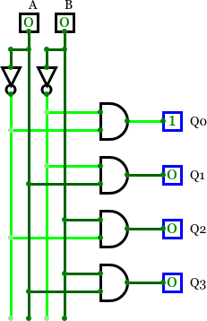

# Lab 1: Introduction to digital circuits

#### Objectives

The purpose of this laboratory exercise is to learn how to use the git versioning system, the Linux console terminal to work in the lab, and to verify basic logic functions using an online simulator.


## 1 Preparation tasks (done before the lab at home)

1. Create an account on [GitHub](https://github.com/) server.


## 2 GitHub

GitHub is a code hosting platform for collaboration and version control. GitHub lets you (and others) work together on projects.

1. In GitHub, create a new public repository titled **Digital-electronics-1**. Initialize a README and [MIT license](https://choosealicense.com/licenses/mit/).

2. Use [How to make the perfect Readme.md on GitHub](https://medium.com/swlh/how-to-make-the-perfect-readme-md-on-github-92ed5771c061), [Basic writing and formatting syntax](https://help.github.com/en/articles/basic-writing-and-formatting-syntax) or [Mastering Markdown](https://guides.github.com/features/mastering-markdown/) articles and add the following parts in your README file.
    * Headers
    * Emphasis
    * List
    * Link
    * Table


## 3 Linux terminal

A Linux console terminal is one of the system consoles provided in the Linux kernel. The Linux console terminal acts as the medium for input and output operations for a Linux system. A Linux console terminal is similar to command line in Microsoft Windows but it differs in that it can perform any operation on the system. (Cited from [Technopedia](https://www.techopedia.com/definition/26897/linux-console-terminal).)

1. Try basic commands in the Linux terminal:

| **Command** | **Description** |
| :-: | :-- |
| `Ctrl+Alt+T` | Open Linux terminal in Ubuntu based distributions |
| `Tab` | Automatic completion what you are typing or suggest options to you |
| `Up/Down` | Browse command history |
| `ls` | List directory contents |
| `cd` | Change the current directory (change to parent directory: `cd ..`) |
| `mkdir` | Make directories |
| `pwd` | Print name of current/working directory |
| `clear` | Clear the terminal screen |
| `touch` | Create an empty file (if it does not exist) |
| `cp` | Copy files and directories |
| `mc` | GNU Midnight Commander (file manager) |

2. In the lab, make your own home folder within `Documents`, and with help of `git` command create a local copy of your public repository:

    ```bash
    $ cd
    $ pwd
    /home/lab661

    $ cd Documents/
    $ mkdir your-name
    $ cd your-name/
    $ pwd
    /home/lab661/Documents/your-name

    $ git clone https://github.com/your-github-account/Digital-electronics-1
    $ cd Digital-electronics-1/
    $ ls
    LICENSE  README.md
    ```

3. Download `Docs` folder from [teacher's repository](https://github.com/tomas-fryza/Digital-electronics-1) and copy it to your `Digital-electronics-1` local repository.

    ```bash
    $ ls
    Docs  LICENSE  README.md
    ```

4. Make a new folder `Images`.

    ```bash
    $ mkdir Images
    $ ls
    Docs  Images  LICENSE  README.md
    ```

5. Make a new folder `Labs/01-gates` and create an empty file `README.md`.

    ```bash
    $ mkdir Labs
    $ cd Labs/
    $ mkdir 01-gates
    $ cd 01-gates/
    $ touch README.md
    $ ls
    README.md
    ```


## 4 Online simulator

1. Use online digital circuit simulator [CircuitVerse](https://circuitverse.org/), launch the simulator, draw and verify basic two-input logic gates.

    

2. Run any text editor, such as Visual Studio Code, open `Digital-electronics-1/Labs/01-gates/README.md` **local** file (not on GitHub), create/complete tables with logical values, and add a screenshot from the simulator.

    | **A** | **NOT** |
    | :-: | :-: |
    | 0 |  |
    | 1 |  |

    | **A** | **B** | **AND** | **NAND** | **OR** | **NOR** | **XOR** | **XNOR** |
    | :-: | :-: | :-: | :-: | :-: | :-: | :-: | :-: |
    | 0 | 0 | 0 | 1 | 0 | 1 | 0 | 1 |
    | 0 | 1 |  |  |  |  |  |  |
    | 1 | 0 |  |  |  |  |  |  |
    | 1 | 1 |  |  |  |  |  |  |

3. Use De Morgan's law and modify logic function to form with (N)AND and (N)OR gates only. Verify all three functions in online simulator.

    

    &nbsp;

    
    
    &nbsp;
    
    
    
    &nbsp;

    | **A** | **B** |**C** |  |  |  |
    | :-: | :-: | :-: | :-: | :-: | :-: |
    | 0 | 0 | 0 |  |  |  |
    | 0 | 0 | 1 |  |  |  |
    | 0 | 1 | 0 |  |  |  |
    | 0 | 1 | 1 |  |  |  |
    | 1 | 0 | 0 |  |  |  |
    | 1 | 0 | 1 |  |  |  |
    | 1 | 1 | 0 |  |  |  |
    | 1 | 1 | 1 |  |  |  |

    > Equations and symbols were generated by [Online LaTeX Equation Editor](https://www.codecogs.com/latex/eqneditor.php) as an Encoded URL link. You can also write LaTeX equation [directly to URL](https://render.githubusercontent.com/render/math?math=f_{AND}).
    >


## 5 Synchronize git

1. Use `cd ..` command in Linux terminal and change the working directory to `Digital-electronics-1`. Then use [git commands](https://github.com/joshnh/Git-Commands) to add, commit, and push all local changes to your remote repository. Check the repository at GitHub web page for changes.

    ```bash
    $ pwd
    /home/lab661/Documents/your-name/Digital-electronics-1/Labs/01-gates

    $ cd ..
    $ cd ..
    $ pwd
    /home/lab661/Documents/your-name/Digital-electronics-1

    $ git status
    $ git add <your-modified-files>
    $ git status
    $ git commit -m "[LAB] Adding 01-gates lab"
    $ git status
    $ git push
    $ git status
    ```


## Experiments on your own

1. Use digital circuit [simulator](https://circuitverse.org/) and verify basic Boolean postulates:

    

    

    

    

    and Distributive laws:

    

    

2. Use online digital circuit [simulator](https://circuitverse.org/), draw the logic diagram according to figure, complete the truth table, and determine the circuit function.

    

    | **A** | **B** | **Q3** | **Q2** | **Q1** | **Q0** |
    | :-: | :-: | :-: | :-: | :-: | :-: |
    | 0 | 0 |  |  |
    | 0 | 1 |  |  |
    | 1 | 0 |  |  |
    | 1 | 1 |  |  |

3. Try different online simulators, such as [Logicly](https://logic.ly/), [CircuitLab](https://www.circuitlab.com/), [simulatorIO](https://simulator.io/), [LogicEmu](https://lodev.org/logicemu/), or find others, and compare them.
