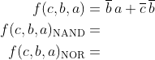
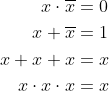
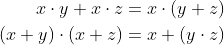

# Lab 1: Introduction to Git and VHDL

#### Objectives

The purpose of this laboratory exercise is to learn how to use the git versioning system, write the markdown readme file, use the Linux console terminal to work in the lab, and how to compose a basic VHDL code using the online development tool.


## 1 Preparation tasks (done before the lab at home)

Create an account on [GitHub](https://github.com/) server. If you don't have Google or Facebook account, register your account on [EDA Playground](https://www.edaplayground.com/login).


## 2 GitHub

GitHub is a code hosting platform for collaboration and version control. GitHub lets you (and others) work together on projects.

**Step 1:** In GitHub, create a new public repository titled **Digital-electronics-1**. Initialize a README and [MIT license](https://choosealicense.com/licenses/mit/).

**Step 2:** Use [How to make the perfect Readme.md on GitHub](https://medium.com/swlh/how-to-make-the-perfect-readme-md-on-github-92ed5771c061), [Basic writing and formatting syntax](https://help.github.com/en/articles/basic-writing-and-formatting-syntax) or [Mastering Markdown](https://guides.github.com/features/mastering-markdown/) articles and add the following parts in your README file.

   * Headers
   * Emphasis
   * List
   * Link
   * Table
   * Listing of VHDL source code


## 3 Linux console terminal

A Linux console terminal is one of the system consoles provided in the Linux kernel. The Linux console terminal acts as the medium for input and output operations for a Linux system. A Linux console terminal is similar to command line in Microsoft Windows but it differs in that it can perform any operation on the system. (Cited from [Technopedia](https://www.techopedia.com/definition/26897/linux-console-terminal).)

**Step 1:** Try basic commands in the Linux console terminal.

| **Command**  | **Description** |
| :-:          | :--             |
| `Ctrl+Alt+T` | Open Linux console terminal in Ubuntu based distributions |
| `Tab`        | Automatic completion what you are typing or suggest options to you |
| `Up/Down`    | Browse command history |
| `ls`         | List directory contents (try this command in reverse order: `sl`) |
| `cd`         | Change the current directory (change to parent directory: `cd ..`) |
| `mkdir`      | Make directories |
| `pwd`        | Print name of current/working directory |
| `clear`      | Clear the terminal screen |
| `touch`      | Create an empty file (if it does not exist) |
| `mc`         | GNU Midnight Commander (file manager) |

**Step 2:** In the lab, make your own home folder within `Documents`, and with help of `git` command clone a local copy of your public repository:

```bash
$ cd
$ pwd
/home/lab661

$ cd Documents/
$ mkdir your-name
$ cd your-name/
$ pwd
/home/lab661/Documents/your-name

$ git clone https://github.com/your-github-account/Digital-electronics-1
$ cd Digital-electronics-1/
$ ls
LICENSE  README.md
```

**Step 3:** Download `Docs` folder from [teacher's repository](https://github.com/tomas-fryza/Digital-electronics-1) and copy it to your `Digital-electronics-1` local repository.

```bash
$ ls
Docs  LICENSE  README.md
```

**Step 4:** Make a new folder `Labs/01-gates` and create an empty `README.md` file.

```bash
$ mkdir Labs
$ cd Labs/
$ mkdir 01-gates
$ cd 01-gates/
$ touch README.md
$ ls
README.md
```


## 4 EDA Playground

**Step 1:** Log in to [EDA Playground](https://www.edaplayground.com/login), then open [Example of basic gates](https://www.edaplayground.com/x/5L92). Take a look at the basic parts of the VHDL source code and testbench. Make a copy of the demo example and run the simulation.

**Step 2:**  Use De Morgan's law and modify logic function to the form with NAND and NOR gates only. Verify all three functions in EDA Playground simulator.



> Note that, equations were generated by [Online LaTeX Equation Editor](https://www.codecogs.com/latex/eqneditor.php) using the following code.
```LaTeX
\begin{align*}
    f(c,b,a) =&~ \overline{b}\,a + \overline{c}\,\overline{b}\\
    f(c,b,a)_{\textup{NAND}} =&\\
    f(c,b,a)_{\textup{NOR}} =&\\
\end{align*}
```
>

Run any text editor, such as Visual Studio Code, open your `Digital-electronics-1/Labs/01-gates/README.md` local file (not on GitHub), create/complete tables with logical values, add link to your Playground and a screenshot from the simulator.

| **c** | **b** |**a** | **f(c,b,a)** |
| :-: | :-: | :-: | :-: |
| 0 | 0 | 0 |  |
| 0 | 0 | 1 |  |
| 0 | 1 | 0 |  |
| 0 | 1 | 1 |  |
| 1 | 0 | 0 |  |
| 1 | 0 | 1 |  |
| 1 | 1 | 0 |  |
| 1 | 1 | 1 |  |


## 5 Synchronize git

Use `cd ..` command in Linux console terminal and change the working directory to `Digital-electronics-1`. Then use [git commands](https://github.com/joshnh/Git-Commands) to add, commit, and push all local changes to your remote repository. Check the repository at GitHub web page for changes.

```bash
$ pwd
/home/lab661/Documents/your-name/Digital-electronics-1/Labs/01-gates

$ cd ..
$ cd ..
$ pwd
/home/lab661/Documents/your-name/Digital-electronics-1

$ git status
$ git add <your-modified-files>
$ git status
$ git commit -m "[LAB] Creating 01-gates lab"
$ git status
$ git push
$ git status
```


## Experiments on your own

1. In VHDL, verify basic Boolean postulates:



and Distributive laws:



2. Try several online graphics simulators, such as [CircuitVerse](https://circuitverse.org/), [Logicly](https://logic.ly/), [CircuitLab](https://www.circuitlab.com/), [simulatorIO](https://simulator.io/), [LogicEmu](https://lodev.org/logicemu/), and compare their options.


## Submission of the assignment

Use BUT e-learning and before the next lab, submit the following tasks in the form of a single PDF file:

* Link to your GitHub repository
* VHDL code and testbench for Boolean postulates
* VHDL code and testbench for Distributive laws
