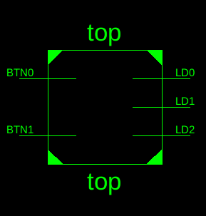

# Lab 2: Introduction to VHDL and Xilinx ISE

#### Objectives

The purpose of this laboratory exercise is to become familiar with the Xilinx ISE development environment, next with basic VHDL syntax, and input/output devices. 


#### Materials

You will use push buttons on the CoolRunner-II CPLD starter board ([XC2C256-TQ144](../../Docs/xc2c256_cpld.pdf), [manual](../../Docs/coolrunner-ii_rm.pdf), [schematic](../../Docs/coolrunner-ii_sch.pdf)) as inputs and light emitting diodes (LEDs) as output devices.


## 1 Preparation tasks (done before the lab at home)

1. *Digital* or *Binary comparator* compares the digital signals A, B presented at input terminal and produce outputs depending upon the condition of those inputs. Complete the truth table for 1-bit *Identity comparator* (A=B), and two *Magnitude comparators* (A>B, A<B). Note, '1' represents true, '0' represents false.

    | **A** | **B** | **A>B** | **A=B** | **A\<B** |
    | :-: | :-: | :-: | :-: | :-: |
    | 0 | 0 | 0 | 1 | 0 |
    | 0 | 1 |  |  |  |
    | 1 | 0 |  |  |  |
    | 1 | 1 |  |  |  |

    According to the truth table, create canonical SoP (Sum of Products) or PoS (Product of Sums) forms as follows:

    &nbsp;

    

    &nbsp;
    
    
    
    &nbsp;
    
    
    
    &nbsp;

    Create K-maps for all three functions.

    &nbsp;

    &nbsp;

    &nbsp;

    &nbsp;

    &nbsp;

    &nbsp;

    Use the K-map to create the simplified PoS form of the function.

    &nbsp;

    
    
    &nbsp;

    > Equations and symbols were generated by [Online LaTeX Equation Editor](https://www.codecogs.com/latex/eqneditor.php) as an Encoded URL link. You can also write LaTeX equation [directly to URL](https://render.githubusercontent.com/render/math?math=f_{AND}).
    >


## 2 Synchronize Git and create a new folder

1. Open a Linux terminal, use `cd` commands to change path to your Digital-electronics-1 working directory, and [synchronize the contents](https://github.com/joshnh/Git-Commands) with GitHub.

    ```bash
    $ pwd
    /home/lab661
    $ cd Documents/your-name/Digital-electronics-1/
    $ pwd
    /home/lab661/Documents/your-name/Digital-electronics-1
    $ git pull
    ```

2. Create a new folder `Labs/02-ise`

    ```bash
    $ cd Labs/
    $ mkdir 02-ise
    $ cd 02-ise/
    $ touch README.md
    $ ls
    README.md
    ```


## 3 Digital circuits in VHDL language

1. Follow instructions from wiki and [create a new project in ISE](https://github.com/tomas-fryza/Digital-electronics-1/wiki/How-to-create-a-new-project-in-ISE). Make sure the project location is `/home/lab661/Documents/your-name/Digital-electronics-1/Labs/02-ise`, ie in **your** local folder.

2. Using VHDL operators, define the architecture for 1-bit digital comparator. Most common VHDL operators are shown in the table.

    | **Operator** | **Description** |
    | :-: | :-- |
    | `<=` | Value assignment |
    | `and` | Logical AND |
    | `nand` | Logical AND with negated output |
    | `or` | Logical OR |
    | `nor` | Logical OR with negated output |
    | `not` | Nagation |
    | `xor` | Exclusive OR |
    | `xnor` | Exclusive OR with negated output |
    | `-- comment` | Comments |

3. Follow instructions from wiki, create a test bench with all input combinations, and [simulate your design](https://github.com/tomas-fryza/Digital-electronics-1/wiki/How-to-Simulate-Your-Design-in-ISE) in ISim simulator.

4. See [schematic](../../Docs/coolrunner-ii_sch.pdf) or [reference manual](../../Docs/coolrunner-ii_rm.pdf) of the board and find out the connection of LD0, LD1, LD2 LEDs and BTN0, BTN1 push buttons. Follow instructions from wiki, create a constraints file, and [implement your design](https://github.com/tomas-fryza/Digital-electronics-1/wiki/How-to-implement-your-design-to-target-device-in-ISE) to CoolRunner-II CPLD starter board. Modify the internal architecture of your design so that a pressed button represents log. 1 and a LED is turn off for log. 0.

5. In menu **Tools > Schematic Viewer > RTL...** select **Start with a schematic of top-level block** and check the hierarchical structure of the module.




6. In menu **Project > Design Summary/Reports** check **CPLD Fitter Report (Text)** for implemented functions in section `********** Mapped Logic **********`.


## 4 Clean project and synchronize git

1. In Xilinx ISE, clean up all generated files in menu **Project > Cleanup Project Files...** and close the project using **File > Close Project**.

    > **Warning:** In any file manager, make sure the project folder does not contain any **large** (gigabyte) files. These can be caused by incorrect simulation in ISim. Delete such files.
    >

2. Use `cd ..` command in Linux terminal and change working directory to `Digital-electronics-1`. Then use [git commands](https://github.com/joshnh/Git-Commands) to add, commit, and push all local changes to your remote repository. Check the repository at GitHub web page for changes.

    ```bash
    $ pwd
    /home/lab661/Documents/your-name/Digital-electronics-1/Labs/02-ise

    $ cd ..
    $ cd ..
    $ pwd
    /home/lab661/Documents/your-name/Digital-electronics-1

    $ git status
    $ git add <your-modified-files>
    $ git status
    $ git commit -m "[LAB] Adding 02-ise lab"
    $ git status
    $ git push
    $ git status
    ```


## Experiments on your own

1. Follow the [Linux](https://github.com/tomas-fryza/Digital-electronics-1/wiki/How-to-Install-ISE-14.7-on-Linux) or [Windows](https://www.xilinx.com/support/download/index.html/content/xilinx/en/downloadNav/vivado-design-tools/archive-ise.html) instructions and install ISE 14.7 on your computer.

2. Create a new project, define, and simulate a 2-to-4 decoder in VHDL (its structure was mentioned in Lab 1).

3. Complete your `README.md` file with screenshot from the simulation(s).
