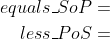
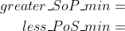

# Lab 2: Combinational logic


### Learning objectives

The purpose of this laboratory exercise is to learn to use different ways of writing combination functions (truth table, K-map, SoP/PoS forms), their minimization, the use of signal assignments in VHDL, and assertion statements in VHDL testbench.


## Preparation tasks (done before the lab at home)

*Digital* or *Binary comparator* compares the digital signals A, B presented at input terminal and produce outputs depending upon the condition of those inputs. Complete the truth table for 2-bit *Identity comparator* (B equals A), and two *Magnitude comparators* (B is greater than A, B is less than A). Note that, such a digital device has four inputs and three outputs/functions.

| **Dec. equivalent** | **B[1:0]** | **A[1:0]** | **B is greater than A** | **B equals A** | **B is less than A** |
| :-: | :-: | :-: | :-: | :-: | :-: |
| 0 | 0 0 | 0 0 | 0 | 1 | 0 |
| 1 | 0 0 | 0 1 | 0 | 0 | 1 |
| 2 | 0 0 | 1 0 | 0 | 0 | 1 |
| 3 | 0 0 | 1 1 | 0 | 0 | 1 |
| 4 | 0 1 | 0 0 |  |  |  |
| 5 | 0 1 | 0 1 |  |  |  |
| 6 |  |  |  |  |  |
| 7 |  |  |  |  |  |
| 8 |  |  |  |  |  |
| 9 |  |  |  |  |  |
| 10 |  |  |  |  |  |
| 11 |  |  |  |  |  |
| 12 |  |  |  |  |  |
| 13 |  |  |  |  |  |
| 14 | 1 1 | 1 0 |  |  |  |
| 15 | 1 1 | 1 1 |  |  |  |

According to the truth table, write canonical SoP (Sum of Products) and PoS (Product of Sums) forms for "equals" and "less than" functions:




## Part 1: Synchronize Git and create a new folder

When you start working, always synchronize the contents of your working folder and local repository with remote version at GitHub. This way you are sure that you will not lose any of your changes.

Run Git Bash (Windows) of Terminal (Linux), navigate to your working directory, and update local repository.

```bash
## Windows Git Bash:
$ cd d:/Documents/
$ cd your-name/
$ ls
Digital-electronics-1/
$ cd Digital-electronics-1/
$ git pull

## Linux:
$ cd
$ cd Documents/
$ cd your-name/
$ ls
Digital-electronics-1/
$ cd Digital-electronics-1/
$ git pull
```

Create a new working folder `Labs/02-logic` for this exercise.

```bash
## Windows Git Bash or Linux:
$ cd Labs/
$ mkdir 02-logic
```


## Part 2: Logic function minimization

*[Karnaugh Maps](https://learnabout-electronics.org/Digital/dig24.php) (or K-maps) offer a graphical method of reducing a digital circuit to its minimum number of gates. The map is a simple table containing 1s and 0s that can express a truth table or complex Boolean expression describing the operation of a digital circuit.*

The K-map for the "equals" function is as follows:


Create K-maps for other two functions.

 &nbsp;  &nbsp;  &nbsp;  &nbsp; 


Use K-maps to create a simplified SoP form of the "greater than" function and a simplified PoS form of the "less than" function.



 
 ## Part 3: Binary comparator in VHDL language

Log in to your [EDA Playground](https://www.edaplayground.com/login) account, open [template](https://www.edaplayground.com/x/5uu3) project, use copy button, and save the project under a different name.

In VHDL, define an [entity](https://github.com/tomas-fryza/Digital-electronics-1/wiki/Entity) for a 2-bit binary comparator (`comparator_2bit`) according to the following table.

| **Port name** | **Direction** | **Type** | **Description** |
| :-: | :-: | :-- | :-- |
| `a_i`       | input  | [`std_logic_vector(2 - 1 downto 0)`](https://github.com/tomas-fryza/Digital-electronics-1/wiki/Data-types) | Data A |
| `b_i`       | input  | `std_logic_vector(2 - 1 downto 0)` | Data B |
| `B_greater_A_o` | output | `std_logic` | B is greater than A |
| `B_equals_A_o`  | output | `std_logic` | B equals A |
| `B_less_A_o`    | output | `std_logic` | B is less than A |

In VHDL, define an [architecture](https://github.com/tomas-fryza/Digital-electronics-1/wiki/Architecture) for a 2-bit binary comparator. The combination logic can be written using low-level operators (`and`, `or`, etc.) as in the previous laboratory exercise. However, it is more efficient to use a higher notation with [signal assignments](https://github.com/tomas-fryza/Digital-electronics-1/wiki/Signal-assignments). Use the **conditional signal assignment** `when`,` else` (outside process) to describe the three output functions, such as:

```vhdl
B_less_A_o   <= '1' when (b_i < a_i) else '0';
```


## Part 4: Assertion statements in VHDL testbench

You can write any information to the console using the report statement. The basic syntax in VHDL is:

```vhdl
report <message_string> [severity <severity_level>];
```

where possible values for `severity_level` are: `note`, `warning`, `error`, `failure`. If the severity level is omitted, then the default value is `note`. The following two statements are therefore equivalent:

```vhdl
report "Stimulus process started" severity note;
report "Stimulus process started";
```

An assertion statement checks that a specified condition is true and reports an error if it is not. It is combined with a report statement as follows:

```vhdl
assert (<condition>)
report <message_string> [severity <severity_level>];
```

The message is displayed to the console when the condition is NOT met, therefore the message should be an opposite to the condition.

```vhdl
    --------------------------------------------------------------------
    -- Data generation process
    --------------------------------------------------------------------
    p_stimulus : process
    begin
        -- Report a note at the beginning of stimulus process
        report "Stimulus process started" severity note;


        -- First test values
        s_b <= "00"; s_a <= "00"; wait for 100 ns;
        -- Expected output
        assert ((s_B_greater_A = '0') and (s_B_equals_A = '1') and (s_B_less_A = '0'))
        -- If false, then report an error
        report "Test failed for input combination: 00, 00" severity error;
        
        
        -- WRITE OTHER TESTS HERE


        -- Report a note at the end of stimulus process
        report "Stimulus process finished" severity note;
        wait;
    end process p_stimulus;
```

In VHDL, write a testbench and verify the correct functionality of the comparator for all input combinations. Update your local (not GitHub) `Labs/02-logic/README.md` file with a link to your public EDA playground.


## Synchronize git

Use [git commands](https://github.com/tomas-fryza/Digital-electronics-1/wiki/Git-useful-commands) to add, commit, and push all local changes to your remote repository. Check the repository at GitHub web page for changes.


## Experiments on your own

1. In EDA Playground, define entity and architecture for a 4-bit binary comparator (`comparator_4bit`).

   | **Port name** | **Direction** | **Type** | **Description** |
   | :-: | :-: | :-- | :-- |
   | `a_i`       | input  | `std_logic_vector(4 - 1 downto 0)` | Data A |
   | `b_i`       | input  | `std_logic_vector(4 - 1 downto 0)` | Data B |
   | `B_greater_A_o` | output | `std_logic` | B is greater than A |
   | `B_equals_A_o`  | output | `std_logic` | B equals A |
   | `B_less_A_o`    | output | `std_logic` | B is less than A |

2. In VHDL, define a testbench for a 4-bit binary comparator. Verify at least ten random input combinations. Make one intentional mistake when automatically verifying expected values using the `assert` command.


## Lab assignment

1. Preparation tasks (done before the lab at home). Submit:
    * Completed 2-bit comparator truth table.

2. A 2-bit comparator. Submit:
    * Karnaugh maps for all three functions,
    * Equations of simplified SoP form of the "greater than" function and simplified PoS form of the "less than" function.
    * Link to your public EDA Playground example in the form `https://www.edaplayground.com/...`

3. A 4-bit binary comparator. Submit:
    * Listing of VHDL architecture from design file (`design.vhd`) with syntax highlighting,
    * Listing of VHDL stimulus process from testbench file (`testbench.vhd`) with syntax highlighting,
    * Listing of simulator console output, i.e. with one reported error,
    * Link to your public EDA Playground example in the form `https://www.edaplayground.com/...`

*Prepare all tasks in your README file `Digital-electronics-1/Labs/02-logic/README.md`, [export/print it to PDF](https://github.com/tomas-fryza/Digital-electronics-1/wiki/Export-MD-to-PDF), use [BUT e-learning](https://moodle.vutbr.cz/) web page and submit a single PDF file. The deadline for submitting the task is the day before the next laboratory exercise.*
