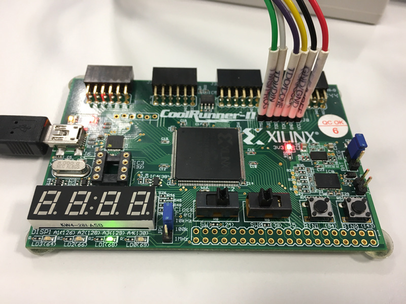
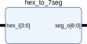
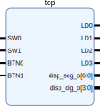

# Lab 3: Hex to seven-segment decoder

#### Contents

1. [Prerequisites](#Prerequisites)
2. [Used hardware components](#Used-hardware-components)
3. [Synchronize Git and create a new folder](#Synchronize-Git-and-create-a-new-folder)
4. [Hex to seven-segment VHDL code](#Hex-to-seven-segment-VHDL-code)
5. [Top level VHDL code](#Top-level-VHDL-code)
5. [Clean project and synchronize git](#Clean-project-and-synchronize-git)
6. [Ideas for other tasks](#Ideas-for-other-tasks)


## Prerequisites

1. See [schematic](../../Docs/coolrunner-ii_sch.pdf) or [reference manual](../../Docs/coolrunner-ii_rm.pdf) of the board and find out the connection of 7-segment display. How can you change the position of the character on the display?

2. Complete the decoder conversion table for common anode display. Sketch the symbols to be displayed.

    | **Hex** | **Input** | **a** | **b** | **c** | **d** | **e** | **f** | **g** |
    | :-: | :-: | :-: | :-: | :-: | :-: | :-: | :-: | :-: |
    | 0 | 0000 | 0 | 0 | 0 | 0 | 0 | 0 | 1 |
    | 1 | 0001 | 1 | 0 | 0 | 1 | 1 | 1 | 1 |
    | 2 |      |   |   |   |   |   |   |   |
    | 3 |      |   |   |   |   |   |   |   |
    | 4 |      |   |   |   |   |   |   |   |
    | 5 |      |   |   |   |   |   |   |   |
    | 6 |      |   |   |   |   |   |   |   |
    | 7 |      |   |   |   |   |   |   |   |
    | 8 |      |   |   |   |   |   |   |   |
    | 9 |      |   |   |   |   |   |   |   |
    | A |      |   |   |   |   |   |   |   |
    | b |      |   |   |   |   |   |   |   |
    | C |      |   |   |   |   |   |   |   |
    | d |      |   |   |   |   |   |   |   |
    | E | 1110 | 0 | 1 | 1 | 0 | 0 | 0 | 0 |
    | F | 1111 | 0 | 1 | 1 | 1 | 0 | 0 | 0 |


## Used hardware components

1. CoolRunner-II CPLD starter board ([XC2C256-TQ144](../../Docs/xc2c256_cpld.pdf)): [Manual](../../Docs/coolrunner-ii_rm.pdf), [Schematic](../../Docs/coolrunner-ii_sch.pdf).




## Synchronize Git and create a new folder

1. Open a Linux terminal, use `cd` commands to change path to your Digital-electronics-1 working directory, and [synchronize the contents](https://github.com/joshnh/Git-Commands) with GitHub.

    ```bash
    $ pwd
    /home/lab661
    $ cd Documents/your-name/Digital-electronics-1/
    $ pwd
    /home/lab661/Documents/your-name/Digital-electronics-1
    $ git pull
    ```

2. Create a new folder `Labs/03-segment`

    ```bash
    $ cd Labs/
    $ mkdir 03-segment
    $ cd 03-segment/
    $ touch README.md
    $ ls
    README.md
    ```


## Hex to seven-segment VHDL code

1. Follow instructions from wiki, [create a new project in ISE](https://github.com/tomas-fryza/Digital-electronics-1/wiki) titled `hex_to_segment` for XC2C256-TQ144 CPLD device.

2. Create a new source file **Project > New Source... > VHDL Module**, name it `hex_to_7seg` and copy + paste the following code template.



```vhdl
------------------------------------------------------------------------
--
-- Hex to seven-segment decoder.
-- Xilinx XC2C256-TQ144 CPLD, ISE Design Suite 14.7
--
-- Copyright (c) 2019-2020 Tomas Fryza
-- Dept. of Radio Electronics, Brno University of Technology, Czechia
-- This work is licensed under the terms of the MIT license.
--
------------------------------------------------------------------------

library ieee;
use ieee.std_logic_1164.all;

------------------------------------------------------------------------
-- Entity declaration for hex to seven-segment decoder
------------------------------------------------------------------------
entity hex_to_7seg is
    port (hex_i: in  std_logic_vector(4-1 downto 0);
          seg_o: out std_logic_vector(7-1 downto 0));
end entity hex_to_7seg;

------------------------------------------------------------------------
-- Architecture declaration for hex to seven-segment decoder
------------------------------------------------------------------------
architecture Behavioral of hex_to_7seg is
begin

    --------------------------------------------------------------------
    --         a
    --       -----          a: seg_o(6)
    --    f |     | b       b: seg_o(5)
    --      |  g  |         c: seg_o(4)
    --       -----          d: seg_o(3)
    --    e |     | c       e: seg_o(2)
    --      |     |         f: seg_o(1)
    --       -----          g: seg_o(0)
    --         d
    --------------------------------------------------------------------
    seg_o <= "0000001" when (hex_i = "0000") else   -- 0
             "1001111" when (hex_i = "0001") else   -- 1

             -- WRITE YOUR CODE HERE

             "0110000" when (hex_i = "1110") else   -- E
             "0111000";                             -- F

end architecture Behavioral;
```

3. Complete the decoding table for all input combinations and define the output signals to display hexadecimal symbols (0, 1, ..., 9, A, b, C, d, E, F). Use VHDL construction `when`-`else`. Save all files in menu **File > Save All**.


## Top level VHDL code

1. Create a new source file **Project > New Source... > VHDL Module**, name it `top` and copy + paste the following code template.



```vhdl
------------------------------------------------------------------------
--
-- Implementation of hex to seven-segment decoder.
-- Xilinx XC2C256-TQ144 CPLD, ISE Design Suite 14.7
--
-- Copyright (c) 2018-2020 Tomas Fryza
-- Dept. of Radio Electronics, Brno University of Technology, Czechia
-- This work is licensed under the terms of the MIT license.
--
------------------------------------------------------------------------

library ieee;
use ieee.std_logic_1164.all;

------------------------------------------------------------------------
-- Entity declaration for top level
------------------------------------------------------------------------
entity top is
    port (SW0, SW1:           in  std_logic;
          BTN0, BTN1:         in  std_logic;
          LD0, LD1, LD2, LD3: out std_logic;
          disp_seg_o:         out std_logic_vector(7-1 downto 0);
          disp_dig_o:         out std_logic_vector(4-1 downto 0));
end entity top;

------------------------------------------------------------------------
-- Architecture declaration for top level
------------------------------------------------------------------------
architecture Behavioral of top is
    signal s_hex: std_logic_vector(4-1 downto 0);   -- Internal signals
begin

    -- Combine inputs [SW1, SW0, BTN1, BTN0] into internal vector
    s_hex(3) <= SW1;
    s_hex(2) <= SW0;
    s_hex(1) <= not BTN1;
    s_hex(0) <= not BTN0;


    --------------------------------------------------------------------
    -- Sub-block of hex_to_7seg entity
    HEX2SSEG: entity work.hex_to_7seg
        port map (-- <entity port_name> => <signal_name>,
                  -- <entity port_name> => <signal_name>,
                  -- ...
                  -- <entity port_name> => <signal_name>);
                  hex_i => s_hex,
                  seg_o => disp_seg_o);

    -- Select display position
    disp_dig_o <= "1110";


    -- Turn on LD3 if the input value is equal to "0000"
    -- WRITE YOUR CODE HERE

    -- Turn on LD2 if the input value is A, B, C, D, E, or F
    -- WRITE YOUR CODE HERE

    -- Turn on LD1 if the input value is odd, ie 1, 2, 3, etc.
    -- WRITE YOUR CODE HERE

    -- Turn on LD0 if the input value is a power of two, ie 1, 2, 4, or 8.
    -- WRITE YOUR CODE HERE

end architecture Behavioral;
```

2. How is the sub-block of hex to 7-segment decoder connected to the top module?

3. Follow instructions from wiki, create a constraints file, and [implement your design](https://github.com/tomas-fryza/Digital-electronics-1/wiki) to CoolRunner-II CPLD starter board.

4. Write combination functions for LEDs.

5. In menu **Tools > Schematic Viewer > RTL...** select **Start with a schematic of top-level block** and check the hierarchical structure of the module.

6. In menu **Project > Design Summary/Reports** check **CPLD Fitter Report (Text)** for implemented functions.


## Clean project and synchronize git

1. In Xilinx ISE clean up all generated files in menu **Project > Cleanup Project Files...** and close the project using **File > Close Project**.

    > **Note:** In the file manager, make sure there is no large files in the project folder.
    >

2. Use `cd ..` command in Linux terminal and change working directory to `Digital-electronics-1`. Then use [git commands](https://github.com/joshnh/Git-Commands) to add, commit, and push all local changes to your remote repository. Check the repository at GitHub web page for changes.

    ```bash
    $ pwd
    /home/lab661/Documents/your-name/Digital-electronics-1/Labs/03-segment

    $ cd ..
    $ cd ..
    $ pwd
    /home/lab661/Documents/your-name/Digital-electronics-1

    $ git status
    $ git add <your-modified-files>
    $ git status
    $ git commit -m "[LAB] Adding 03-segment lab"
    $ git status
    $ git push
    $ git status
    ```


## Ideas for other tasks

1. TBD

2. Complete your `README.md` file with notes and screenshots from the implementation.
