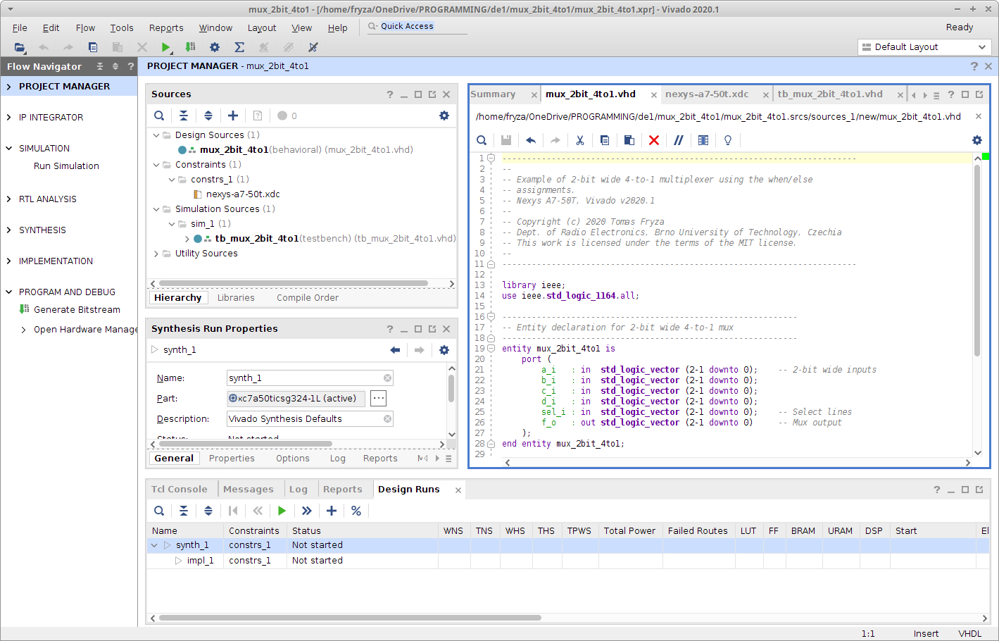
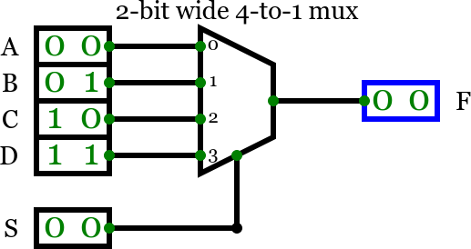

# Lab 3: Introduction to Vivado


### Learning objectives

The purpose of this laboratory exercise is to learn to use Vivado to create a simple HDL design targeting Nexys A7 Artix-7 FPGA Trainer Board.




## Preparation tasks (done before the lab at home)

The Nexys A7 board provides sixteen switches and LEDs. The switches can be used to provide inputs, and the LEDs can be used as output devices. See schematic or reference manual of the Nexys A7 board and find out the connection of slide switches and LEDs.

&nbsp;

&nbsp;

&nbsp;

&nbsp;

&nbsp;

&nbsp;


## Part 1: Synchronize Git and create a new folder

Run Git Bash (Windows) of Terminal (Linux), navigate to your working directory, and update local repository. 

```bash
## Windows Git Bash:
$ cd d:/Documents/
$ cd your-name/
$ ls
Digital-electronics-1/
$ cd Digital-electronics-1/
$ git pull


## Linux:
$ cd
$ cd Documents/
$ cd your-name/
$ ls
Digital-electronics-1/
$ cd Digital-electronics-1/
$ git pull
```

Create a new working folder `Labs/03-vivado` for this exercise.

```bash
## Windows Git Bash or Linux:
$ cd Labs/
$ mkdir 03-vivado
```


## Part 2: Project creation in Vivado

Get inspired by the [Creating and Programming our First FPGA Project Part 2: Initial Project Creation](https://blog.digilentinc.com/creating-and-programming-our-first-fpga-project-part-2-initial-project-creation/) tutorial and create a new project in Vivado (Set location to your `Labs/03-vivado` working folder). Unlike the instructions, let your project contains:
   * VHDL source file: `comparator_2bit` (the same file name as the entity)
   * Created constraints XDC file: `nexys-a7-50t`
   * Default board : `Nexys A7-50T`

Copy/paste your EDA Playground `design.vhd` code from the previous exercise to `comparator_2bit.vhd` source file.

The Nexys A7 board have hardwired connections between FPGA chip and the switches and LEDs. To use these devices it is necessary to include in your project the correct pin assignments. Copy/paste constraints from [Nexys-A7-50T-Master.xdc](https://github.com/Digilent/digilent-xdc) to `nexys-a7-50t.xdc` file. The pin assignments in the file are useful only if the pin names that appear in this file are exactly the same as the port names used in your VHDL entity.

Use **File** > **Add Sources Alt+A** > **Add or create simulation sources** and create a new VHDL file `tb_comparator_2bit` (same filename as tested entity with prefix `tb_`). Copy/pase your EDA Playground `testbench.vhd` code from previous exercise to `tb_comparator_2bit.vhd` file.

Use **Flow** > **Run Simulation** > **Run Behavioral Simulation** and run Vivado simulator.

Get inspired by the [Creating and Programming our First FPGA Project Part 4](https://blog.digilentinc.com/creating-and-programming-our-first-fpga-project-part-4/) tutorial, compile and download circuit into the FPGA chip.


## Part 3: Multiplexer

A multiplexer (MUX) is a device that has multiple inputs and a single line output. The select lines determine which input is connected to the output. Consider a circuit in which the 2-bit output f_o[1:0] has to be selected from four inputs a_i[1:0], b_i[1:0], c_i[1:0], and d_i[1:0]. The circuit uses a 2-bit select input sel_i[1:0] and implements the following truth table.

| **Select sel_i[1:0]** | **Output f_o[1:0]** |
| :-: | :-: |
| 0 0 | a_i[1:0] |
| 0 1 | b_i[1:0] |
| 1 0 | c_i[1:0] |
| 1 1 | d_i[1:0] |



Perform the following steps to implement the two-bit wide 4-to-1 multiplexer. Take screenshots and make your own README tutorial on how to create a Vivado project, how to run a simulation and how to program an FPGA on board Nexys A7.

   1. Create a new Vivado project for your circuit.
   2. Create a VHDL entity `mux_2bit_4to1` for the two-bit wide 4-to-1 multiplexer.
   3. Create a testbench `tb_mux_2bit_4to1` and simulate the circuit.
   4. Make pin assignments for the Nexys A7 board in `nexys-a7-50t.xdc`: connect mux select inputs sel_i[1:0] to slide switches SW[15:14] and use switches SW[7:0] to provide the four inputs a_i[1:0] to d_i[1:0]. Connect output f_o[1:0] to leds LD[15:14].
   5. Compile the project and download the generated bitstream into the FPGA chip.
   6. Test the functionality of the two-bit wide 4-to-1 multiplexer by toggling the switches and observing the LEDs.


## Synchronize repositories

Use [git commands](https://github.com/tomas-fryza/Digital-electronics-1/wiki/Git-useful-commands) to add, commit, and push all local changes to your remote repository. Check the repository at GitHub web page for changes.


## Experiments on your own

1. Complete your own tutorial for Vivado design flow in `Labs/03-vivado/README.md` file.


## Lab assignment

1. Two-bit wide 4-to-1 multiplexer. Submit:
    * VHDL code of two-bit wide 4-to-1 multiplexer (`mux_2bit_4to1.vhd`),
    * VHDL testbench (`tb_mux_2bit_4to1.vhd`),
    * XDC constraints file (`nexys-a7-50t.xdc`).

2. A Vivado tutorial. Submit:
    * Link to your README file with Vivado tutorial.

The deadline for submitting the task is the day before the next laboratory exercise. Use [BUT e-learning](https://moodle.vutbr.cz/) web page and submit a single PDF file.
