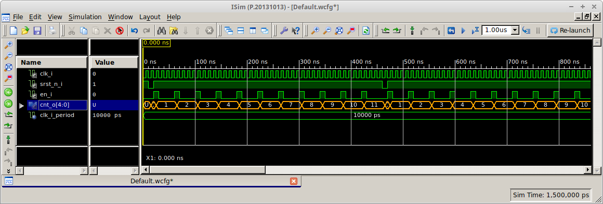
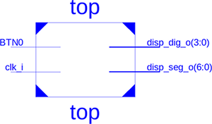

# Lab 5: Binary counter

#### Objectives

The purpose of this laboratory exercise is to become familiar with the creation of sequential processes in VHDL, next to implement a clock enable signal to drive another logic with slower clock, and to design a binary counter.


## Preparation tasks (done before the lab at home)

The Nexys A7 board provides six push buttons. See schematic or reference manual of the Nexys A7 board and find out the connection of these push buttons. What output the push buttons normally generate when they are at rest, and what output when the push buttons are pressed?

&nbsp;

&nbsp;

&nbsp;

&nbsp;

&nbsp;

&nbsp;


Calculate how many periods of clock signal with frequency of 100&nbsp;MHz contain time intervals 2&nbsp;ms, 4&nbsp;ms, 10&nbsp;ms, 250&nbsp;ms, 500&nbsp;ms, and 1&nbsp;s. Write values in decimal, binary, and hexadecimal forms.

   &nbsp;
    
   
    
   &nbsp;

   | **Freq** | **Time** | **Number of periods** | **Number of periods in hex** | **Number of periods in binary** |
   | :-: | :-: | :-: | :-: | :-: |
   | 500&nbsp;Hz | 2&nbsp;ms | 200 000 | x"3_0d40" | b"0011_0000_1101_0100_0000" |
   | 250&nbsp;Hz | 4&nbsp;ms |
   | 100&nbsp;Hz | 10&nbsp;ms |
   | 4&nbsp;Hz | 250&nbsp;ms |
   | 2&nbsp;Hz | 500&nbsp;ms |
   | 1&nbsp;Hz | 1&nbsp;sec | 100 000 000 | x"5F5_E100" | b"0101_1111_0101_1110_0001_0000_0000" |


## Part 1: Synchronize Git and create a new folder

1. Open a Linux terminal, change path to your Digital-electronics-1 working directory, and synchronize the contents with GitHub.
2. Create a new folder `Labs/05-counter`


## Part 2: VHDL code for clock enable

To drive another logic in the design (with slower clock), it is better to generate a **clock enable signal** instead of creating another clock domain (using clock dividers) that would cause timing issues or clock domain crossing problems such as metastability, data loss, and data incoherency.

Perform the following steps to simulate the clock enable circuit.

   1. Create a new Vivado project `counter` in your `Labs/05-counter` working folder.
   2. Create a VHDL source file `clock_enable` for the clock enable circuit.
   3. Choose default board: `Nexys A7-50T`.
   4. Open the [Clock enable circuit example](https://www.edaplayground.com/x/5LiJ) and copy/paste the `design.vhd` code to your `clock_enable.vhd` file. Take a look at the new parts of the VHDL source code, such as package for arithmetic operations, `generic`, `signal`, and [synchronous process](https://github.com/tomas-fryza/Digital-electronics-1/wiki/Processes). **Generic** allows us to pass information into an entity and component. Since a generic cannot be modified inside the architecture, it is like a constant.

   5. Create a simulation source `tb_clock_enable`, copy/paste the `testbench.vhd` code and run the simulation. Verify the meaning of the constant `c_MAX` and reset generation process. The default simulation run time is set to 1000&nbsp;ns in Vivado. You can change it in the menu **Tools > Settings...**


#TBD

## Part 3: Top level VHDL code for 

1. Create a new VHDL module `binary_cnt`, copy/paste the following code template, and run the synthesis.

```vhdl
------------------------------------------------------------------------
--
-- N-bit binary counter.
-- Xilinx XC2C256-TQ144 CPLD, ISE Design Suite 14.7
--
-- Copyright (c) 2019-2020 Tomas Fryza
-- Dept. of Radio Electronics, Brno University of Technology, Czechia
-- This work is licensed under the terms of the MIT license.
--
------------------------------------------------------------------------

library ieee;
use ieee.std_logic_1164.all;
use ieee.numeric_std.all;   -- Provides unsigned numerical computation

------------------------------------------------------------------------
-- Entity declaration for N-bit binary counter
------------------------------------------------------------------------
entity binary_cnt is
generic (
    g_NBIT : natural := 5       -- Number of bits
);
port (
    clk_i    : in  std_logic;
    srst_n_i : in  std_logic;   -- Synchronous reset (active low)
    en_i     : in  std_logic;   -- Enable
    cnt_o    : out std_logic_vector(g_NBIT-1 downto 0)
);
end entity binary_cnt;

------------------------------------------------------------------------
-- Architecture body for N-bit binary counter
------------------------------------------------------------------------
architecture Behavioral of binary_cnt is

    -- Internal signals
    signal s_cnt : unsigned(g_NBIT-1 downto 0) := (others => '0');

begin
    --------------------------------------------------------------------
    -- p_binary_cnt:
    -- Clocked process with synchronous reset and clock enable,
    -- which implements one-way binary counter.
    --------------------------------------------------------------------
    p_binary_cnt : process (clk_i)
    begin
        if rising_edge(clk_i) then          -- Rising clock edge

            if srst_n_i = '0' then          -- Synchronous reset (active low)
                s_cnt <= (others => '0');   -- Clear all bits
            elsif en_i = '1' then
                s_cnt <= s_cnt + 1;         -- Normal operation
            end if;

        end if; -- Rising edge
    end process p_binary_cnt;

    -- Must be retyped from "unsigned" to "std_logic_vector"
    cnt_o <= std_logic_vector(s_cnt);

end architecture Behavioral;
```

Note that an internal `s_cnt` signal is used to implement the counter. This is because the **output** port `cnt_o` cannot be read and therefore the operation `cnt_o + 1` cannot be performed.

2. Create a new VHDL test bench, simulate the module for different `g_NBIT` values and verify that the clock enable signal works correctly. Activate the reset signal at the beginning of the simulation for one clock period. In simulation you can use test bench loops as follows.

```vhdl
en_i <= '0';
srst_n_i <= '1'; wait for clk_i_period;
   
-- Reset activation
srst_n_i <= '0'; wait for clk_i_period;
srst_n_i <= '1';

-- Clock enable pulses
for i in 0 to 10 loop
    en_i <= '1'; wait for clk_i_period;
    en_i <= '0'; wait for clk_i_period*3;
end loop;
```



For `std_logic_vector` data type signals it is possible to change the numeric system in the simulation which represents the current state of the vector. Right-click the vector name (here `cnt_o[4:0]`) and select **Radix > Unsigned Decimal** from the context menu. You can change the vector color by **Signal Color** as well.

## 5 Top level implementation of 4-bit counter

1. Create a new VHDL module `top` and copy/paste the following code template.

```vhdl
------------------------------------------------------------------------
--
-- Implementation of 4-bit binary counter.
-- Xilinx XC2C256-TQ144 CPLD, ISE Design Suite 14.7
--
-- Copyright (c) 2019-2020 Tomas Fryza
-- Dept. of Radio Electronics, Brno University of Technology, Czechia
-- This work is licensed under the terms of the MIT license.
--
------------------------------------------------------------------------

library ieee;
use ieee.std_logic_1164.all;

------------------------------------------------------------------------
-- Entity declaration for top level
------------------------------------------------------------------------
entity top is
port (
    clk_i      : in  std_logic;     -- 10 kHz clock signal
    BTN0       : in  std_logic;     -- Synchronous reset
    disp_seg_o : out std_logic_vector(7-1 downto 0);
    disp_dig_o : out std_logic_vector(4-1 downto 0)
);
end entity top;

------------------------------------------------------------------------
-- Architecture body for top level
------------------------------------------------------------------------
architecture Behavioral of top is
    --- WRITE YOUR CODE HERE
begin

    --------------------------------------------------------------------
    -- Sub-block of clock_enable entity
    --- WRITE YOUR CODE HERE


    --------------------------------------------------------------------
    -- Sub-block of binary_cnt entity
    --- WRITE YOUR CODE HERE


    --------------------------------------------------------------------
    -- Sub-block of hex_to_7seg entity
    --- WRITE YOUR CODE HERE

    -- Select display position
    disp_dig_o <= "1110";

end architecture Behavioral;
```

2. Connect clock enable, binary counter, and hex to seven-segment decoder sub-blocks. Map `g_MAX` generic to a hexadecimal value from preparation tasks table, map `g_NBIT` to 4, and copy VHDL file of seven-segment decoder and Coolrunner UCF file to the working folder. Display 4-bit binary counter value on the 7-segment display, connect the reset to BTN0 push button and make sure the 10kHz clock frequency is selected by JP1 jumper.

   

   

If top level module in Xilinx ISE has not changed automatically, do it manually: right click to **top - Behavioral (top.vhd)** line and select **Set as Top Module**.

3. Implement a four-bit binary counter to the Coolrunner-II board. Test all `g_NPERIOD` period values from preparation task table.


## 6 Clean project and synchronize git

1. In Xilinx ISE, clean up all generated files in menu **Project > Cleanup Project Files...** and close the project using **File > Close Project**.

    > **Warning:** In any file manager, make sure the project folder does not contain any **large** (gigabyte) files. These can be caused by incorrect simulation in ISim. Delete such files.
    >

2. Use git commands to add, commit, and push all local changes to your remote repository. Check the repository at GitHub web page for changes.


## TBD:Experiments on your own

1. Display 4-bit counter value with onboard LEDs.

2. Implement a second 8-bit counter with a different time base (ie. different clock enable value) and display its value using LEDs on the CPLD expansion board.

3. Complete your `README.md` file with notes and screenshots from simulation and implementation.


## TBD:Lab assignment

1. XXXX. Submit:
    * VHDL code of the decoder (`hex_7seg.vhd`),
    * VHDL testbench (`tb_hex_7seg.vhd`).

2. LED indicators. Submit:
    * VHDL code for LEDs(7:4).

The deadline for submitting the assignment is before the start of the next laboratory exercise. Use [BUT e-learning](https://moodle.vutbr.cz/) web page and submit a single PDF file.
