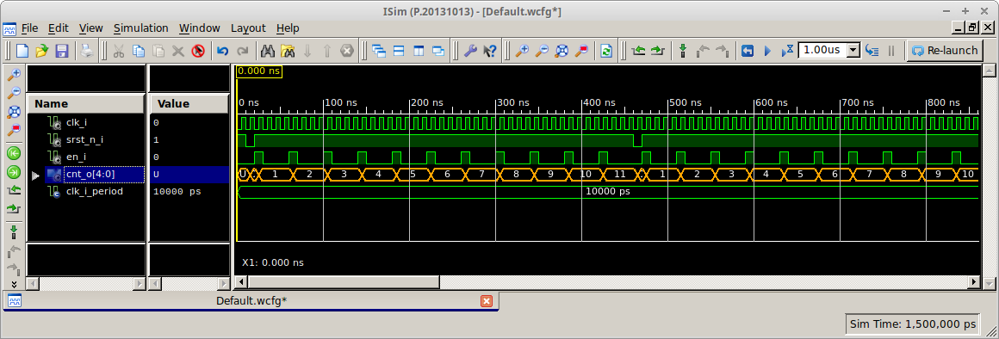
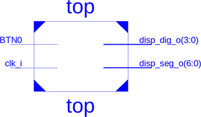
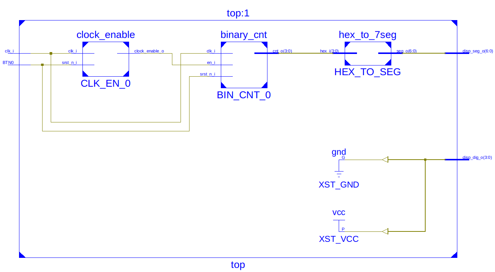

# Lab 5: Binary counters

#### Objectives

The purpose of this laboratory exercise is to become familiar with the creation of sequential processes in VHDL, next to implement a clock enable signal to drive another logic with slower clock, and to design a binary counter.


#### Materials

You will use a push button on the CoolRunner-II CPLD starter board ([XC2C256-TQ144](../../Docs/xc2c256_cpld.pdf), [manual](../../Docs/coolrunner-ii_rm.pdf), [schematic](../../Docs/coolrunner-ii_sch.pdf)) as reset device, onboard clock signal with frequency of 10&nbsp;kHz for synchronization, and 7-segment display as output device.


## 1 Preparation tasks (done before the lab at home)

1. Calculate how many periods of clock signal with frequency of 10&nbsp;kHz contain time intervals 4&nbsp;ms, 10&nbsp;ms, 250&nbsp;ms, 500&nbsp;ms, and 1&nbsp;s. Write values in decimal, binary, and hexadecimal forms.

    &nbsp;
    
    
    
    &nbsp;

    | **Freq** | **Time** | **Number of periods** | **Number of periods in binary** | **Number of periods in hex** |
    | :-: | :-: | :-: | :-: | :-: |
    | 250&nbsp;Hz | 4&nbsp;ms |  |  |  |
    | 100&nbsp;Hz | 10&nbsp;ms |  |  |  |
    | 4&nbsp;Hz | 250&nbsp;ms |  |  |  |
    | 2&nbsp;Hz | 500&nbsp;ms |  |  |  |
    | 1&nbsp;Hz | 1&nbsp;sec |  |  |  |

2. See how to create a [sequential process](https://github.com/tomas-fryza/Digital-electronics-1/wiki/Processes) in VHDL.


## 2 Synchronize Git and create a new folder

1. Open a Linux terminal, change path to your Digital-electronics-1 working directory, and synchronize the contents with GitHub.

2. Create a new folder `Labs/05-counter_binary`


## 3 Clock enable VHDL code

To drive another logic in the design (with slower clock), it is better to generate a **clock enable signal** instead of creating another clock domain (using **clock dividers**) that would cause timing issues or clock domain crossing problems such as metastability, data loss, and data incoherency.

1. Create a new project in ISE titled `binary_counter` for XC2C256-TQ144 CPLD device in location `/home/lab661/Documents/your-name/Digital-electronics-1/Labs/05-counter_binary`

2. Create a new VHDL module `clock_enable`, copy/paste the following code template, and run the synthesis (**Implement Design > Synthesize - XST**).

```vhdl
------------------------------------------------------------------------
--
-- Generates clock enable signal.
-- Xilinx XC2C256-TQ144 CPLD, ISE Design Suite 14.7
--
-- Copyright (c) 2019-2020 Tomas Fryza
-- Dept. of Radio Electronics, Brno University of Technology, Czechia
-- This work is licensed under the terms of the MIT license.
--
------------------------------------------------------------------------

library ieee;
use ieee.std_logic_1164.all;
use ieee.std_logic_unsigned.all;    -- Provides unsigned numerical computation

------------------------------------------------------------------------
-- Entity declaration for clock enable
------------------------------------------------------------------------
entity clock_enable is
generic (
    g_NPERIOD : std_logic_vector(16-1 downto 0) := x"0006"
);
port (
    clk_i          : in  std_logic;
    srst_n_i       : in  std_logic; -- Synchronous reset (active low)
    clock_enable_o : out std_logic
);
end entity clock_enable;

------------------------------------------------------------------------
-- Architecture declaration for clock enable
------------------------------------------------------------------------
architecture Behavioral of clock_enable is
    signal s_cnt : std_logic_vector(16-1 downto 0) := x"0000";
begin

    --------------------------------------------------------------------
    -- p_clk_enable:
    -- Generate clock enable signal instead of creating another clock 
    -- domain. By default enable signal is low and generated pulse is 
    -- always one clock long.
    --------------------------------------------------------------------
    p_clk_enable : process (clk_i)
    begin
        if rising_edge(clk_i) then  -- Rising clock edge
            if srst_n_i = '0' then  -- Synchronous reset (active low)
                s_cnt <= (others => '0');   -- Clear all bits
                clock_enable_o <= '0';
            elsif s_cnt >= g_NPERIOD-1 then -- Enable pulse
                s_cnt <= (others => '0');
                clock_enable_o <= '1';
            else
                s_cnt <= s_cnt + x"0001";
                clock_enable_o <= '0';
            end if;
        end if;
    end process p_clk_enable;

end architecture Behavioral;
```

**Generic** allows us to pass information into an entity and component. Since a generic cannot be modified inside the architecture, it is like a constant.

3. Create a new VHDL test bench, simulate the module for different `g_NPERIOD` values, and verify that the reset works correctly.

    > **Warning:** Comment or remove lines in generated test bench that contain `clock_enable_o_process` process definition. The clock enable signal is generated by the VHDL module.
    >

   ```vhdl
   --   clock_enable_o_process :process
   --   begin
   --       clock_enable_o <= '0';
   --       wait for clock_enable_o_period/2;
   --       clock_enable_o <= '1';
   --       wait for clock_enable_o_period/2;
   --   end process;
   ```


## 4 Binary counter VHDL code

1. Create a new VHDL module `binary_cnt`, copy/paste the following code template, and run the synthesis.

```vhdl
------------------------------------------------------------------------
--
-- N-bit binary counter.
-- Xilinx XC2C256-TQ144 CPLD, ISE Design Suite 14.7
--
-- Copyright (c) 2019-2020 Tomas Fryza
-- Dept. of Radio Electronics, Brno University of Technology, Czechia
-- This work is licensed under the terms of the MIT license.
--
------------------------------------------------------------------------

library ieee;
use ieee.std_logic_1164.all;
use ieee.std_logic_unsigned.all;    -- Provides unsigned numerical computation

------------------------------------------------------------------------
-- Entity declaration for N-bit binary counter
------------------------------------------------------------------------
entity binary_cnt is
generic (
    g_NBIT : positive := 5      -- Number of bits
);
port (
    clk_i    : in  std_logic;
    srst_n_i : in  std_logic;   -- Synchronous reset (active low)
    en_i     : in  std_logic;   -- Enable
    cnt_o    : out std_logic_vector(g_NBIT-1 downto 0)
);
end entity binary_cnt;

------------------------------------------------------------------------
-- Architecture declaration for N-bit binary counter
------------------------------------------------------------------------
architecture Behavioral of binary_cnt is
    signal s_cnt : std_logic_vector(g_NBIT-1 downto 0);
begin

    --------------------------------------------------------------------
    -- p_binary_cnt:
    -- Sequential process with synchronous reset and clock enable,
    -- which implements an one-way binary counter.
    --------------------------------------------------------------------
    p_binary_cnt : process (clk_i)
    begin
        if rising_edge(clk_i) then  -- Rising clock edge
            if srst_n_i = '0' then  -- Synchronous reset (active low)
                s_cnt <= (others => '0');   -- Clear all bits
            elsif en_i = '1' then
                s_cnt <= s_cnt + 1; -- Normal operation
            end if;
        end if;
    end process p_binary_cnt;

    cnt_o <= s_cnt;                 -- Entity output

end architecture Behavioral;
```

Note that an internal `s_cnt` signal is used to implement the counter. This is because the **output** port `cnt_o` cannot be read and therefore the operation `cnt_o + 1` cannot be performed.

2. Create a new VHDL test bench, simulate the module for different `g_NBIT` values and verify that the clock enable signal works correctly. Activate the reset signal at the beginning of the simulation for one clock period. In simulation you can use test bench loops as follows.

   ```vhdl
   en_i <= '0';
   srst_n_i <= '1'; wait for clk_i_period;
   
   -- Reset activation
   srst_n_i <= '0'; wait for clk_i_period;
   srst_n_i <= '1';

   -- Clock enable pulses
   for i in 0 to 10 loop
       en_i <= '1'; wait for clk_i_period;
       en_i <= '0'; wait for clk_i_period*3;
   end loop;
   ```

    

   For `std_logic_vector` data type signals it is possible to change the numeric system in the simulation which represents the current state of the vector. Right-click the vector name (here `cnt_o[4:0]`) and select **Radix > Unsigned Decimal** from the context menu. You can change the vector color by **Signal Color** as well.

## 5 Top level implementation of 4-bit counter

1. Create a new VHDL module `top` and copy/paste the following code template.

```vhdl
------------------------------------------------------------------------
--
-- Implementation of 4-bit binary counter.
-- Xilinx XC2C256-TQ144 CPLD, ISE Design Suite 14.7
--
-- Copyright (c) 2019-2020 Tomas Fryza
-- Dept. of Radio Electronics, Brno University of Technology, Czechia
-- This work is licensed under the terms of the MIT license.
--
------------------------------------------------------------------------

library ieee;
use ieee.std_logic_1164.all;

------------------------------------------------------------------------
-- Entity declaration for top level
------------------------------------------------------------------------
entity top is
port (
    clk_i      : in  std_logic;     -- 10 kHz clock signal
    BTN0       : in  std_logic;     -- Synchronous reset
    disp_seg_o : out std_logic_vector(7-1 downto 0);
    disp_dig_o : out std_logic_vector(4-1 downto 0)
);
end entity top;

------------------------------------------------------------------------
-- Architecture declaration for top level
------------------------------------------------------------------------
architecture Behavioral of top is
    --- WRITE YOUR CODE HERE
begin

    --------------------------------------------------------------------
    -- Sub-block of clock_enable entity
    --- WRITE YOUR CODE HERE


    --------------------------------------------------------------------
    -- Sub-block of binary_cnt entity
    --- WRITE YOUR CODE HERE


    --------------------------------------------------------------------
    -- Sub-block of hex_to_7seg entity
    --- WRITE YOUR CODE HERE

    -- Select display position
    disp_dig_o <= "1110";

end architecture Behavioral;
```

2. Connect clock enable, binary counter, and hex to seven-segment decoder sub-blocks. Map `g_NPERIOD` generic to a hexadecimal value from preparation tasks table, map `g_NBIT` to 4, and copy VHDL file of seven-segment decoder and Coolrunner UCF file to the working folder. Display 4-bit binary counter value on the 7-segment display, connect the reset to BTN0 push button and make sure the 10kHz clock frequency is selected by JP1 jumper.

   
   

    > If top level module in Xilinx ISE has not changed automatically, do it manually: right click to **top - Behavioral (top.vhd)** line and select **Set as Top Module**.
    >

3. Implement a four-bit binary counter to the Coolrunner-II board. Test all `g_NPERIOD` period values from preparation task table.


## 6 Clean project and synchronize git

1. In Xilinx ISE, clean up all generated files in menu **Project > Cleanup Project Files...** and close the project using **File > Close Project**.

    > **Warning:** In any file manager, make sure the project folder does not contain any **large** (gigabyte) files. These can be caused by incorrect simulation in ISim. Delete such files.
    >

2. Use git commands to add, commit, and push all local changes to your remote repository. Check the repository at GitHub web page for changes.


## Experiments on your own

1. Display 4-bit counter value with onboard LEDs.

2. Implement a second 8-bit counter with a different time base (ie. different clock enable value) and display its value using LEDs on the CPLD expansion board.

3. Complete your `README.md` file with notes and screenshots from simulation and implementation.
