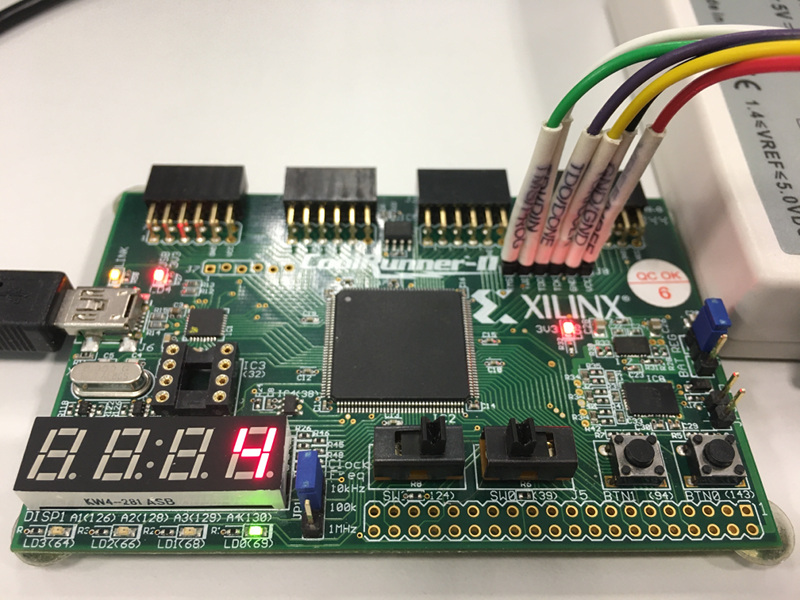

# Lab 5: Binary counters

The purpose of this laboratory exercise is to design a counter.


#### Contents

1. [Materials](#1-Materials)
2. [Synchronize Git and create a new folder](#2-Synchronize-Git-and-create-a-new-folder)
3. [Clock enable VHDL code](#3-Clock-enable-VHDL-code)
4. [Binary counter VHDL code](#4-Binary-counter-VHDL-code)
5. [Top level implementation of 4-bit counter](#5-Top-level-implementation-of-4-bit-counter)
6. [Clean project and synchronize git](#6-Clean-project-and-synchronize-git)


## Preparation tasks (done before the lab at home)

1. Calculate how many periods of clock signal with fclk = 10kHz contain time intervals 10ms, 250ms, 500ms, and 1s. Write values in decimal, binary, and hexadecimal forms.

    &nbsp;

    Tclk = 

    &nbsp;

    | **Time** | **Number of periods** | **Number of periods in binary** | **Number of periods in hexa** |
    | :-: | :-: | :-: | :-: |
    | 10ms |  |  |  |
    | 250ms |  |  |  |
    | 500ms |  |  |  |
    | 1sec |  |  |  |


## 1 Materials

1. CoolRunner-II CPLD starter board ([XC2C256-TQ144](../../Docs/xc2c256_cpld.pdf)): [Manual](../../Docs/coolrunner-ii_rm.pdf), [Schematic](../../Docs/coolrunner-ii_sch.pdf).

    


## 2 Synchronize Git and create a new folder

1. Open a Linux terminal, change path to your Digital-electronics-1 working directory, and synchronize the contents with GitHub.

2. Create a new folder `Labs/05-counter_binary`


## 3 Clock enable VHDL code

1. Create a new project in ISE titled `binary_counter` for XC2C256-TQ144 CPLD device in location `/home/lab661/Documents/your-name/Digital-electronics-1/Labs/05-counter_binary`

2. Create a new source file `clock_enable` and copy + paste the following code template.

```vhdl
------------------------------------------------------------------------
--
-- Clock enable.
-- Xilinx XC2C256-TQ144 CPLD, ISE Design Suite 14.7
--
-- Copyright (c) 2019-2020 Tomas Fryza
-- Dept. of Radio Electronics, Brno University of Technology, Czechia
-- This work is licensed under the terms of the MIT license.
--
------------------------------------------------------------------------

library ieee;
use ieee.std_logic_1164.all;

XXXX
```

3. TBD


## 4 Binary counter VHDL code

1. TBD


## 5 Top level implementation of 4-bit counter

1. TBD


## 6 Clean project and synchronize git

1. In Xilinx ISE, clean up all generated files in menu **Project > Cleanup Project Files...** and close the project using **File > Close Project**.

    > **Warning:** In any file manager, make sure the project folder does not contain any **large** (gigabyte) files. These can be caused by incorrect simulation in ISim. Delete such files.
    >

2. Use git commands to add, commit, and push all local changes to your remote repository. Check the repository at GitHub web page for changes.


## Experiments on your own

1. TBD

2. Complete your `README.md` file with notes and screenshots from simulation and implementation.
