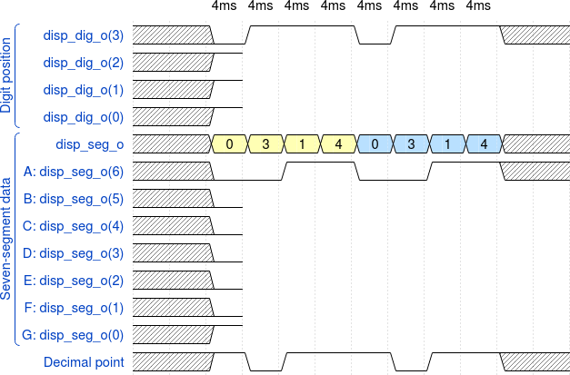
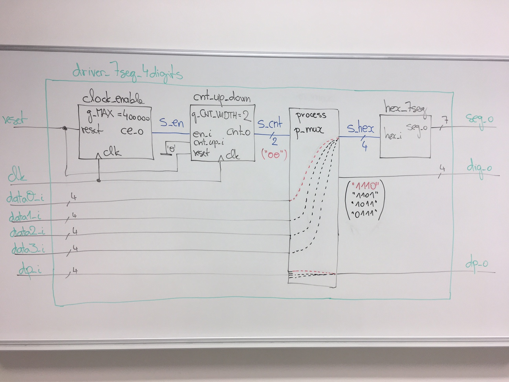

# Lab 6: Driver for multiple seven-segment displays


### Learning objectives

In this laboratory exercise, you will study the creation of a sequential circuit for multiplexing 7-segment displays. This allows you to display four or even eight-digit values, including the decimal point on the display.


## Preparation tasks (done before the lab at home)

See schematic or reference manual of the Nexys board, find out the connection of 7-segment displays, and complete the signal timing to display four-digit value `3.142`.

Due to the physiological properties of human vision, it is necessary that the time required to display the whole value is a maximum of 16&nbsp;ms. If we display four digits, then the duration of one of them is 4&nbsp;ms. If we display eight digits, the time is reduced to 2&nbsp;ms, etc.



> The figure above was created in [WaveDrom](https://wavedrom.com/) digital timing diagram online tool. The figure source code is as follows:
>
```javascript
{
  signal:
  [
    ['Digit position',
      {name: 'Common anode: AN(3)', wave: 'xx01..01..01'},
      {name: 'AN(2)', wave: 'xx1'},
      {name: 'AN(1)', wave: 'xx1'},
      {name: 'AN(0)', wave: 'xx1'},
    ],
    ['Seven-segment data',
      {name: '4-digit value to display', wave: 'xx3333555599', data: ['3','1','4','2','3','1','4','2','3','1']},
      {name: 'Cathod A: CA', wave: 'xx01.0.1.0.1'},
      {name: 'CB', wave: 'xx0'},
      {name: 'CC', wave: 'xx0'},
      {name: 'CD', wave: 'xx0'},
      {name: 'CE', wave: 'xx1'},
      {name: 'CF', wave: 'xx1'},
      {name: 'CG', wave: 'xx0'},
    ],
    {name: 'Decimal point: DP', wave: 'xx01..01..01'},
  ],
  head:
  {
    text: '                    4ms   4ms   4ms   4ms   4ms   4ms   4ms   4ms   4ms   4ms',
  },
}
```


## Part 1: Synchronize repositories and create a new folder

Run Git Bash (Windows) of Terminal (Linux), navigate to your working directory, and update local repository. Create a new working folder `Labs/06-display_driver` for this exercise.


## Part 2: VHDL code for display driver

Multiplexer or MUX is a digital switch. It allows to route binary information from several input lines or sources to one output line or channel.

Perform the following steps to model the driver circuit.

   1. Create a new Vivado RTL project `display_driver` in your `Labs/06-display_driver` working folder.
   2. Create a VHDL source file `driver_7seg_4digits.vhd` for the driver circuit.
   3. Choose default board: `Nexys A7-50T`.
   4. Open the [Driver for 7-segment display](https://www.edaplayground.com/x/3f_A) example and copy/paste the `design.vhd` code to your `driver_7seg_4digits.vhd` file. Copy source files of clock enable, binary counter, 7-segment decoder modules from previous labs to `display_driver/display_driver.srcs/sources_1/new/` folder and add then to the project.
   5. Complete the driver code according to the following block diagram.




## Part 3: Top level VHDL code

Perform the following steps to implement the 4-digit 7-segment display driver on the Nexys A7 board.

   1. Create a new design source `top.vhd` in your project.
   2. Define an entity `top` as follows.

   | **Port name** | **Direction** | **Type** | **Description** |
   | :-: | :-: | :-: | :-- |
   | `CLK100MHZ` | input | `std_logic` | Main clock |
   | `BTNC` | input | `std_logic` | Synchronous reset |
   | `SW`  | input   | `std_logic_vector(16 - 1 downto 0)` | Four 4-bit values |
   | `CA` | output | `std_logic` | Cathod A |
   | `CB` | output | `std_logic` | Cathod B |
   | `CC` | output | `std_logic` | Cathod C |
   | `CD` | output | `std_logic` | Cathod D |
   | `CE` | output | `std_logic` | Cathod E |
   | `CF` | output | `std_logic` | Cathod F |
   | `CG` | output | `std_logic` | Cathod G |
   | `DP` | output | `std_logic` | Decimal point |
   | `AN` | output | `std_logic_vector(8 - 1 downto 0)` | Common anode signals to individual displays |

   3. Create a new [constraints XDC](https://github.com/Digilent/digilent-xdc) file: `nexys-a7-50t` and uncomment used pins according to the entity.
   4. Use direct instantiation and define an architecture of the top level.

```vhdl
------------------------------------------------------------------------
-- Architecture body for top level
------------------------------------------------------------------------
architecture behavioral of top is
    -- No internal signals
begin

    --------------------------------------------------------------------
    -- Instance (copy) of driver_7seg_4digits entity
    driver_seg_4 : entity work.driver_7seg_4digits
        port map(
            clk      => CLK100MHZ,
            reset    => BTNC,
            data0_i(3) => SW(3),
            data0_i(2) => SW(2),
            data0_i(1) => SW(1),
            data0_i(0) => SW(0),
            --- WRITE YOUR CODE HERE
            dp_i => "0111",
            --- WRITE YOUR CODE HERE
        );

    -- Disconnect the top four digits of the 7-segment display
    AN(7 downto 4) <= b"1111";

end architecture behavioral;
```

   5. Compile the project and download the generated bitstream `display_driver/display_driver.runs/impl_1/top.bit` into the FPGA chip.
   6. Test the functionality of the driver by toggling the switches and observing the display.
   7. Use **IMPLEMENTATION > Open Implemented Design > Schematic** to see the generated structure.


## Synchronize repositories

Use [git commands](https://github.com/tomas-fryza/Digital-electronics-1/wiki/Git-useful-commands) to add, commit, and push all local changes to your remote repository. Check the repository at GitHub web page for changes.


## Experiments on your own

1. On your smartphone, set slow motion video recording and observe the seven-segment display behavior:)
2. Extend the duration of one symbol on the 7-segment display ie. generic `g_MAX` in `driver_7seg_4digit.vhd` file and experimentally determine the maximum value at which switching by the human eye is not yet observable.
3. Design the structure of `driver_7seg_8digits` module, which controls all eight 7-segment displays.


## Lab assignment

1. Display driver. Submit:
    * VHDL code of the process `p_mux`,
    * VHDL code of the top layer architecture.

2. Eight-digit driver. Submit:
    * (Hand-drawn) sketch of the driver schematic.

The deadline for submitting the task is the day before the next laboratory exercise. Use [BUT e-learning](https://moodle.vutbr.cz/) web page and submit a single PDF file.
