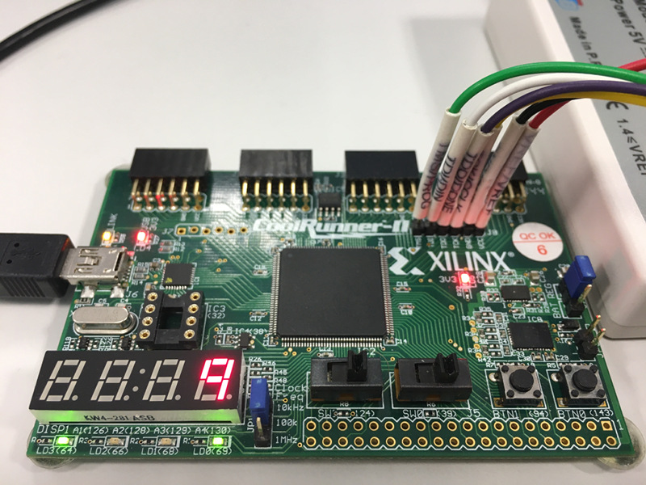

# Lab 7: Decimal counter

#### Objectives

In this laboratory exercise you will study XXXX.
You will use a push button on the CoolRunner board as reset device, onboard clock signal with frequency of 10&nbsp;kHz for synchronization, and 7-segment display as output device.


#### Materials

You will use CoolRunner-II CPLD starter board ([XC2C256-TQ144](../../Docs/xc2c256_cpld.pdf), [manual](../../Docs/coolrunner-ii_rm.pdf), [schematic](../../Docs/coolrunner-ii_sch.pdf)) and CPLD expansion board ([schematic](../../Docs/cpld_expansion.pdf)).




## 1 Preparation tasks (done before the lab at home)

1. TBD

2. See how to make [signal assignments](https://github.com/tomas-fryza/Digital-electronics-1/wiki/VHDL-cheat-sheet#signal-assignments) outside and inside a process.


## 2 Synchronize Git and create a new folder

1. Open a Linux terminal, change path to your Digital-electronics-1 working directory, and synchronize the contents with GitHub.

2. Create a new folder `Labs/07-counter_decimal`


## 3 Decimal counter VHDL code

*Decimal counter is a device that xxx.*

1. Create a new project in ISE titled `decimal_counter` for XC2C256-TQ144 CPLD device in location `/home/lab661/Documents/your-name/Digital-electronics-1/Labs/07-counter_decimal`

2. Create a new VHDL module `decimal_cnt` and copy + paste the following code template.

```vhdl
------------------------------------------------------------------------
--
-- Up/down decimal counter with load.
-- Xilinx XC2C256-TQ144 CPLD, ISE Design Suite 14.7
--
-- Copyright (c) 2020 Tomas Fryza
-- Dept. of Radio Electronics, Brno University of Technology, Czechia
-- This work is licensed under the terms of the MIT license.
--
------------------------------------------------------------------------

library ieee;
use ieee.std_logic_1164.all;
use ieee.std_logic_unsigned.all;    -- Provides unsigned numerical computation

------------------------------------------------------------------------
-- Entity declaration for decimal counter
------------------------------------------------------------------------
entity decimal_cnt is
port (
    clk_i    : in  std_logic;
    srst_n_i : in  std_logic;   -- Synchronous reset (active low)
    en_i     : in  std_logic;   -- Enable
    up_i     : in  std_logic    -- Up direction
    -- Load
    -- Data outputs
);
end entity decimal_cnt;

------------------------------------------------------------------------
-- Architecture declaration for decimal counter
------------------------------------------------------------------------
architecture Behavioral of decimal_cnt is
    -- TBD
begin

    --------------------------------------------------------------------
    -- p_decimal_cnt:
    -- Sequential process with synchronous reset and clock enable,
    -- which implements a two-way decimal counter.
    --------------------------------------------------------------------
    p_decimal_cnt : process (clk_i)
    begin
        if rising_edge(clk_i) then  -- Rising clock edge
            if srst_n_i = '0' then  -- Synchronous reset (active low)
                -- WRITE YOUR CODE HERE
            elsif en_i = '1' then
                -- WRITE YOUR CODE HERE
            end if;
        end if;
    end process p_bcd_cnt;

    -- WRITE YOUR CODE HERE

end architecture Behavioral;
```

2. Implement a decimal synchronous up/down counter with load.

3. Simulate the module.


## 4 Top level implementation of decimal counter

1. Create a new VHDL module `top` and copy + paste the following code template.

    > If top level module in Xilinx ISE has not changed automatically, do it manually: right click to **top - Behavioral (top.vhd)** line and select **Set as Top Module**.
    >

```vhdl
------------------------------------------------------------------------
--
-- Implementation of decimal counter.
-- Xilinx XC2C256-TQ144 CPLD, ISE Design Suite 14.7
--
-- Copyright (c) 2019-2020 Tomas Fryza
-- Dept. of Radio Electronics, Brno University of Technology, Czechia
-- This work is licensed under the terms of the MIT license.
--
------------------------------------------------------------------------

library ieee;
use ieee.std_logic_1164.all;

------------------------------------------------------------------------
-- Entity declaration for top level
------------------------------------------------------------------------
entity top is
port (
    clk_i      : in  std_logic;     -- 10 kHz clock signal
    -- TBD
    disp_seg_o : out std_logic_vector(7-1 downto 0);
    disp_dig_o : out std_logic_vector(4-1 downto 0)
);
end entity top;

------------------------------------------------------------------------
-- Architecture declaration for top level
------------------------------------------------------------------------
architecture Behavioral of top is
    --- WRITE YOUR CODE HERE
begin

    --- WRITE YOUR CODE HERE

end architecture Behavioral;
```

2. TBD
   Implement a decimal counter on the Coolrunner-II board. Display its value on the 7-segment displays, connect the reset to BTN0 push button and make sure the 10kHz clock frequency is selected. Use slide switches on the CPLD expansion board as load inputs.


## 5 Clean project and synchronize git

1. In Xilinx ISE, clean up all generated files in menu **Project > Cleanup Project Files...** and close the project using **File > Close Project**.

    > **Warning:** In any file manager, make sure the project folder does not contain any **large** (gigabyte) files. These can be caused by incorrect simulation in ISim. Delete such files.
    >

2. Use git commands to add, commit, and push all local changes to your remote repository. Check the repository at GitHub web page for changes.


## Experiments on your own

1. TBD

2. Complete your `README.md` file with notes and screenshots from simulation and implementation.
