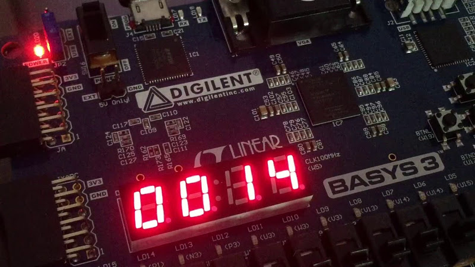

# Lab 7: Stopwatch

#### Objectives

In this laboratory exercise you will implement BCD counters. You will use the Xilinx Isim simulator or the EDA playground online tool. You will use a push button on the CoolRunner board as reset device, onboard clock signal with frequency of 10&nbsp;kHz for synchronization, and 7-segment display as output device.




## 1 Synchronize Git and create a new folder

Synchronize the contents of your Digital-electronics-1 working directory with GitHub. and create a new folder `Labs/07-stopwatch`.


## 2 Stopwatch

In VHDL, write a stopwatch counter. The counter counts the time in the form of a **seconds&nbsp;&nbsp;hundredths** and the maximum value is 59 99 (1 minute), then the time is reset to 00 00 and the counting continues. The counter increment must be performed every 10 ms (one hundredth of a second) with the clock enable signal. In addition, the counting is enabled by the input signal `cnt_en_i` and the counter is reset by the synchronous reset input.

Use an approach that uses one BCD counter for each decade and counts from 0 to 9. The lowest of the counters is incremented every 10 ms, and each higher-order counter is incremented if all lower-order counters are equal to the maximum value of 9.

Let the entity has these inputs:
* `clk_i` (clock)
* `srst_n_i` (synchronous reset, active low)
* `ce_100Hz_i` (clock enable)
* `cnt_en_i` (stopwatch enable)

and outputs:
* `sec_h_o[3:0]` (counter for tens of seconds)
* `sec_l_o[3:0]` (counter for seconds)
* `hth_h_o[3:0]` (counter for tenths of seconds)
* `hth_l_o[3:0]` (counter for hundredths of seconds)


## 3 Stopwatch simulation

Design and simulate stopwatch counters in [EDA playground](https://www.edaplayground.com) or Xilinx ISE. Write a testbench that verifies all the functions of your stopwatch (reset, counting, enable(s)).

Hint: Use the `numeric_std` package that defines the `unsigned` type and mathematical operations with that type (you will need the sum for the counter). Use the following conversion to associate the `unsigned` signal with the `std_logic_vector` output.

```vhdl
library ieee;
use ieee.std_logic_1164.all;
use ieee.numeric_std.all;

entity stopwatch is
port(
    hth_l_o : out std_logic_vector(4-1 downto 0);
...

architecture Behavioral of stopwatch is
    signal s_cnt0 : unsigned(4-1 downto 0) := (others => '0');
    ...

    s_cnt0 <= s_cnt0 + 1;
    ...

    hth_l_o <= std_logic_vector(s_cnt0);
end architecture Behavioral;
```

Follow **programming conventions** and **coding style** from previous lab exercises.


## 4 Top level

Implement the top level in VHDL **or instead** draw a block diagram of used modules and name all input, output and internal signals.


## Synchronize git

Your repository must include README file, source code for the stopwatch, testbench code, screenshot of the correct simulation, and source code or schematic of top level implementation. Submit your solution **no later** than Friday.
