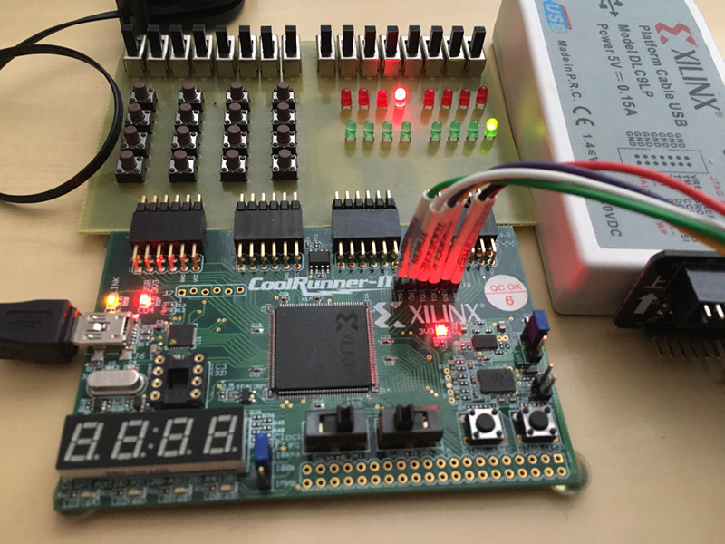
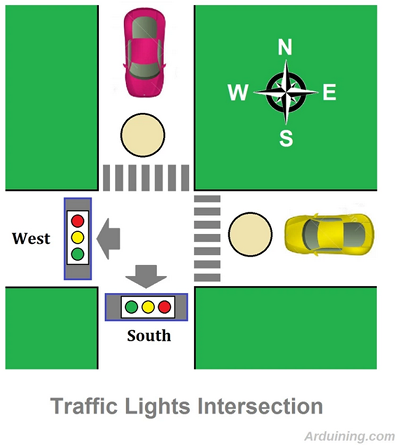

# Lab 8: Traffic light controller

#### Objectives

In this laboratory exercise you will implement a finite state machine, specifically a traffic light controller at a junction. You will use the Xilinx Isim simulator or the EDA playground online tool. You will use a push button on the CoolRunner board as reset device, onboard clock signal with frequency of 10&nbsp;kHz for synchronization, and CPLD expansion board LEDs as outputs.

[Video](https://youtu.be/P2emiQeBgE8)




## 1 Synchronize Git and create a new folder

Synchronize the contents of your Digital-electronics-1 working directory with GitHub. and create a new folder `Labs/08-traffic_lights`.


## 2 Finite State Machine (FSM)

A finite state machine (FSM) is a computation model that can be implemented with hardware or software and can be used to simulate sequential logic. There are two different main types of finite state machines: the Mealy FSM and the Moore FSM. The fundamental difference between these two types lies in the management of the outputs:

* The output of the Mealy FSM depends on the present state and inputs.
* The outputs of a Moore machine depend only on the present state and not on the inputs.

Read the article [Implementing a Finite State Machine in VHDL](https://www.allaboutcircuits.com/technical-articles/implementing-a-finite-state-machine-in-vhdl/) and understand how to design your own FSM. How you can define your own data type in VHDL? Give an example.


## 3 Traffic light controller

Watch [Example 62: Traffic Light Controller](https://www.youtube.com/watch?v=6_Rotnw1hFM) video and implement the basic controller for 2 one-way streets in VHDL.

Hint: Use the `numeric_std` package instead of `ieee.std_logic_unsigned` and change type for internal signals `count`, `SEC5`, and `SEC1` from `std_logic_vector` to `unsigned`. Also change `clk'event and clk = '1'` to `rising_edge(clk)`.

```vhdl
library ieee;
use ieee.std_logic_1164.all;
--use ieee.std_logic_unsigned.all;
use ieee.numeric_std.all;

...

architecture traffic of traffic is
    ...
    --signal count: std_logic_vector(3 downto 0);
    --constant SEC5: std_logic_vector(3 downto 0) := "1111";
    --constant SEC1: std_logic_vector(3 downto 0) := "0011";
    signal count : unsigned(3 downto 0);
    constant SEC5: unsigned(3 downto 0) := "1111";
    constant SEC1: unsigned(3 downto 0) := "0011";

    ...

        --elsif clk'event and clk = '1' then
        elsif rising_edge(clk) then
        ...

end traffic;
```

Change the reset in the example from asynchronous to synchronous.

Follow programming conventions and coding style from previous lab exercises and rename all inputs, outputs and internal signals.

Rename the states `s0`, `s1`, .., `s5` from the example to more meaningful and draw the state diagram.


## 4 Traffic light simulation

Design and simulate traffic light FSM in [EDA playground](https://www.edaplayground.com) or Xilinx ISE. Write a testbench that verifies all the functions of your traffic light controller (reset, timing, output lights).


## 5 Top level

Implement the top level in VHDL **or instead** draw a block diagram of used modules and name all inputs, outputs and internal signals. Use the `clock_enable` entity with the correct timing (the duration of each state should be 1 or 5 seconds).


## Synchronize git

Your repository must include `README.md` file with simulation screenshot(s), next the source code for traffic light controller, testbench code, and source code or schematic of top level implementation. Submit your solution **no later** than Friday.


## Experiments on your own

1. Follow the [exercise inspired by prof. Jon Valvano](https://arduining.com/2015/09/18/traffic-light-states-machine-with-arduino/) from University of Texas and desing an enhanced traffic light controller for the intersection of two equally busy one-way streets. The controller using two sensors and 6 lights. Two sensors detects the presence of cars in each direction and the goal is to maximize traffic flow, minimize waiting time at a red light, and avoid accidents.

   

   Explain how the intersection throughput is maximized.

   Draw a state diagram of your implementation.
