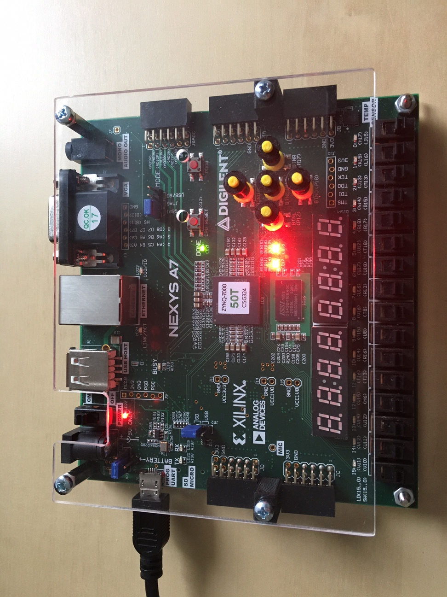
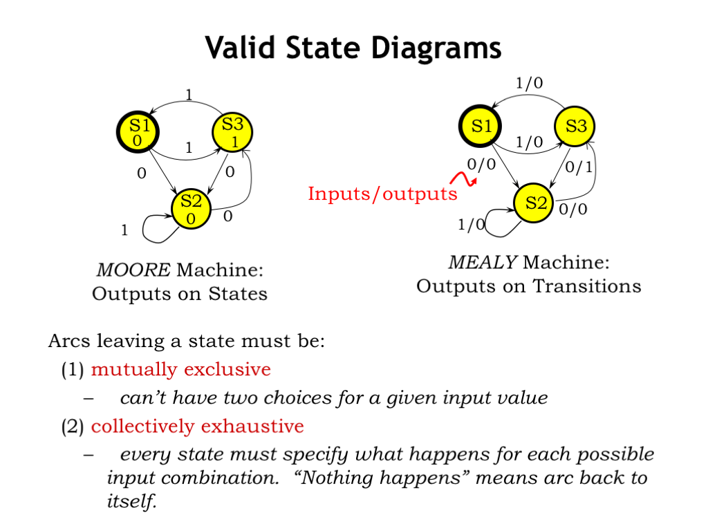

# Lab 8: Traffic light controller


### Learning objectives

In this laboratory exercise you will implement a finite state machine (FSM), specifically a traffic light controller at a junction. At first, the intersection will contain only two one-way streets with a fixed time control system in which traffic lights are configured to turn on the green, yellow, and red color after a given period. Subsequently, the system will be extended with a smarter way of driving.




## Preparation tasks (done before the lab at home)

Read the article [Implementing a Finite State Machine in VHDL](https://www.allaboutcircuits.com/technical-articles/implementing-a-finite-state-machine-in-vhdl/) (parts **A Bit of Background** and **The Finite State Machine**) and understand what a FSM is.

Fill in the table with the state names and output values accoding to the given inputs.

| **Input P** | `0` | `0` | `1` | `1` | `0` | `1` | `0` | `1` | `1` | `1` | `1` | `0` | `0` | `1` | `1` | `1` |
| :-- | :-: | :-: | :-: | :-: | :-: | :-: | :-: | :-: | :-: | :-: | :-: | :-: | :-: | :-: | :-: | :-: |
| **State** | A |  |  |  |  |  |  |  |  |  |  |  |  |  |  |  |
| **Output R** | `0` |  |  |  |  |  |  |  |  |  |  |  |  |  |  |  |

See schematic or reference manual of the Nexys board and find out the connection of two RGB LEDs. How you can control them to get red, yellow, or green colors?

&nbsp;

&nbsp;

&nbsp;

&nbsp;

&nbsp;

&nbsp;

| **RGB LED** | **Artix-7 pin names** | **Red** | **Yellow** | **Green** |
| :-: | :-: | :-: | :-: | :-: |
| LD16 | N15, M16, R12 | `1,0,0` |  |  |
| LD17 |  |  |  |  |


## Part 1: Synchronize Git and create a new folder

Run Git Bash (Windows) of Terminal (Linux), navigate to your working directory, and update local repository. Create a new working folder `Labs/08-traffic_lights`.


## Part 2: Finite State Machine (FSM)

A finite state machine (FSM) is a computation model that can be implemented with hardware or software and can be used to simulate sequential logic. There are two main types of finite state machines: the Mealy FSM and the Moore FSM. The fundamental difference between these two types lies in the management of the outputs:
   * The output of the **Mealy** machine depends on the present state and inputs.
   * The outputs of a **Moore** machine depend only on the present state and not on the inputs, as shown in the figure [[1]](https://www.allaboutcircuits.com/technical-articles/implementing-a-finite-state-machine-in-vhdl/).


A common way how to represent a finite state machine is a **state diagram** which contains of:
   * Circles and
   * Directed arcs to the next state circles.

Circles represent the machine states labelled with a reflecting state and for a Moore machine also with the output value [[2]](https://ocw.mit.edu/courses/electrical-engineering-and-computer-science/6-004-computation-structures-spring-2017/c6/c6s1/).


Directed arcs represent the transitions between states and they are labelled with input/output pair for a Mealy machine and with input for a Moore machine.




## Part 3: Traffic light controller VHDL code

Let a intersection contains two one-way streets with a fixed time control system in which traffic lights are configured to turn on the green, yellow, and red color after a given period. If it is red in one direction on the traffic light, it is green in the other, and green in the first direction can only occur when it is red in the other direction, etc.

> The exercise is inspired by the following references:
   1. LBEbooks, Lesson 92 - Example 62: [Traffic Light Controller](https://www.youtube.com/watch?v=6_Rotnw1hFM) video
   2. David Williams, [Implementing a Finite State Machine in VHDL](https://www.allaboutcircuits.com/technical-articles/implementing-a-finite-state-machine-in-vhdl/)
   3. VHDLwhiz, [One-process vs two-process vs three-process state machine](https://vhdlwhiz.com/n-process-state-machine/)
> 
> Note that, several changes have been made to preserve the programming style from previous exercises, such as:
   * Use `numeric_std` package instead of `IEEE.STD_LOGIC_unsigned`,
   * Types for internal signal/constants changed from `STD_LOGIC_VECTOR(3 downto 0)` to `unsigned`,
   * Edge detector `clk'event and clk = '1'` changed to `rising_edge(clk)`.
>

Perform the following steps to model the traffic light controller.
   1. Create a new Vivado RTL project `traffic` in your `Labs/08-traffic_lights` working folder.
   2. Create a VHDL source file `tlc.vhd` for the traffic light controller circuit.
   3. Choose default board: `Nexys A7-50T`.
   4. Open the [Traffic light controller](https://www.edaplayground.com/x/5HBi) example and copy/paste the `design.vhd` code to your `tlc.vhd` file.
   5. Copy source file of clock_enable circuit from previous labs to `traffic/traffic.srcs/sources_1/new/` folder and add it to the project.
   6. Complete the traffic light code according to the following description.

The controller contains six states and sets the semaphore outputs according to the following table. It remains in each of the states for a certain time.

| **Current state** | **Direction North** | **Direction West** | **Delay** |
| :-- | :-: | :-: | :-: |
| `STOP1`      | red    | red | 1 sec |
| `WEST_GO`    | red    | green | 4 sec |
| `WEST_WAIT`  | red    | yellow | 2 sec |
| `STOP2`      | red    | red | 1 sec |
| `NORTH_GO`   | green  | red | 4 sec |
| `NORTH_WAIT` | yellow | red | 2 sec |

Draw a state diagram according to the table.

&nbsp;

&nbsp;

&nbsp;

&nbsp;

&nbsp;

&nbsp;

In VHDL it is possible to define a new data type, which contains the names of our states.

```vhdl
    -- Define the states
    type   t_state is (STOP1, WEST_GO,  WEST_WAIT,
                       STOP2, SOUTH_GO, SOUTH_WAIT);
    -- Define the signal that uses different states
    signal s_state  : t_state;
```

The FSM function is divided into two processes, where the first is sequential and it entirely controls state changes by CASE statement. The second is a combinatorial process, it is sensitive to state changes, and sets the output signals accordingly. This is an example of a Moore state machine because the output is set based on the active state. FSM behavior can be written in one to three processes. The differences between these approaches are described in detail [here](https://vhdlwhiz.com/n-process-state-machine/).

```vhdl
    --------------------------------------------------------------------
    -- p_traffic_fsm:
    -- The sequential process with synchronous reset and clock_enable 
    -- entirely controls the s_state signal by CASE statement.
    --------------------------------------------------------------------
    p_traffic_fsm : process(clk)
    begin
        if rising_edge(clk) then
            if (reset = '1') then       -- Synchronous reset
                s_state <= STOP1 ;      -- Set initial state
                s_cnt   <= c_ZERO;      -- Clear all bits

            elsif (s_en = '1') then
                -- Every 250 ms, CASE checks the value of the s_state 
                -- variable and changes to the next state according 
                -- to the delay value.
                case s_state is

                    -- If the current state is STOP1, then wait 1 sec
                    -- and move to the next GO_WAIT state.
                    when STOP1 =>
                        -- Count up to c_DELAY_1SEC
                        if (s_cnt < c_DELAY_1SEC) then
                            s_cnt <= s_cnt + 1;
                        else
                            -- Move to the next state
                            s_state <= WEST_GO;
                            -- Reset local counter value
                            s_cnt   <= c_ZERO;
                        end if;

                    -- If the current state is WEST_GO, then wait 4 sec
                    -- and move to the next WEST_WAIT state.
                    when WEST_GO => ...

                    ...

                    -- It is a good programming practice to use the 
                    -- OTHERS clause, even if all CASE choices have 
                    -- been made. 
                    when others =>
                        s_state <= STOP1;

                end case;
            end if; -- Synchronous reset
        end if; -- Rising edge
    end process p_traffic_fsm;
```

Complete CASE/WHEN statements in both processes.


## Part 4: Traffic light controller simulation

Perform the following steps to simulate traffic light controller.
   1. Create a VHDL simulation source `tb_tlc.vhd`, copy/paste the `testbench.vhd` code from EDA Playground example. Note that the maximum value of clock enable circuit is set to 1 for the simulation, ie the traffic light controller changes its state with a frequency of 100&nbsp;MHz and not 4&nbsp;Hz.
   2. Change the duration of simulation to 10000ns in Vivado menu **Tools > Settings... > Simulation > Simulation**.
   3. Run the simulation, and verify that the controller works correctly (reset, timing, output lights, states).


## Part 5: Top level VHDL code

Perform the following steps to implement the traffic light controller on the Nexys A7 board.
   1. Create a new design source `top.vhd` in your project.
   2. Define an entity `top` as follows.

   | **Port name** | **Direction** | **Type** | **Description** |
   | :-: | :-: | :-: | :-- |
   | `CLK100MHZ` | input | `std_logic` | Main clock |
   | `BTNC` | input | `std_logic` | Synchronous reset |
   | `LED16_R` | output | `std_logic` | Red1 |
   | `LED16_G` | output | `std_logic` | Green1 |
   | `LED16_B` | output | `std_logic` | Blue1 |
   | `LED17_R` | output | `std_logic` | Red2 |
   | `LED17_G` | output | `std_logic` | Green2 |
   | `LED17_B` | output | `std_logic` | Blue2 |

   3. Create a new [constraints XDC](https://github.com/Digilent/digilent-xdc) file: `nexys-a7-50t` and uncomment used pins according to the entity.
   4. Use direct instantiation and define an architecture of the top level.

```vhdl
------------------------------------------------------------------------
-- Architecture body for top level
------------------------------------------------------------------------
architecture behavioral of top is

begin
    --------------------------------------------------------------------
    -- Instance (copy) of tlc entity
    tlc : entity work.tlc
        port map(
            clk   => CLK100MHZ,
            reset => BTNC,
            --- WRITE YOUR CODE HERE
        );

end architecture behavioral;
```

   5. Compile the project and download the generated bitstream `traffic/traffic.runs/impl_1/top.bit` into the FPGA chip.
   6. Observe the functionality of the traffic light controller.
   7. Use **IMPLEMENTATION > Open Implemented Design > Schematic** to see the generated structure.


## Synchronize repositories

Use [git commands](https://github.com/tomas-fryza/Digital-electronics-1/wiki/Git-useful-commands) to add, commit, and push all local changes to your remote repository. Check the repository at GitHub web page for changes.


## Experiments on your own

1. Follow the [exercise inspired by prof. Jon Valvano](https://arduining.com/2015/09/18/traffic-light-states-machine-with-arduino/) from University of Texas and desing an enhanced traffic light controller for the intersection of two equally busy one-way streets. The controller using two sensors and 6 lights. Two sensors detects the presence of cars in each direction and the goal is to maximize traffic flow, minimize waiting time at a red light, and avoid accidents.

   

   Create a state stable and draw a state diagram of this smart controller including delays. Use on-board slide switches to emulate two sensors and implement the traffic light controller on the Nexys A7 board.


## Lab assignment

1. Preparation tasks (done before the lab at home). Submit:
    * State table,
    * RGB LEDs table.

2. Traffic light controller. Submit:
    * VHDL code of the process `p_traffic_fsm`,
    * Screenshot(s) of the simulation, from which it is clear that controller works correctly,
    * VHDL code of the top layer architecture.

3. Smart controller. Submit:
    * State diagram,
    * VHDL code of the smart controller architecture.

The deadline for submitting the task is the day before the next laboratory exercise. Use [BUT e-learning](https://moodle.vutbr.cz/) web page and submit a single PDF file.
