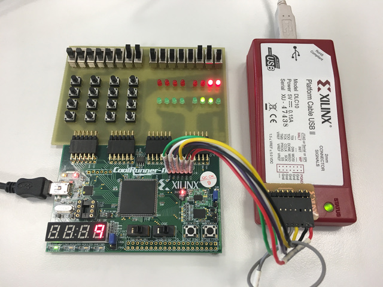
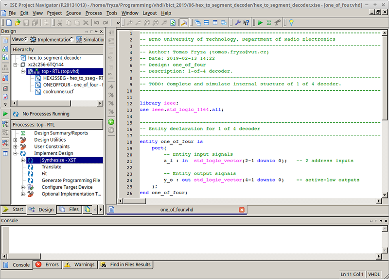

# Digital electronics 1

The repository contains VHDL examples for bachelor course [*Digital Electronics 1*](https://www.vutbr.cz/en/students/courses/detail/210628) at Brno University of Technology, Czechia. In folder `Docs` all manuals are stored. Folder `Docs/Hw` contains KiCad schematic of CPLD expansion board used in the course. All screenshots and images are located in `Images` folder and  computer lab exercises are located in `Labs` folder.

| **Laboratory exercise** | **Description** |
| :-- | :-- |
| [01-gates](Labs/01-gates) | Lab 1: Introduction to digital circuits |
| [02-ise](Labs/02-ise) | Lab 2: Introduction to VHDL and Xilinx ISE |
| [03-segment](Labs/03-segment) | Lab 3: Hex to seven-segment decoder |
| [04-adder](Labs/04-adder) | Lab 4: Binary adder |
| [05-counter_binary](Labs/05-counter_binary) | Lab 5: Binary counter |
| [06-display_driver](Labs/06-display_driver) | Lab 6: Driver for seven-segment display |
| [07-stopwatch](Labs/07-stopwatch) | Lab 7: Stopwatch |
| [08-traffic_lights](Labs/08-traffic_lights) | Lab 8: Traffic light controller |
| [project](Labs/project) | Lab 9-13: Project |

## Materials

The following hardware and software components are mainly used in the lab.

### Hardware

| **Component** | **Description** | **Manual** |
| :-: | :-- | :-: |
| [CoolRunner-II](https://store.digilentinc.com/coolrunner-ii-cpld-starter-board-limited-time/) | CoolRunner-II CPLD starter board ([XC2C256-TQ144](Docs/xc2c256_cpld.pdf)) | [Manual](Docs/coolrunner-ii_rm.pdf), [Schematic](Docs/coolrunner-ii_sch.pdf)
| [Platform Cable USB II](https://www.xilinx.com/products/boards-and-kits/hw-usb-ii-g.html) | USB tool for in-circuit configuration and programming of all Xilinx devices |
| CPLD board | CPLD expansion board by Michal Kubicek | [Schematic](Docs/cpld_expansion.pdf)

## Software

| **Component** | **Description** | **Manual** |
| :-: | :-- | :-: |
| [ISE Design](https://www.xilinx.com/products/design-tools/ise-design-suite/ise-webpack.html) | ISE WebPACK Design Software, ver 14.7 | [Installation](https://github.com/tomas-fryza/Digital-electronics-1/wiki)
| [Linux Mint](https://linuxmint.com/download_all.php) | Linux Mint 18.2 "Sonya" - Xfce (64-bit) |

## References

1. [Git, free and open source distributed version control system](https://git-scm.com/)
2. KALLSTROM, P. [A Fairly Small VHDL Guide](Docs/VHDL_guide.pdf). Version 2.1.
3. ASHENDEN, Peter J. *The designer's guide to VHDL.* 3rd ed. Boston: Morgan Kaufmann Publishers, c2008. ISBN 978-0-12-088785-9.
4. [Digital electronics 1 wiki](https://github.com/tomas-fryza/Digital-electronics-1/wiki)

## License

[MIT](https://choosealicense.com/licenses/mit/)
