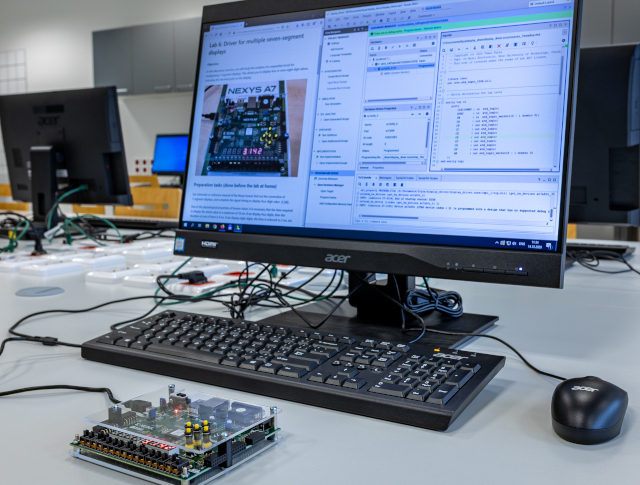

# VHDL course

<!--

  The Study of Modern and Developing Engineering BUT 
  CZ.02.2.69/0.0/0.0/18_056/0013325

-->

* [Installation](#installation)
* [Exercises](#exercises)
* [List of VHDL examples](#list-of-vhdl-examples)
* [Components](#components)

The repository contains VHDL lab exercises for bachelor course [*Digital Electronics*](https://www.vut.cz/en/students/courses/detail/268610) at Brno University of Technology, Czechia. [Nexys A7 Artix-7](https://store.digilentinc.com/nexys-a7-fpga-trainer-board-recommended-for-ece-curriculum/) FPGA board is used in the course.

## Installation

* [Vivado Design Suite 2020.2](https://github.com/tomas-fryza/vhdl-course/wiki/List-of-versions) (tens of GBs)

* [TerosHDL](https://github.com/tomas-fryza/vhdl-course/wiki/How-to-install-TerosHDL-on-Windows-and-Linux) :+1: (tens of MBs)

* [ghdl + GtkWave](https://github.com/tomas-fryza/vhdl-course/wiki/How-to-install-ghdl-on-Windows-and-Linux) (several MBs)

* [EDA Playground](https://edaplayground.com/) (online simulator, 0 Bytes)

* [ModelSim](https://www.intel.com/content/www/us/en/software-kit/750666/modelsim-intel-fpgas-standard-edition-software-version-20-1-1.html) (several GBs)

## Exercises

1. [Introduction to VHDL and basic gates](lab1-gates)
2. [Combinational logic circuits](lab2-logic)
3. Seven-segment display decoder
4. Arithmetic circuits
5. Latches and Flip-flops
6. Counters
7. Traffic light controller
8. [Project](project)

## List of VHDL examples

* [Basic gates in VHDL](https://www.edaplayground.com/x/5L92)
* [Binary comparator](https://www.edaplayground.com/x/5uu3)
* [Half/Full adder](https://www.edaplayground.com/x/2Jcz)
* [Seven-segment display](https://www.edaplayground.com/x/Vdpu)
* [Clock enable circuit](https://www.edaplayground.com/x/5LiJ)
* [N-bit Up/Down binary counter](https://www.edaplayground.com/x/5bgq)
* [Driver for 7-segment display](https://www.edaplayground.com/x/3f_A)
* [One-minute stopwatch](https://www.edaplayground.com/x/2uKg)
* [Traffic light controller](https://www.edaplayground.com/x/5HBi)

## Components

The following hardware and software components are mainly used in the lab.

* Boards:
  * [Nexys A7 Artix-7](https://store.digilentinc.com/nexys-a7-fpga-trainer-board-recommended-for-ece-curriculum/) FPGA Trainer Board: [reference manual](https://reference.digilentinc.com/reference/programmable-logic/nexys-a7/reference-manual), [schematic](docs/nexys-a7-sch.pdf), XC7A50T-1CSG324C [FPGA](docs/ds180_7Series_Overview.pdf), [Nexys-A7-50T-Master.xdc](https://github.com/Digilent/digilent-xdc/blob/master/Nexys-A7-50T-Master.xdc)

* Analyzers:
  * 24MHz 8-channel [logic analyzer](https://www.ebay.com/sch/i.html?LH_CAds=&_ex_kw=&_fpos=&_fspt=1&_mPrRngCbx=1&_nkw=24mhz%20logic%20analyzer&_sacat=&_sadis=&_sop=12&_udhi=&_udlo=): [software](https://www.saleae.com/)
  * Oscilloscope Keysight Technologies [DSOX3034T](https://www.keysight.com/en/pdx-x202175-pn-DSOX3034T/oscilloscope-350-mhz-4-analog-channels?&cc=CZ&lc=eng) (350 MHz, 4 analog channels), including 16 logic timing channels [DSOXT3MSO](https://www.keysight.com/en/pdx-x205238-pn-DSOXT3MSO/3000t-x-series-oscilloscope-mso-upgrade?cc=CZ&lc=eng) and serial protocol triggering and decode options [D3000BDLA](https://www.keysight.com/en/pd-2990560-pn-D3000BDLA/ultimate-software-bundle-for-the-3000a-t-x-series?&cc=CZ&lc=eng)

* Development tools:
  * [Vivado](https://www.xilinx.com/products/design-tools/vivado.html) Design Suite 2020.2: [installation](https://github.com/tomas-fryza/vhdl-course/wiki/List-of-versions)

  * [EDA Playground](https://www.edaplayground.com/playgrounds?searchString=Brno&_showAllResults=on&language=VHDL) is a cloud-based service that runs in your browser

  * [TerosHDL](https://terostechnology.github.io/terosHDLdoc/) is an open-source IDE for FPGA: [installation](https://github.com/tomas-fryza/vhdl-course/wiki/How-to-install-TerosHDL-on-Windows-and-Linux) :+1:

  * [ghdl + GtkWave](https://github.com/tomas-fryza/vhdl-course/wiki/How-to-install-ghdl-on-Windows-and-Linux)

* Other tool(s):
  * [git](https://git-scm.com/)

## References

1. [Digital electronics wiki](https://github.com/tomas-fryza/vhdl-course/wiki)

2. [How to install TerosHDL on Windows and Linux](https://github.com/tomas-fryza/vhdl-course/wiki/How-to-install-TerosHDL-on-Windows-and-Linux)

3. [How to install ghdl on Windows and Linux](https://github.com/tomas-fryza/vhdl-course/wiki/How-to-install-ghdl-on-Windows-and-Linux)

4. [How to install Vivado on Windows and Linux](https://github.com/tomas-fryza/vhdl-course/wiki/List-of-versions)

5. [ModelSim Installation on Ubuntu](https://gist.github.com/Razer6/cafc172b5cffae189b4ecda06cf6c64f)

6. [ES 4 VHDL reference sheet](docs/vhdl_cheatsheet.pdf)

7. Jeremiah C. Leary. [Welcome to vhdl-style-guide's documentation!](https://vhdl-style-guide.readthedocs.io/en/latest/)

8. ASHENDEN, Peter J. *The designer's guide to VHDL.* 3rd ed. Boston: Morgan Kaufmann Publishers, c2008. ISBN 978-0-12-088785-9.

9. CHU, Pong P. *FPGA prototyping by VHDL examples.* Hoboken, N.J.: Wiley-Interscience, c2008. ISBN 978-0-470-18531-5.

10. MANO, M. Morris. Digital Design: With an Introduction to the Verilog, HDL, VHDL, and System Verilog. Pearson, 6th edition, 2018. ISBN-13: 978-1292231167.

11. KALLSTROM, P. [A Fairly Small VHDL Guide](docs/VHDL_guide.pdf). Version 2.1.

12. [GitHub GIT CHEAT SHEET](docs/git_cheatsheet.pdf)

13. [Online VHDL Testbench Template Generator](https://vhdl.lapinoo.net/testbench/)

14. [VHDL Style Guide. Rules](https://vhdl-style-guide.readthedocs.io/en/latest/rules.html)
