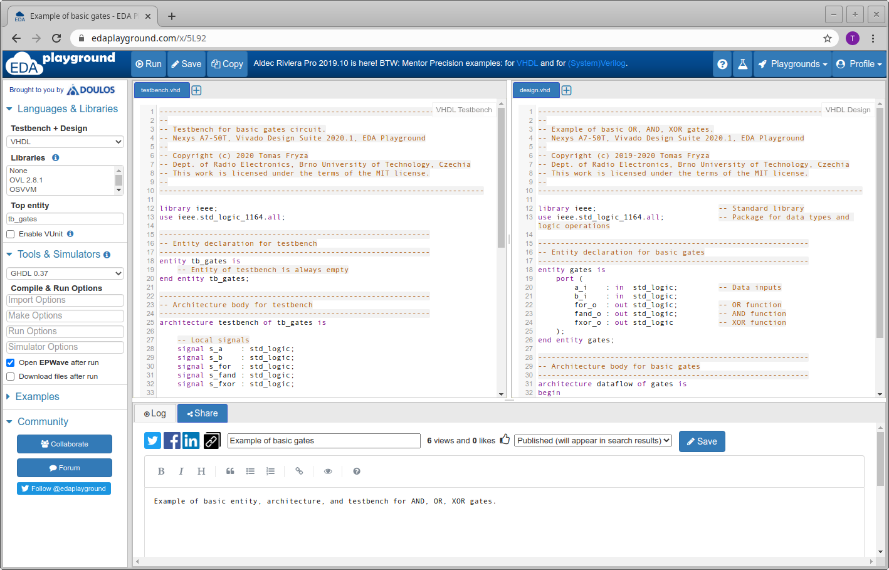
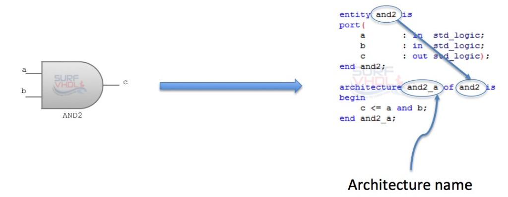
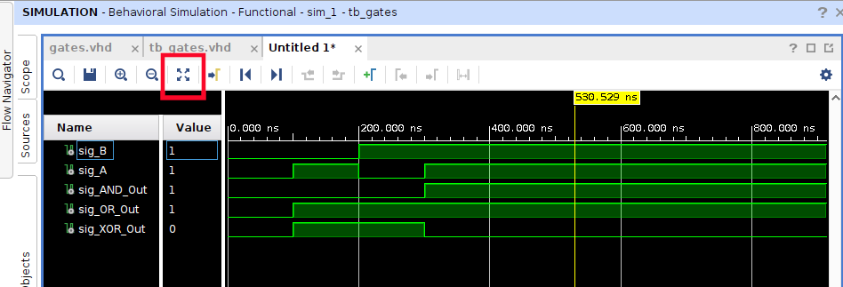
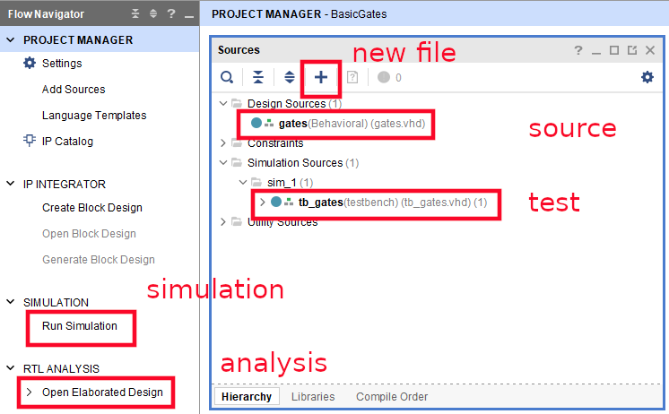
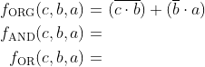
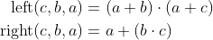

# Lab 1: Introduction to VHDL and basic gates

<!--

<p align="center">
  The Study of Modern and Developing Engineering BUT<br>
  CZ.02.2.69/0.0/0.0/18_056/0013325
</p>


-->

* [Pre-Lab preparation](#preparation)
* [Part 1: Vivado](#part1)
* [Part 2: DeMorgans laws](#part2)
* [Experiments on your own](#experiments)
* [References](#references)

### Learning objectives

After completing this lab you will be able to:

* Understand basic structure of VHDL files
* Use Vivado development tool

In this laboratory exercise, you will learn how to compose a basic VHDL code using Vivado development tool.

<a name="preparation"></a>

## Pre-Lab preparation

1. Remind yourself the AND, OR, XOR gates.

2. Optional: If you want to use online [EDA Playground](https://www.edaplayground.com) tool, you will need Google account, Facebook account, or register your account on EDA Playground.

<a name="part1"></a>

## Part 1: Vivado

[VHDL (VHSIC Hardware Description Language)](https://ieeexplore.ieee.org/document/8938196) is a programming language used to describe the behavior and structure of digital circuits. The acronym VHSIC (Very High Speed Integrated Circuits) in the language's name comes from the U.S. government program that funded early work on the standard. VHDL is a formal notation intended for use in all phases of the creation of electronic systems. Since it is both machine and human readable, it supports the design, development, verification, synthesis, and testing of hardware designs; the communication of hardware design data; and the maintenance, modification, and procurement of hardware.

 > **Note:** IEEE standards for VHDL language:
 > * IEEE Std 1076-1987
 > * IEEE Std 1076-1993
 > * IEEE Std 1076-2002
 > * IEEE Std 1076-2008
 > * IEEE Std 1076-2019

[Vivado Design Suite](https://www.xilinx.com/products/design-tools/vivado.html) is a comprehensive design environment developed by Xilinx (AMD) for the design, analysis, and implementation of programmable logic devices, such as FPGAs (Field-Programmable Gate Arrays) and SoCs (System on Chips). It provides a set of tools and features for digital design, synthesis, simulation, and implementation of electronic systems.

1. Run Vivado and create a new project:

   * Project name: `BasicGates`
   * Project location: your working folder, such as `Documents`
   * Project type: **RTL Project**
   * Create a new VHDL source file: `gates`
   * Do not add any constraints now
   * Choose a default board: `Nexys A7-50T` (will be used later in the lab)
   * Click **Finish** to create the project
   * Define I/O ports of new module `gates`:
      * Port name: `A`, Direction: `in`
      * `B`, `in`
      * `AND_Out`, `out`
      * `OR_Out`, `out`
      * `XOR_Out`, `out`

2. Open generated `gates.vhd` file in **Design Sources** and complete the `architecture` part as follows.

   ```vhdl
   library IEEE;
   use IEEE.STD_LOGIC_1164.ALL;

   entity gates is
      Port (
         A, B : in  STD_LOGIC;
         AND_Out, OR_Out, XOR_Out : out  STD_LOGIC
      );
   end gates;

   architecture Behavioral of gates is
   begin
      -- 2-input AND gate
      AND_Out <= A and B;

      -- 2-input OR gate
      OR_Out <= A or B;

      -- XOR gate
      XOR_Out <= A xor B;

   end Behavioral;
   ```

   > **Help:** The `std_logic` type provides several values.
   > 
   > ```vhdl
   >     TYPE std_logic IS ( 'U',  -- Uninitialized state used as a default value
   >                         'X',  -- Forcing unknown
   >                         '0',  -- Forcing zero. Transistor driven to GND
   >                         '1',  -- Forcing one. Transistor driven to VCC
   >                         'Z',  -- High impedance. 3-state buffer outputs
   >                         'W',  -- Weak unknown. Bus terminators
   >                         'L',  -- Weak zero. Pull down resistors
   >                         'H',  -- Weak one. Pulll up resistors
   >                         '-'   -- Don't care state used for synthesis and advanced modeling
   >                       );
   > ```

3. Take a look at the basic parts of the VHDL source code, such as [entity](https://github.com/tomas-fryza/vhdl-course/wiki/Entity), [architecture](https://github.com/tomas-fryza/vhdl-course/wiki/Architecture), and testbench.

   

   The usefull VHDL operators are shown in the table.

   | **Operator** | **Description** |
   | :-: | :-- |
   | `<=` | Value assignment |
   | `and` | Logical AND |
   | `nand` | Logical AND with negated output |
   | `or` | Logical OR |
   | `nor` | Logical OR with negated output |
   | `not` | Negation |
   | `xor` | Exclusive OR |
   | `xnor` | Exclusive OR with negated output |
   | `-- comment` | Comments |

4. Use **File** > **Add Sources... Alt+A** > **Add or create simulation sources** and create a new VHDL file `tb_gates` (same filename as tested entity with prefix `tb_`). This time, click **OK** to define an empty module. You will find the new simulation file in **Simulation Sources > sim_1**.

   You can generate the testbench file by [online generator](https://vhdl.lapinoo.net/testbench/) and complete the test cases or copy/paste the following testbench to `tb_gates.vhd` file. **Important:** Make sure you are modifying `tb_*.vhd` file!

   ```vhdl
   library IEEE;
   use IEEE.STD_LOGIC_1164.ALL;

   entity tb_gates is
     -- Entity of testbench is always empty
   end tb_gates;

   architecture testbench of tb_gates is

      component gates is
         port (A       : in std_logic;
               B       : in std_logic;
               AND_Out : out std_logic;
               OR_Out  : out std_logic;
               XOR_Out : out std_logic
         );
      end component;

      signal sig_A, sig_B : STD_LOGIC;
      signal sig_AND_Out, sig_OR_Out, sig_XOR_Out : STD_LOGIC;

   begin
      -- Instantiate the design under test (DUT)
      DUT : gates
         port map (
            sig_A, sig_B,
            sig_AND_Out, sig_OR_Out, sig_XOR_Out
         );

      -- Test stimulus
      stimulus_process: process
      begin
         sig_B <= '0'; sig_A <= '0'; wait for 100 ns;
         sig_B <= '0'; sig_A <= '1'; wait for 100 ns;
         sig_B <= '1'; sig_A <= '0'; wait for 100 ns;
         sig_B <= '1'; sig_A <= '1'; wait for 100 ns;

         wait;
      end process stimulus_process;

   end testbench;
   ```

4. Use **Flow** > **Run Simulation** > **Run Behavioral Simulation** and run Vivado simulator. To see the whole simulated signals, it is recommended to select **View > Zoom Fit**.

   

   > To cleanup generated files, close simulation window, right click to SIMULATION or Run Simulation option, and select **Reset Behavioral Simulation**.
   >
   > 

5. Use **Flow** > **Open Elaborated design** and see the schematic after RTL analysis. Note that RTL (Register Transfer Level) represents digital circuit at the abstract level.

   

   

<a name="part2"></a>

## Part 2: DeMorgans laws

De Morgan's laws are two fundamental rules in Boolean algebra that are used to simplify Boolean expressions. There are two versions of De Morgan's laws. De Morgan's law for AND: The complement of the product of two operands is equal to the sum of the complements of the operands. De Morgan's law for OR: The complement of the sum of two operands is equal to the product of the complements of the operands.

1. Use De Morgan's laws and modify the original function to the form with NAND and NOR gates only.

<!--
   > **Help:** De Morgan's laws are defined as follows:
   >
   > 
-->

   <!--
   \begin{align*}
      \overline{a\cdot b} =&~ \overline{a} + \overline{b}\\
      \overline{a+b} =&~ \overline{a}\cdot \overline{b}\\
   \end{align*}
   -->

   

   > Note that the figure with the equations above was generated by [Online LaTeX Equation Editor](https://www.codecogs.com/latex/eqneditor.php) using the following code.
   >
   > ```LaTeX
   > \begin{align*}
   >    f_{\textup{ORIG}}(c,b,a) =&~ (\overline{c\cdot b}) + (\overline{b}\cdot a)\\
   >    f_{\textup{(N)AND}}(c,b,a) =&\\
   >    f_{\textup{(N)OR}}(c,b,a) =&\\
   > \end{align*}
   > ```

2. Create a new Vivado project `deMorgan` and source file `demorgan.vhd` with the following I/O ports:

   * Port name: `a`, Direction: `in`
   * `b`, `in`
   * `c`, `in`
   * `f_orig`, `out`
   * `f_nand`, `out`
   * `f_nor`, `out`

   Get inspired by [Example of basic gates](https://www.edaplayground.com/x/5L92) from EDA Playground, complete the `architecture`, add new simulation source file `tb_demorgan.vhd`, and verify all three functions in Vivado simulator.

<a name="experiments"></a>

## Experiments on your own

1. In Vivado, verify the Distributive laws:

   First Distributive law:

   

   Second Distributive law:

   

<!--
\begin{align*}
   \textup{left}(c,b,a)  =&~a\cdot b + a\cdot c\\
   \textup{right}(c,b,a) =&~a\cdot (b+c)\\
\end{align*}
-->
<!--
\begin{align*}
    \textup{left}(c,b,a)  =&~(a+b)\cdot (a+c)\\
    \textup{right}(c,b,a) =&~a+ (b\cdot c)\\
\end{align*}
-->

2. Apart from the professional Vivado tool that takes up a significant amount of local disk storage, there are other simulation tools available, such as TerosHDL and ghdl.

   TerosHDL is a high-performance VHDL simulator that is designed for FPGA and ASIC design. It is known for its speed and accuracy, and it is often used for large-scale designs. GHDL is a free and open-source VHDL simulator that is a popular choice for hobbyists and students. It is a good option for learning VHDL and for simulating small-scale designs.

   * [How to install TerosHDL on Windows and Linux](https://github.com/tomas-fryza/vhdl-course/wiki/How-to-install-TerosHDL-on-Windows-and-Linux)
   * [How to install ghdl on Windows and Linux](https://github.com/tomas-fryza/vhdl-course/wiki/How-to-install-ghdl-on-Windows-and-Linux)

3. You can also try several online graphics simulators, such as [CircuitVerse](https://circuitverse.org/), [Logicly](https://logic.ly/), [CircuitLab](https://www.circuitlab.com/), [simulatorIO](https://simulator.io/), [LogicEmu](https://lodev.org/logicemu/), and compare their options.

<a name="references"></a>

## References

1. Tomas Fryza. [Example of basic OR, AND, XOR gates](https://www.edaplayground.com/x/5L92)

2. CodeCogs. [Online LaTeX Equation Editor](https://www.codecogs.com/latex/eqneditor.php)

3. CircuitVerse. [Online Digital Logic Circuit Simulator](https://circuitverse.org/)

4. Bowler Hat LLC. [Logicly - A logic circuit simulator for Windows and macOS](https://logic.ly/)

5. CircuitLab, Inc. [Online circuit simulation & schematic editor](https://www.circuitlab.com/)

6. Bastian Born. [simulatorIO - Build and simulate logic circuits](https://simulator.io/)

7. Lode Vandevenne. [LogicEmu: Online Logic Simulator](https://lodev.org/logicemu/)

8. [Online VHDL Testbench Template Generator](https://vhdl.lapinoo.net/testbench/)
