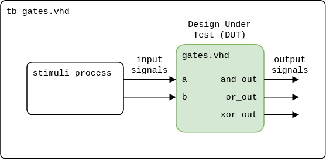

# Lab 1: Introduction to VHDL and Vivado

<!--

<p align="center">
  The Study of Modern and Developing Engineering BUT<br>
  CZ.02.2.69/0.0/0.0/18_056/0013325
</p>


-->

* [Pre-Lab preparation](#preparation)
* [Part 1: Vivado](#part1)
* [Part 2: DeMorgans laws](#part2)
* [Challenges](#challenges)
* [References](#references)

### Learning ojectives

* Describe the main parts of a VHDL file
* Use Vivado development tool
* Be able to create a simulation testbenche and run the simulation

<a name="preparation"></a>

## Pre-Lab preparation

1. Remind yourself the AND, OR, XOR gates.

2. Optional: If you want to use online [EDA Playground](https://www.edaplayground.com) tool, you will need Google account, Facebook account, or register your account on EDA Playground.

<a name="part1"></a>

## Part 1: Vivado

[VHDL (VHSIC Hardware Description Language)](https://ieeexplore.ieee.org/document/8938196) is a programming language used to describe the behavior and structure of digital circuits. The acronym VHSIC (Very High Speed Integrated Circuits) in the language's name comes from the U.S. government program that funded early work on the standard. VHDL is a formal notation intended for use in all phases of the creation of electronic systems. Since it is both machine and human readable, it supports the design, development, verification, synthesis, and testing of hardware designs; the communication of hardware design data; and the maintenance, modification, and procurement of hardware.

 > **Note:** IEEE standards for VHDL language:
 > * IEEE Std 1076-1987
 > * IEEE Std 1076-1993
 > * IEEE Std 1076-2002
 > * IEEE Std 1076-2008
 > * IEEE Std 1076-2019

[Vivado Design Suite](https://www.xilinx.com/products/design-tools/vivado.html) is a comprehensive design environment developed by Xilinx (AMD) for the design, analysis, and implementation of programmable logic devices, such as FPGAs (Field-Programmable Gate Arrays) and SoCs (System on Chips). It provides a set of tools and features for digital design, synthesis, simulation, and implementation of electronic systems.

1. Run Vivado and create a new project:

   1. Project name: `BasicGates`
   2. Project location: your working folder, such as `Documents`
   3. Project type: **RTL Project**
   4. Create a new VHDL source file: `gates`
   5. Do not add any constraints now
   6. Choose a default board: `Nexys A7-50T` (will be used later in the lab)
   7. Click **Finish** to create the project
   8. Define I/O ports of new module `gates`:
      * Port name: `a`, Direction: `in`
      * `b`, `in`
      * `and_out`, `out`
      * `or_out`, `out`
      * `xor_out`, `out`

2. Open generated `gates.vhd` file in **Design Sources** and complete the `architecture` part as follows.

   ```vhdl
   library ieee;
   use ieee.std_logic_1164.all;

   entity gates is
       port (
           a       : in  std_logic;
           b       : in  std_logic;
           and_out : out std_logic;
           or_out  : out std_logic;
           xor_out : out std_logic
       );
   end gates;

   architecture Behavioral of gates is

       -- Declaration part, can be empty

   begin
       -- Architecture body

       -- 2-input AND gate
       and_out_ <= a and b;

       -- 2-input OR gate
       or_out_ <= a or b;

       -- XOR gate
       xor_out_ <= a xor b;

   end Behavioral;
   ```

   > **Help:** The `std_logic` type provides several values.
   > 
   > ```vhdl
   > TYPE std_logic IS (
   >     'U',  -- Uninitialized state used as a default value
   >     'X',  -- Forcing unknown
   >     '0',  -- Forcing zero. Transistor driven to GND
   >     '1',  -- Forcing one. Transistor driven to VCC
   >     'Z',  -- High impedance. 3-state buffer outputs
   >     'W',  -- Weak unknown. Bus terminators
   >     'L',  -- Weak zero. Pull down resistors
   >     'H',  -- Weak one. Pulll up resistors
   >     '-'   -- Don't care state used for synthesis and advanced modeling
   > );
   > ```

3. Take a look at the basic parts of the VHDL source code, such as [entity](https://github.com/tomas-fryza/vhdl-course/wiki/Entity), [architecture](https://github.com/tomas-fryza/vhdl-course/wiki/Architecture), and testbench.

   The usefull VHDL operators are shown in the table.

   | **Operator** | **Description** |
   | :-: | :-- |
   | `<=` | Value assignment |
   | `and` | Logical AND |
   | `nand` | Logical AND with negated output |
   | `or` | Logical OR |
   | `nor` | Logical OR with negated output |
   | `not` | Negation |
   | `xor` | Exclusive OR |
   | `xnor` | Exclusive OR with negated output |
   | `-- comment` | Comments |

4. The primary approach to testing VHDL designs involves creating a **testbench**. A testbench is essentially a separate VHDL file that stimulates the design under test (DUT) with various input values and monitors its outputs to verify correct functionality. The testbench typically includes DUT component instantiation and stimulus generation.

   

   Navigate to **File > Add Sources... Alt+A > Add or create simulation sources** and proceed to create a new VHDL file named `tb_gates` (ensuring it has the same filename as the tested entity but prefixed with `tb_`). This time, click **OK** to define an empty module. Subsequently, locate the newly created simulation file under **Simulation Sources > sim_1**.

   Generate the testbench file using the [online generator](https://vhdl.lapinoo.net/testbench/), then copy and paste its contents into your `tb_gates.vhd` file. Afterwards, fill in the test cases within the `stimuli` process.

   ```vhdl
       ...
       stimuli : process
       begin
           -- EDIT Adapt initialization as needed
           b <= '0';
           a <= '0';
           wait for 100 ns;

           -- EDIT Add stimuli here


           wait;
       end process;

   end tb;
   ```

4. Use **Flow > Run Simulation > Run Behavioral Simulation** and run Vivado simulator. To see the whole simulated signals, it is recommended to select **View > Zoom Fit**.

   

   > **Note:** To cleanup generated files, close simulation window, right click to SIMULATION or Run Simulation option, and select **Reset Behavioral Simulation**.
   >
   > 

5. Use **Flow > Open Elaborated design** and see the schematic after RTL analysis. Note that RTL (Register Transfer Level) represents digital circuit at the abstract level.

   

   

<a name="part2"></a>

## Part 2: DeMorgans laws

De Morgan's laws are two fundamental rules in Boolean algebra that are used to simplify Boolean expressions. There are two versions of De Morgan's laws. De Morgan's law for AND: The complement of the product of two operands is equal to the sum of the complements of the operands. De Morgan's law for OR: The complement of the sum of two operands is equal to the product of the complements of the operands.

1. Use De Morgan's laws and modify the original function into a form with AND, OR, or NAND, NOR gates.

<!--
   > **Help:** De Morgan's laws are defined as follows:
   >
   > 
-->

   <!--
   \begin{align*}
      \overline{a\cdot b} =&~ \overline{a} + \overline{b}\\
      \overline{a+b} =&~ \overline{a}\cdot \overline{b}\\
   \end{align*}
   -->

   

   > Note that the figure with the equations above was generated by [Online LaTeX Equation Editor](https://www.codecogs.com/latex/eqneditor.php) using the following code.
   >
   > ```LaTeX
   > \begin{align*}
   >    f_{\textup{ORG}}(c,b,a) =&~ (\overline{c\cdot b}) + (\overline{b}\cdot a)\\
   >    f_{\textup{AND}}(c,b,a) =&\\
   >    f_{\textup{OR}}(c,b,a) =&\\
   > \end{align*}
   > ```

2. Create a new Vivado project `deMorgan` and source file `demorgan.vhd` with the following I/O ports:

   * Port name: `a`, Direction: `in`
   * `b`, `in`
   * `c`, `in`
   * `f_org`, `out`
   * `f_and`, `out`
   * `f_or`, `out`

   Get inspired by [Example of basic gates](https://www.edaplayground.com/x/5L92) from EDA Playground, complete the `architecture`, add new simulation source file `tb_demorgan.vhd`, and verify all three functions in Vivado simulator.

3. Use **Flow > Open Elaborated design** and see the schematic after RTL analysis.

<a name="challenges"></a>

## Challenges

1. Choose one of the distributive laws and verify, using VHDL, that both sides of the equation represent the same logic function.

   First Distributive law:

   

   Second Distributive law:

   

<!--
\begin{align*}
   \textup{left}(c,b,a)  =&~a\cdot b + a\cdot c\\
   \textup{right}(c,b,a) =&~a\cdot (b+c)\\
\end{align*}
-->
<!--
\begin{align*}
    \textup{left}(c,b,a)  =&~(a+b)\cdot (a+c)\\
    \textup{right}(c,b,a) =&~a+ (b\cdot c)\\
\end{align*}
-->

2. You can also try several online graphics simulators, such as [CircuitVerse](https://circuitverse.org/), [Logicly](https://logic.ly/), [CircuitLab](https://www.circuitlab.com/), [simulatorIO](https://simulator.io/), [LogicEmu](https://lodev.org/logicemu/) to simulate logic circuits.

3. In addition to the professional Vivado tool, which requires significant local disk storage, other simulation tools are available, including TerosHDL and ghdl.

   TerosHDL is an open-source tool designed to streamline FPGA development by providing a unified workflow for simulation and synthesis using VHDL. GHDL is a free and open-source VHDL simulator that is a popular choice for hobbyists and students. It is a good option for learning VHDL and for simulating small-scale designs.

   * Try to [install TerosHDL](https://github.com/tomas-fryza/vhdl-course/wiki/How-to-install-TerosHDL-on-Windows-and-Linux) on Windows or Linux
   * Try to [install ghdl](https://github.com/tomas-fryza/vhdl-course/wiki/How-to-install-ghdl-on-Windows-and-Linux) on Windows or Linux

<a name="references"></a>

## References

1. Real Digital. [Creating Your First Project in Vivado](https://www.realdigital.org/doc/4ddc6ee53d1a2d71b25eaccc29cdec4b)

2. Tomas Fryza. [Example of basic OR, AND, XOR gates](https://www.edaplayground.com/x/5L92)

3. CodeCogs. [Online LaTeX Equation Editor](https://www.codecogs.com/latex/eqneditor.php)

4. CircuitVerse. [Online Digital Logic Circuit Simulator](https://circuitverse.org/)

5. [Online VHDL Testbench Template Generator](https://vhdl.lapinoo.net/testbench/)

6. Xilinx University Program. [Vivado FPGA Design Flow on Zynq](https://github.com/xupgit/FPGA-Design-Flow-using-Vivado)
