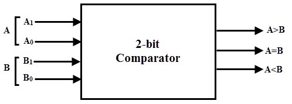
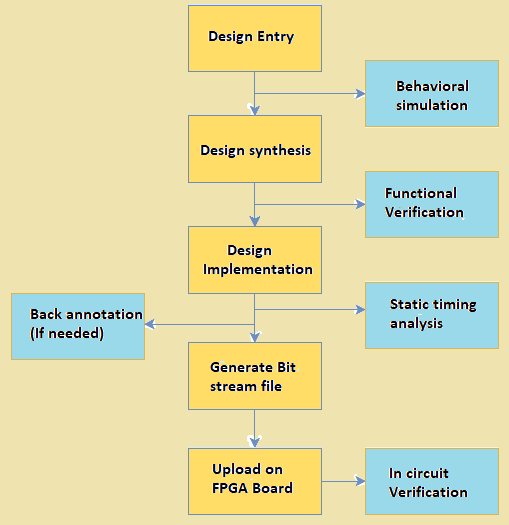
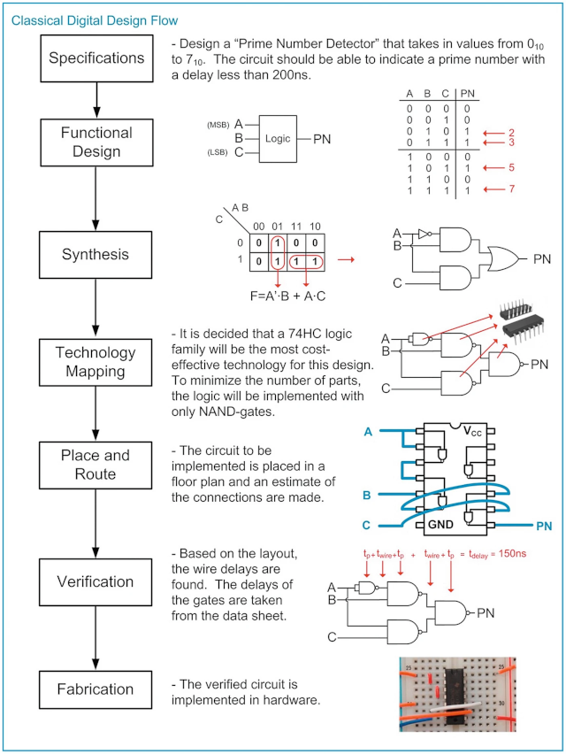

# Lab 2: Combinational logic circuits

* [Pre-Lab preparation](#preparation)
* [Part 1: Logic function minimization](#part1)
* [Part 2: Binary comparator in VHDL language](#part2)
* [Part 3: Assertion statements in VHDL testbench](#part3)
* [Part 4: Implementing to FPGA](#part4)
* [Challenges](#challenges)
* [References](#references)

### Learning objectives

After completing this lab you will be able to:

* Use truth table, K-map, SoP/PoS forms of logic functions
* Minimize logic functions
* Understand signal assignments in VHDL
* Use VHDL assertion statements for testing

The purpose of this laboratory exercise is to learn to use different ways of writing combination functions (truth table, K-map, SoP/PoS forms), their minimization, the use of signal assignments in VHDL, and assertion statements in VHDL testbench.

<a name="preparation"></a>

## Pre-Lab preparation

*Digital* or *Binary comparator* compares the digital signals A, B presented at input terminal and produce outputs depending upon the condition of those inputs.



1. Complete the truth table for 2-bit *Identity comparator* (B equals A), and two *Magnitude comparators* (B is greater than A, A is greater than B). Note that, such a digital device has four inputs and three outputs/functions.

   | **Dec. equivalent** | **B[1:0]** | **A[1:0]** | **B is greater than A** | **B equals A** | **A is greater than B** |
   | :-: | :-: | :-: | :-: | :-: | :-: |
   |  0 | 0 0 | 0 0 | 0 | 1 | 0 |
   |  1 | 0 0 | 0 1 | 0 | 0 | 1 |
   |  2 | 0 0 | 1 0 | 0 | 0 | 1 |
   |  3 | 0 0 | 1 1 | 0 | 0 | 1 |
   |  4 | 0 1 | 0 0 |  | 0 |  |
   |  5 | 0 1 | 0 1 |  | 1 |  |
   |  6 | 0 1 | 1 0 |  | 0 |  |
   |  7 | 0 1 | 1 1 |  | 0 |  |
   |  8 | 1 0 | 0 0 |  | 0 |  |
   |  9 | 1 0 | 0 1 |  | 0 |  |
   | 10 | 1 0 | 1 0 |  | 1 |  |
   | 11 | 1 0 | 1 1 |  | 0 |  |
   | 12 | 1 1 | 0 0 |  | 0 |  |
   | 13 | 1 1 | 0 1 |  | 0 |  |
   | 14 | 1 1 | 1 0 |  | 0 |  |
   | 15 | 1 1 | 1 1 |  | 1 |  |

<a name="part1"></a>

## Part 1: Logic function minimization

*[Karnaugh Maps](https://learnabout-electronics.org/Digital/dig24.php) (or K-maps) offer a graphical method of reducing a digital circuit to its minimum number of gates. The map is a simple table containing `1`s and `0`s that can express a truth table or complex Boolean expression describing the operation of a digital circuit.*

The K-map for the "equals" function is as follows:

   

1. Create K-maps for other two functions.

    &nbsp;  &nbsp;  &nbsp;  &nbsp;
   

2. Use K-maps to create simplified SoP and PoS forms of both "greater than" functions.

<a name="part2"></a>

## Part 2: Binary comparator in VHDL language

1. Run Vivado and create a new project:

   1. Project name: `comparator`
   2. Project location: your working folder, such as `Documents`
   3. Project type: **RTL Project**
   4. Create a new VHDL source file: `compare_2bit`
   5. Do not add any constraints now
   6. Choose a default board: `Nexys A7-50T`
   7. Click **Finish** to create the project
   8. Define I/O ports of new module:
      * Port name: `a`, Direction: `in`, Bus: `check`, MSB: `1`, LSB: `0`
      * `b`, `in`, Bus: `check`, MSB: `1`, LSB: `0`
      * `b_greater`, `out`
      * `b_a_equal`, `out`
      * `a_greater`, `out`

   > **Note:** The [entity](https://github.com/tomas-fryza/vhdl-course/wiki/Entity) for a 2-bit binary comparator in `compare_2bit.vhd` therefore coresponds to the following table.
   >
   > | **Port name** | **Direction** | **Type** | **Description** |
   > | :-: | :-: | :-- | :-- |
   > | `b`       | input  | [`std_logic_vector(1 downto 0)`](https://github.com/tomas-fryza/vhdl-course/wiki/Data-types) | Input bus b[1:0] |
   > | `a`       | input  | `std_logic_vector(1 downto 0)` | Input bus a[1:0] |
   > | `b_greater` | output | `std_logic` | Output is `1` if b > a |
   > | `b_a_equal` | output | `std_logic` | Output is `1` if b = a |
   > | `a_greater` | output | `std_logic` | Output is `1` if b < a |

2. In VHDL, define an [architecture](https://github.com/tomas-fryza/vhdl-course/wiki/Architecture) for a 2-bit binary comparator. The combination logic can be written using low-level operators (`and`, `or`, etc.) as assignment statements using SoP or PoS logic. However, it is more efficient to use a higher notation with [conditional signal assignments](https://github.com/tomas-fryza/vhdl-course/wiki/Signal-assignments).

   ```vhdl
   architecture behavioral of compare_2bit is
   begin

     -- MODIFY LOGIC FUNCTION FOR "B GREATER"
     b_greater <= b(1) and a(1);

     b_a_equal <= '1' when (b = a) else
                  '0';

     -- MODIFY LOGIC FUNCTION FOR "A GREATER"
     a_greater <= b(0) or a(0);

   end architecture behavioral;
   ```

   One function is provided, but you must complete the other two: write one as a VHDL assignment statement using SoP or Pos logic, and the second as a conditional signal assignment.

3. Use **File** > **Add Sources... Alt+A** > **Add or create simulation sources** and create a new VHDL file `tb_compare_2bit` (same filename as tested entity with prefix `tb_`). Generate the testbench file by [online generator](https://vhdl.lapinoo.net/testbench/) or copy/paste it from the [EDA Playground template](https://www.edaplayground.com/x/5uu3). Complete the stimuli process by several test cases.

   ```vhdl
   stimuli : process
   begin
     -- EDIT Adapt initialization as needed
     b <= "00";
     a <= "00";
     wait for 100 ns;

     -- EDIT Add stimuli here

     wait;
   end process;
   ```

<a name="part3"></a>

## Part 3: Assertion statements in VHDL testbench

You can write any information to the console using the **report statement**. The basic syntax in VHDL is:

   ```vhdl
   report <message_string> [severity <severity_level>];
   ```

where possible values for `severity_level` are: `note`, `warning`, `error`, `failure`. If the severity level is omitted, then the default value is `note`. The following two statements are therefore equivalent:

   ```vhdl
   report "Stimulus process started" severity note;
   report "Stimulus process started";
   ```

An **assertion statement** checks that a specified condition is true and reports an error if it is not. It can be combined with a report statement as follows:

   ```vhdl
   assert (<condition>)
     report <message_string> [severity <severity_level>];
   ```

The message is displayed to the console when the condition is NOT met, therefore the message should be an opposite to the condition.

   ```vhdl
   -------------------------------------------------
   p_stimulus : process is
   begin

     -- Report a note at the beginning of stimulus process
     report "Stimulus process started";

     -- Test case is followed by the expected output
     -- value(s). If assert condition is false, then
     -- an error is reported to the console.
     b <= "00";
     a <= "00";
     wait for 100 ns;
     assert (
         (b_greater = '0') and
         (b_a_equal = '1') and
         (a_greater = '0')
       )
       report "Input combination b=0, a=0 FAILED"
       severity error;


     -- WRITE OTHER TEST CASES AND ASSERTS HERE


     report "Stimulus process finished";

     -- Data generation process is suspended forever
     wait;

   end process p_stimulus;
   ```

1. In VHDL, write a testbench and verify the correct functionality of the comparator for all/selected input combinations.

<a name="part4"></a>

## Part 4: Implementing to FPGA

The Nexys A7 board provides sixteen switches and LEDs. The switches can be used to provide inputs, and the LEDs can be used as output devices.

1. See [schematic](https://github.com/tomas-fryza/vhdl-course/blob/master/docs/nexys-a7-sch.pdf) or [reference manual](https://reference.digilentinc.com/reference/programmable-logic/nexys-a7/reference-manual) of the Nexys A7 board and find out the connection of slide switches and LEDs, ie to which FPGA pins are connected and how.

2. The Nexys A7 board have hardwired connections between FPGA chip and the switches and LEDs. To use these devices it is necessary to include in your project the correct pin assignments:

   1. Create a new constraints source `nexys-a7-50t` (XDC file).
   2. Copy/paste default constraints from [Nexys-A7-50T-Master.xdc](https://raw.githubusercontent.com/Digilent/digilent-xdc/master/Nexys-A7-50T-Master.xdc) to `nexys-a7-50t.xdc` file.
   3. The pin assignments in the file are useful only if the pin names that appear in this file are exactly the same as the port names used in your VHDL entity. Uncomment any 2 switches for inputs `a[0]`, `a[1]`, other 2 switches for `b[0]`, `b[1]`, and 3 LEDs for logic functions `b_greater`, `b_a_equal`, and `a_greater`. Part of XDC file can be as follows:

      ```xdc
      ## Switches
      set_property -dict { PACKAGE_PIN J15   IOSTANDARD LVCMOS33 } [get_ports { a[0] }];  # Sch=sw[0]
      set_property -dict { PACKAGE_PIN L16   IOSTANDARD LVCMOS33 } [get_ports { a[1] }];  # Sch=sw[1]
      ...

      ## LEDs
      set_property -dict { PACKAGE_PIN H17   IOSTANDARD LVCMOS33 } [get_ports { a_greater }];  # Sch=led[0]
      ...
      ```

3. Implement your design to Nexys A7 board:

   1. Use **Flow > Generate Bitstream** (the process is time consuming and can take tens of seconds).
   2. Select **Open Hardware Manager**.
   3. Click on **Open Target > Auto Connect** (make sure Nexys A7 board is connected and switched on).
   4. Click on **Program device** and select generated bitstream `YOUR-PROJECT-FOLDER/comparator.runs/impl_1/comparator.bit`.
   5. Test the functionality by toggling the switches and observing LEDs.

      

<a name="challenges"></a>

## Challenges

1. Extend your design to 4-bit comparator. (Hint: Use conditional signal assignments `when/else`.)

2. Design a [*Prime number detector*](https://link.springer.com/chapter/10.1007/978-3-030-10552-5_1) that takes in values from 0 to 15.

   

3. Use onboard RGB LED and eight switches. Turn the green LED on only when exactly two of the first four switches are set to `1` and turn the red LED on when exactly three of the next four switches are set to `0`.


<a name="references"></a>

## References

1. Eric Coates. [Karnaugh Maps](https://learnabout-electronics.org/Digital/dig24.php)

2. Tomas Fryza. [Example of 2-bit binary comparator using the when/else assignments](https://www.edaplayground.com/x/5uu3)
