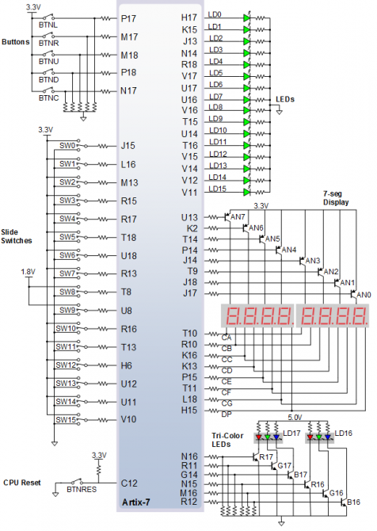
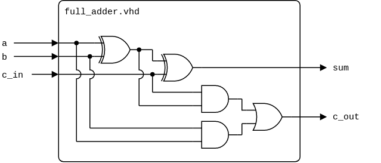
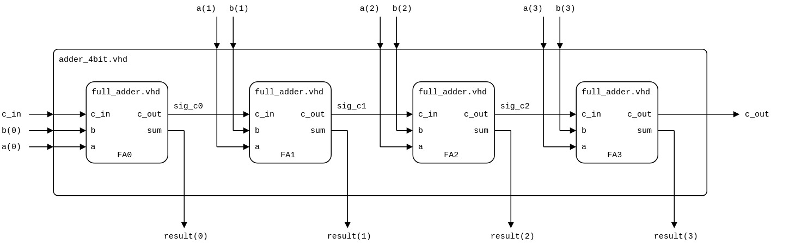
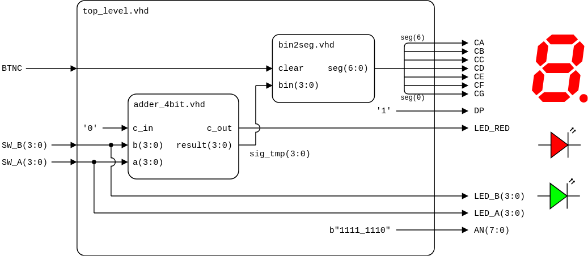
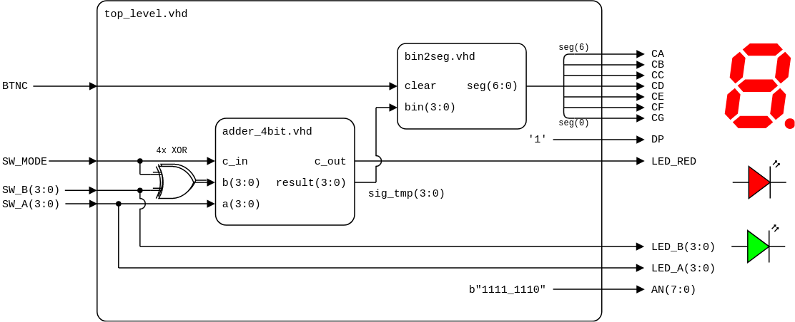

# Lab 4: Arithmetic circuits

* [Pre-Lab preparation](#preparation)
* [Part 1: VHDL code for full adder](#part1)
* [Part 2: VHDL code for 4-bit adder](#part2)
* [Part 3: Top level VHDL code](#part3)
* [Challenges](#challenges)
* [References](#references)

### Learning objectives

After completing this lab you will be able to:

* Understand half- and full-adders
* Practice instantiating VHDL sub-components
* Construct a ripple carry adder

<a name="preparation"></a>

## Pre-Lab preparation

A **half adder** has two one-bit inputs A and B and consists of two outputs Carry and Sum. Complete the half adder truth table. Draw a logic diagram of both output functions. A **full adder** extend inputs to three signal: A, B, and input Carry and also has two outputs: output Carry and Sum. Basicaly, carry and sum represent 2-bit result of addition operation.

1. Complete the full adder truth table.

   | **C_in** | **B** | **A** | **C_out** | **Sum** | **Dec. equivalent** |
   | :-: | :-: | :-: | :-: | :-: | :-: |
   | 0 | 0 | 0 | 0 | 0 | 0 |
   | 0 | 0 | 1 | 0 | 1 | 1 |
   | 0 | 1 | 0 |  |  |  |
   | 0 | 1 | 1 |  |  |  |
   | 1 | 0 | 0 |  |  |  |
   | 1 | 0 | 1 |  |  |  |
   | 1 | 1 | 0 | 1 | 0 | 2 |
   | 1 | 1 | 1 | 1 | 1 | 3 |

2. See [schematic](https://github.com/tomas-fryza/vhdl-course/blob/master/docs/nexys-a7-sch.pdf) or [reference manual](https://reference.digilentinc.com/reference/programmable-logic/nexys-a7/reference-manual) of the Nexys A7 board and find out the connection of RGB LEDs and how to turn them on and off using BJTs (Bipolar Junction Transistor).

   

<a name="part1"></a>

## Part 1: VHDL code for full adder

Full adder is the adder which adds three inputs and produces two outputs. The first two inputs are A and B and the third input is an input carry as C_IN. The output carry is designated as C_OUT and the normal output is designated as SUM.

1. Run Vivado and create a new project:

   1. Project name: `adder`
   2. Project location: your working folder, such as `Documents`
   3. Project type: **RTL Project**
   4. Create a new VHDL source file: `full_adder`
   5. Do not add any constraints now
   6. Choose a default board: `Nexys A7-50T`
   7. Click **Finish** to create the project
   8. Define I/O ports of new module:

      | **Port name** | **Direction** | **Type** | **Description** |
      | :-: | :-: | :-- | :-- |
      | `c_in` | input | `std_logic` | Input carry |
      | `b` | input   | `std_logic` | Input b |
      | `a` | input   | `std_logic` | Input a |
      | `c_out` | output | `std_logic` | Output carry |
      | `sum` | output  | `std_logic` | Output sum |

2. Complete the architecture and define output signals `c_out` and `sum`. You can use simple VHDL assignment statements or two instances of [half adders](https://www.edaplayground.com/x/2Jcz) and one OR gate. (For explanation, see logic diagram of [Satvik Ramaprasad](https://circuitverse.org/users/3/projects/247).)

   **VHDL assignment statements**

   

   **Component instantiation**

   

4. Create a VHDL simulation source `tb_full_adder`, [generate testbench](https://vhdl.lapinoo.net/testbench/), complete all test cases, and verify the functionality of the adder.

   ```vhdl
   -- Test case 1: Input binary value 0,0,0
   c_in <= '0';
   b    <= '0';
   a    <= '0';
   wait for 100 ns;
   assert (c_out = '0' and sum = '0')
     report "Combination c_in=0, b=0, a=0 FAILED"
     severity error;
   ```

5. Use **Flow > Open Elaborated design** and see the schematic after RTL analysis. Note that RTL (Register Transfer Level) represents digital circuit at the abstract level.

<a name="part2"></a>

## Part 2: VHDL code for 4-bit adder

**Ripple carry** adder is designed by connecting full-adder circuits in a cascade fasion in such a way that, two n-bit binary inputs are applied parallelly to the circuit and the output carry of previous full adder is applied to the input carry of the next full adder. For two n-bit binary addition, n number of full adder circuit is required.

1. Create a new VHDL design source `adder_4bit` in your project.
2. Define I/O ports as follows.

   | **Port name** | **Direction** | **Type** | **Description** |
   | :-: | :-: | :-- | :-- |
   | `c_in` | in  | `std_logic` | Input carry |
   | `b` | input   | `std_logic_vector (3 downto 0)` | Input bus b[3:0] |
   | `a` | input   | `std_logic_vector (3 downto 0)` | Input bus a[3:0] |
   | `c_out` | output | `std_logic` | Output carry |
   | `result` | output  | `std_logic_vector (3 downto 0)` | Output bus sum[3:0] |

3. Use component declaration and four instantiations of `full_adder` and define the architecture of 4-bit binary adder. (Hint: In Vivado, you can use VHDL templates in menu **Tools > Language Templates**.)

   

   ```vhdl
   architecture behavioral of adder_4bit is
     -- Component declaration for full adder
     component full_adder is
       port (
         c_in  : in    std_logic;
         b     : in    std_logic;
         a     : in    std_logic;
         c_out : out   std_logic;
         sum   : out   std_logic
       );
     end component;

     -- Local signals for carry propagation
     signal sig_c0 : std_logic;
     signal sig_c1 : std_logic;
     signal sig_c2 : std_logic;
   begin

     -- Component instantiations for each bit position
     -- 1st full adder
     FA0 : full_adder
       port map (
         c_in  => c_in,
         b     => b(0),
         a     => a(0),
         c_out => sig_c0,
         sum   => result(0)
       );

     -- 2nd full adder
     

     -- 3rd full adder


     -- 4th full adder


   end architecture behavioral;
   ```

4. Use **Flow > Open Elaborated design** and see the schematic after RTL analysis.

5. (Optional: Create a VHDL simulation source `tb_adder_4bit` and simulate several test cases.)

<a name="part3"></a>

## Part 3: Top level VHDL code

1. Create a new VHDL design source `top_level` in your project.
2. Define I/O ports as follows.

   | **Port name** | **Direction** | **Type** | **Description** |
   | :-: | :-: | :-- | :-- |
   | `SW_B` | in  | `std_logic_vector(3 downto 0)` | First operand b[3:0] |
   | `SW_A` | in  | `std_logic_vector(3 downto 0)` | Second operand a[3:0] |
   | `LED_B` | out | `std_logic_vector(3 downto 0)` | Show binary value b[3:0] |
   | `LED_A` | out | `std_logic_vector(3 downto 0)` | Show binary value a[3:0] |
   | `LED_RED` | out | `std_logic` | Show output carry |
   | `CA` | out | `std_logic` | Cathode of segment A |
   | `CB` | out | `std_logic` | Cathode of segment B |
   | `CC` | out | `std_logic` | Cathode of segment C |
   | `CD` | out | `std_logic` | Cathode of segment D |
   | `CE` | out | `std_logic` | Cathode of segment E |
   | `CF` | out | `std_logic` | Cathode of segment F |
   | `CG` | out | `std_logic` | Cathode of segment G |
   | `DP` | out | `std_logic` | Decimal point |
   | `AN` | out | `std_logic_vector(7 downto 0)` | Common anodes of all on-board displays |
   | `BTNC` | in | `std_logic` | Clear the display |

2. Copy design source file `bin2seg.vhd` from the previous lab to `YOUR-PROJECT-FOLDER/adder.srcs/sources_1/new/` folder and add it to the project.

3. Use component declaration and instantiation of `adder_4bit` and `bin2seg`, and define the top-level architecture as follows.

   

   ```vhdl
   architecture behavioral of top_level is
     -- Component declaration for 4-bit adder


     -- Component declaration for bin2seg


     -- Local signal for adder result

   begin

     -- Component instantiation of 4-bit adder


     -- Component instantiation of bin2seg


     -- Turn off decimal point


     -- Display input values on LEDs


     -- Set display position


   end architecture behavioral;
   ```

4. Create a new [constraints XDC](https://raw.githubusercontent.com/Digilent/digilent-xdc/master/Nexys-A7-50T-Master.xdc) file `nexys-a7-50t`, uncomment and modify names of used pins according to the `top_level` entity.

5. Compile the project (ie. transform the high-level VHDL code into a binary configuration file) and download the generated bitstream `YOUR-PROJECT-FOLDER/adder.runs/impl_1/top_level.bit` into the FPGA chip.

6. Test the functionality of the adder by toggling the switches and observing display and LEDs.

7. Use **Flow > Open Elaborated design** and see the schematic after RTL analysis.

<!--
5. In menu **Project > Design Summary/Reports** check **CPLD Fitter Report (Text)** for implemented functions in section `********** Mapped Logic **********`.
-->

> **Fun fact:** In the next labs we are not going to use those low level gates to perform arithmetical operations but operators defined in VHDL :sweat_smile:
>
>    ```vhdl
>    library ieee;
>      use ieee.std_logic_1164.all;
>      use ieee.numeric_std.all; -- Package for data type conversions
>
>    ...
>      sig_cnt <= sig_cnt + 1;
>    ...
>    ```

<a name="challenges"></a>

## Challenges

1. Extend the functionality of 4-bit adder and design a combined adder and subtractor circuit.

   

2. Use two 4-bit adders and create an 8-bit adder circuit.

## References

1. Digilent Reference. [Nexys A7 Reference Manual](https://digilent.com/reference/programmable-logic/nexys-a7/reference-manual)

2. Satvik Ramaprasad. [Full adder from 2 half adders](https://circuitverse.org/users/3/projects/247)

3. Tomas Fryza. [Template for binary adder](https://www.edaplayground.com/x/Vdpu)

4. Ishaan. [Ripple Carry Adder](https://circuitfever.com/ripple-carry-adder)

5. Digilent. [General .xdc file for the Nexys A7-50T](https://github.com/Digilent/digilent-xdc/blob/master/Nexys-A7-50T-Master.xdc)
