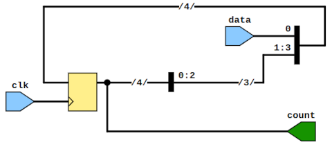
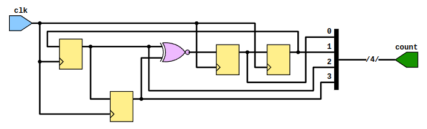
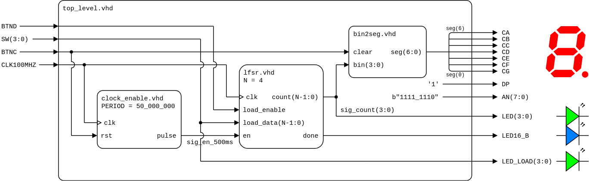
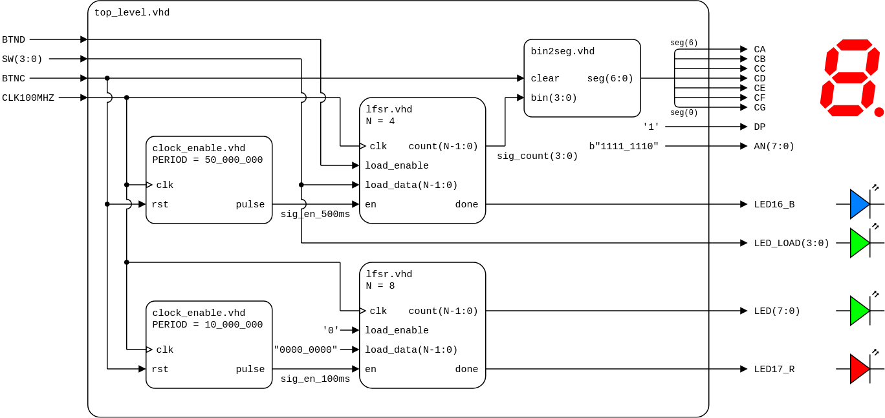

# Lab 6: Shift register and LFSR

* [Pre-Lab preparation](#preparation)
* [Part 1: VHDL code for shift register](#part1)
* [Part 2: 4-bit LFSR (Linear Feedback Shift Register)](#part2)
* [Part 3: n-bit LFSR counter](#part3)
* [Challenges](#challenges)
* [References](#references)

### Learning objectives

After completing this lab you will be able to:

* Understand shift registers
* Understand the pseudo-random generator using LFSR (Linear Feedback Shift Register)
* Use generate statements to replicate logic in VHDL or turning on/off blocks of logic

<a name="preparation"></a>

## Pre-Lab preparation

1. Calculate the maximum length and duration of one run (one complete sequence) of the LFSR counter on the Nexys board for various `N_BITS` values of 4, 8, 16, 32, 40, and 64. Given a clock frequency of 100 MHz, determine the time it takes for the counter to complete one full sequence.

   Note that, unlike a binary counter, the full sequence of an LFSR counter contains only `2^(N_BITS)-1` values.

   | **NBIT** | **Max. length** | **Duration** |
   | :-: | :-: | :-: |
   | 4   | 15 | 150 ns |
   | 8   |  |  |
   | 16  |  |  |
   | 32  |  |  |
   | 40  |  |  |
   | 64  |  |  |

<a name="part1"></a>

## Part 1: VHDL code for shift register

A binary **shift register** is a digital circuit that sequentially shifts data bits, either left or right, through a series of flip-flops controlled by a clock signal. It operates in parallel-in, serial-out (PISO) or serial-in, parallel-out (SIPO) modes. Shift registers are commonly used for serial-to-parallel and parallel-to-serial data conversion, data storage, and data transmission.

**FYI:** The structures below decsribe a simple 4-bit shift register in RTL (higher) and gate (lower) levels.

**RTL level:**



**Gate level:**


**VHDL code:**

```vhdl
...
process (clk)
begin
    if rising_edge(clk) then
        -- The VHDL **concatenate operator** is ampersand (&). It
        -- can be used to combine two or more items together. Since
        -- VHDL is strongly typed, it requires that all inputs to the
        -- concatenation be of the same type. Additionally, the result
        -- of the concatenation needs to exactly fit the width of the
        -- concatenated input signals.

        -- "sig_reg(2)  sig_reg(1)  sig_reg(0)  data"
        sig_reg <= sig_reg(2 downto 0) & data;
    end if;
end process;

count <= sig_reg;
...
```

1. Run Vivado, create a new project and implement a 4-bit shift register with clock enable and load signals:

   1. Project name: `lfsr`
   2. Project location: your working folder, such as `Documents`
   3. Project type: **RTL Project**
   4. Create a VHDL source file: `lfsr`
   5. Do not add any constraints now
   6. Choose a default board: `Nexys A7-50T`
   7. Click **Finish** to create the project
   8. Define I/O ports of new module:

      | **Port name** | **Direction** | **Type** | **Description** |
      | :-: | :-: | :-- | :-- |
      | `clk`   | input  | `std_logic` | Main clock |
      | `en`    | input  | `std_logic` | Clock enable input |
      | `load_enable` | input  | `std_logic` | Enable signal to load default/seed data |
      | `load_data` | input  | `std_logic_vector(3 downto 0)` | Default/seed data |
      | `count` | output | `std_logic_vector(3 downto 0)` | Register value |

2. Use VHDL templates in menu **Tools > Language Templates**, search for `parallel load`, copy/paste `w/ CE` template to the architecture and modify the code according to your I/O port names.

   > **Note:** The shift register template is located in:
   > ```bash
   > Language Templates:
   > VHDL
   >   Synthesis Constructs
   >     Coding Examples
   >       Shift Registers
   >         Parallel Load, Serial In, Serial Out
   >           w/ CE
   > ```

   ```vhdl
   -- Define a temporary signal that is of type std_logic_vector(<width>-1 downto 0).
   -- Where width is the number of bits to shift
   process (<clock>)
   begin
       if <clock>'event and <clock>='1' then
           if <load_enable> = '1' then
               <tmp_sig> <= <load_data>;
           elsif <clock_enable> = '1' then
               <tmp_sig> <= <tmp_sig>(<width>-2 downto 0) & <input>;
           end if;
       end if;
   end process;
   <output> <= <tmp_sig>(<width>-1);
   ```

   Hints:
      * Use `rising_edge(clk)` instead of `clk='1' and clk'event` to test clock edge
      * Define an internal signal `sig_reg` of data type `std_logic_vector(3 downto 0)` to implement the shift register
      * For now, use constant `1` instead of `<input>` signal
      * Notation `&` represents vector concatenation used to merge data. For example `s <= s(2 downto 0) & '1';` creates `"s2 s1 s0 1"`.
      * Assign the whole internal register to the output `count <= sig_reg;` (The template here implements Serial out and not Parallel output.)

<a name="part2"></a>

## Part 2: 4-bit LFSR (Linear Feedback Shift Register)

A **Linear Feedback Shift Register (LFSR)** is a shift register whose input bit is a linear function of its previous state using XOR or XNOR gates. The feedback taps determine the new bit entering the register. LFSRs are widely used for generating pseudo-random sequences in digital systems, cryptography, and communication protocols due to their simplicity, efficiency, and long periods before repeating sequences. They are also used for channel encoding and decoding, error detection, and testing digital systems.

1. To implement a linear feedback for an LFSR counter in VHDL, integrate an XNOR gate with a 4-bit shift register. Create an internal signal `sig_feedback` of type `std_logic`, utilizing feedback taps `sig_reg(3)` and `sig_reg(2)`, and connect it to the least significant bit (LSB) of the internal register.

   

2. Add a `done` signal of type `std_logic` into the LFSR entity. Outside the LFSR process, produce a pulse when the internal register matches the initial seed value.

   ```vhdl
   entity lfsr is
       port (
           ...
           done      : out std_logic;
           count     : out std_logic_vector(4-1 downto 0)
       );
   end lfsr;

   architecture behavioral of lfsr is
       ...
       signal sig_feedback : std_logic;
   begin

       process (clk)
       begin
           ...
           sig_reg <= sig_reg(4-2 downto 0) & sig_feedback;
           ...
       end process;

       -- Create feedback for 4-bit LFSR counter
       sig_feedback <= sig_reg(3) xnor sig_reg(2);

       -- Assign internal register to output
       count <= sig_reg;

       -- Create a `done` output pulse
       done <= '1' when (sig_reg = load_data) else
               '0';

   end behavioral;
   ```

3. Use **Flow > Open Elaborated design** and see the schematic after RTL analysis.

4. Generate a [simulation source](https://vhdl.lapinoo.net/testbench/) named `tb_lfsr`, execute the simulation, and validate the functionality of enable and seed values. Experiment with various tap configurations for XNOR gates and analyze the length of the generated pseudo-random sequence.

   | **Taps** | **Length** | **Values** |
   | :-: | :-: | :-- |
   | 3, 2 | 15 | 0, 1, 3, 7, 14, 13, 11, 6, 12, 9, 2, 5, 10, 4, 8 |
   | 3, 1 |  |  |
   | 3, 0 |  |  |
   | 2, 1 |  |  |
   | 2, 0 |  |  |
   | 1, 0 |  |  |

<a name="part3"></a>

## Part 3: n-bit LFSR counter

1. Extend the code from the previous part and use generics in both, design and testbench sources.

   In **design source**, use generic `N_BITS` to define number of bits for the counter. In **testbench**, define a constant `C_NBITS`, prior to declaring the component and use it to declare your internal counter signal:

   ```vhdl
   -- Design source file
   entity lfsr is
       generic (
           N_BITS : integer := 4 --! Default number of bits
       );
       port (
           ...
           count : out std_logic_vector(N_BITS-1 downto 0)
       );
   end entity lfsr;
   ```

   ```vhdl
   -- Testbench file
   constant C_NBITS : integer := 4; --! Simulating number of bits
   signal count : std_logic_vector(C_NBITS-1 downto 0);
   ```

   When you instantiate your counter, you then also bind the `N_BITS` generic to this constant:

   ```vhdl
   dut : component lfsr
       generic map (
           N_BITS => C_NBITS
       )
       ...
   ```

2. In VHDL, there is a way for iteratively or conditionally elaborating a part of a description. Typically, it is used to define a group of identical components using a single component specification and then repeating it using the `generate` mechanism.

   ```vhdl
   -- Conditional
   label : if condition generate
       { concurrent_statements }
   end generate label;

   -- Iterative
   label : for parameter in range generate
       { concurrent_statements }
   end generate label;
   ```

   Use conditional `generate` statements and define `sig_feedback` for several `N_BITS` values. See [AMD LFSR Counters](https://docs.xilinx.com/v/u/en-US/xapp052) to get the taps for maximum-length LFSR counters. Note that, the taps here are indexed from 1 and not from 0, ie. 4-bit counter use taps 4 and 3.

   ```vhdl
   g_4bit : if N_BITS = 4 generate
       -- Create feedback for 4-bit LFSR counter
       sig_feedback <= sig_reg(3) xnor sig_reg(2);
   end generate g_4bit;
   ```

3. Simulate your design and try several `C_NBITS` values.

4. Create a VHDL design source named `top_level` and implement a 4-bit LFSR counter on the Nexys A7 board. Configure the counter to increment every 500 ms, displaying the count on the 7-segment display and LEDs. Set the initial seed value using four switches `SW(3:0)` and enable loading by pressing `BTND`.

   Use component declaration and instantiation of `lfsr`, `clock_enable`, and `bin2seg`, and define the top-level architecture as follows.

   

   **Note:** The `enable_clock` and `bin2seg` components from the previous lab are required. Do not forget to copy both files to `YOUR-PROJECT-FOLDER/lfsr.srcs/sources_1/new/` folder and add them to the project.

   ```vhdl
   architecture behavioral of top_level is
       -- Component declaration for clock enable


       -- Component declaration for LFSR counter


       -- Component declaration for bin2seg


       -- Local signals for a counter: 4-bit @ 500 ms


   begin

       -- Component instantiation of clock enable for 500 ms


       -- Component instantiation of 4-bit LFSR counter


       -- Component instantiation of bin2seg


       -- Turn off decimal point


       -- Set display position


       -- Set output LEDs (green)


   end architecture behavioral;
   ```

5. Create a new [constraints XDC](https://raw.githubusercontent.com/Digilent/digilent-xdc/master/Nexys-A7-50T-Master.xdc) file `nexys-a7-50t`, uncomment the used pins according to the `top_level` entity.

6. Compile the project (ie. transform the high-level VHDL code into a binary configuration file) and download the generated bitstream `YOUR-PROJECT-FOLDER/lfsr.runs/impl_1/top_level.bit` into the FPGA chip.

<a name="challenges"></a>

## Challenges

1. Implement two n-bit LFSR counters on the Nexys A7 board. Configure the first, a 4-bit counter, to increment every 500 ms (requires the `enable_clock` component from the previous lab), displaying the count on the 7-segment display (also requires `bin2seg`). Set the initial seed value using four switches and enable loading by `BTND`.

   For the second counter, an 8-bit counter, configure it to increment every 100 ms, display its value using LEDs, and disable the initial settings.

   

2. Use `for-generate` statement and define an N-bit adder according to [previous lab](https://github.com/tomas-fryza/vhdl-course/tree/master/lab4-adder#part2).

<a name="references"></a>

## References

1. NandLand. [Concatenation Operator – VHDL Example](https://nandland.com/concatenation-operator/)

2. NandLand. [LFSR in an FPGA – VHDL & Verilog Code](https://nandland.com/lfsr-linear-feedback-shift-register/)

3. AMD. [Efficient Shift Registers, LFSR Counters, and Long Pseudo-Random Sequence Generators (XAPP052)](https://docs.xilinx.com/v/u/en-US/xapp052)

4. Digilent. [General .xdc file for the Nexys A7-50T](https://github.com/Digilent/digilent-xdc/blob/master/Nexys-A7-50T-Master.xdc)
