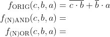
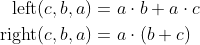

# Lab 1: Introduction to Git and VHDL

<!--

<p align="center">
  The Study of Modern and Developing Engineering BUT<br>
  CZ.02.2.69/0.0/0.0/18_056/0013325
</p>


-->

### Learning objectives

After completing this lab you will be able to:

* Use git and markdown README files
* Create and clone repositories through GitHub
* Commit, push, and pull changes to the repository
* Understand basic structure of VHDL files

In this laboratory exercise, you will learn how to use the git versioning system, write the markdown readme file, use the Windows/Linux console terminal to work in the lab, and then how to compose a basic VHDL code using the online development tool.

### Table of contents

* [Pre-Lab preparation](#preparation)
* [Part 1: GitHub](#part1)
* [Part 2: Local repository](#part2)
* [Part 3: EDA Playground](#part3)
* [Experiments on your own](#experiments)
* [Post-Lab report](#report)
* [References](#references)

<a name="preparation"></a>

## Pre-Lab preparation

1. If you don't have any, create a free account on [GitHub](https://github.com/signup?source=login).
2. If you don't have Google or Facebook account, register your account on [EDA Playground](https://www.edaplayground.com/login).
3. For future synchronization of local folders with GitHub, download and install [git](https://git-scm.com/). Git is free, open source, and available on Windows, Mac, and Linux platforms. Window users will also need to use the Git Bash application (installed automatically with git) for command line operations.

<a name="part1"></a>

## Part 1: GitHub

GitHub is a code hosting platform for collaboration and version control. GitHub lets you (and others) work together on projects.

1. In GitHub, create a new public repository titled **digital-electronics-1**. Initialize README, [`.gitignore`](https://raw.githubusercontent.com/iDoka/eda-scripts/master/gitignore/vivado.gitignore), and [MIT license](https://choosealicense.com/licenses/mit/).

2. Use one of the available git manuals, such as [[1]](https://medium.com/swlh/how-to-make-the-perfect-readme-md-on-github-92ed5771c061) or [[2]](https://help.github.com/en/articles/basic-writing-and-formatting-syntax) and add the following sections to your online README.md file.

* Headers H1, H2, H3
* Emphasis (*italics*, **bold**)
* Lists (ordered, unordered)
* Link
* Table
* Listing of VHDL source code (with syntax highlighting)

<a name="part2"></a>

## Part 2: Local repository

1. Use your favorite file manager and run Git Bash (Windows) or Terminal (Linux) inside your home folder `Documents`.

2. With help of `git` command, clone a local copy of your public repository.

   > **Important:** To avoid future problems, never use national characters (such as éščřèêö, ...) and spaces in folder- and file-names.
   >
   > **Help:** Useful git command is `git clone` - Create a local copy of remote repository. This command is executed just once; later synchronization between remote and local repositories is performed differently.
   >
   > Useful bash commands are `cd` - Change working directory. `mkdir` - Create directory. `ls` - List information about files in the current directory. `ls -a` - List information aout all files in the current directory. `pwd` - Print the name of the current working directory.

   ```bash
   ## Windows Git Bash or Linux:
   $ git clone https://github.com/your-github-account/digital-electronics-1
   $ cd digital-electronics-1/
   $ ls
   .gitignore  LICENSE  README.md
   ```

3. Set username and email for your repository (values will be associated with your later commits):

   ```shell
   $ git config user.name "your-git-user-name"
   $ git config user.email "your-email@address.com"
   ```

   You can verify that the changes were made correctly by:

   ```shell
   $ git config --list
   ```

4. Each computer exercise will be located in a separate folder, eg `01-gates` for the first exercise, `02-logic` for the second, `03-vivado` for the third, etc. Create a new working folder `labs/01-gates` for this exercise.

   ```bash
   ## Windows Git Bash or Linux:
   $ mkdir 01-gates
   ```

5. Use your favorite text editor, such as VS Code, Notepad++, etc. and create a new file `README.md` in your `01-gates/` folder. Copy/paste [report template](https://raw.githubusercontent.com/tomas-fryza/digital-electronics-1/master/labs/01-gates/report.md) to your `01-gates/README.md` file.

6. Synchronize the contents of your working folder with the local and remote repository. This way you are sure that you will not lose any of your changes. To do that, use git commands to add, commit, and push all local changes to your remote repository. Check GitHub web page for changes.

   > **Help:** Useful git commands are `git status` - Get state of working directory and staging area. `git add` - Add new and modified files to the staging area. `git commit` - Record changes to the local repository. `git push` - Push changes to remote repository. `git pull` - Update local repository and working folder. Note that, a brief description of useful git commands can be found [here](https://github.com/tomas-fryza/digital-electronics-1/wiki/Useful-Git-commands) and detailed description of all commands is [here](https://github.com/joshnh/Git-Commands).

   ```bash
   ## Windows Git Bash or Linux:
   $ git status
   $ git add -A
   $ git status
   $ git commit -m "Creating 01-gates lab"
   $ git status
   $ git push
   $ git status
   ```

   

<a name="part3"></a>

## Part 3: EDA Playground

EDA Playground is a cloud-based service that runs in your browser.

1. Log in to your [EDA Playground](https://www.edaplayground.com/login) account, open [Example of basic gates](https://www.edaplayground.com/x/5L92) project, use **Copy** button, and **Save** the project under a different name.

2. Take a look at the basic parts of the VHDL source code, such as [entity](https://github.com/tomas-fryza/digital-electronics-1/wiki/Entity), [architecture](https://github.com/tomas-fryza/digital-electronics-1/wiki/Architecture), and testbench. Use button **Run** to run the simulation.

   Most common VHDL operators are shown in the table.

   | **Operator** | **Description** |
   | :-: | :-- |
   | `<=` | Value assignment |
   | `and` | Logical AND |
   | `nand` | Logical AND with negated output |
   | `or` | Logical OR |
   | `nor` | Logical OR with negated output |
   | `not` | Nagation |
   | `xor` | Exclusive OR |
   | `xnor` | Exclusive OR with negated output |
   | `-- comment` | Comments |

3. Use De Morgan's laws and modify the following logic function to the form with NAND and NOR gates only. Verify all three functions in EDA Playground tool.

   

   > Note that, equations were generated by [Online LaTeX Equation Editor](https://www.codecogs.com/latex/eqneditor.php) using the following code.
   >
   > ```LaTeX
   > \begin{align*}
   >    f_{\textup{ORIG}}(c,b,a) =&~ \overline{b}\cdot a + c\cdot\overline{(b+\overline{a})}\\
   >    f_{\textup{(N)AND}}(c,b,a) =&\\
   >    f_{\textup{(N)OR}}(c,b,a) =&\\
   > \end{align*}
   > ```
   >

4. According to the simulation, complete the table with logic values.

   | **c** | **b** |**a** | **f_ORIG** | **f_(N)AND** | **f_(N)OR** |
   | :-: | :-: | :-: | :-: | :-: | :-: |
   | 0 | 0 | 0 |  |  |  |
   | 0 | 0 | 1 |  |  |  |
   | 0 | 1 | 0 |  |  |  |
   | 0 | 1 | 1 |  |  |  |
   | 1 | 0 | 0 |  |  |  |
   | 1 | 0 | 1 |  |  |  |
   | 1 | 1 | 0 |  |  |  |
   | 1 | 1 | 1 |  |  |  |

<a name="experiments"></a>

## Experiments on your own

1. In EDA Playground, verify at least one of the Distributive laws:

  First Distributive law:

  

<!--
\begin{align*}
   \textup{left}(c,b,a)  =&~a\cdot b + a\cdot c\\
   \textup{right}(c,b,a) =&~a\cdot (b+c)\\
\end{align*}
-->

  Second Distributive law:

  

<!--
\begin{align*}
    \textup{left}(c,b,a)  =&~(a+b)\cdot (a+c)\\
    \textup{right}(c,b,a) =&~a+ (b\cdot c)\\
\end{align*}
-->

2. You can also try several online graphics simulators, such as [CircuitVerse](https://circuitverse.org/), [Logicly](https://logic.ly/), [CircuitLab](https://www.circuitlab.com/), [simulatorIO](https://simulator.io/), [LogicEmu](https://lodev.org/logicemu/), and compare their options.

<a name="report"></a>

## Post-Lab report

*Complete all parts of `01-gates/README.md` file (see Part 2.4) in Czech, Slovak, or English, push it to your GitHub repository, and submit a link to this file via [BUT e-learning](https://moodle.vutbr.cz/). The deadline for submitting the task is the day before the next lab, i.e. in one week.*

*Vypracujte všechny části ze souboru `01-gates/README.md` (viz Část 2.4) v českém, slovenském, nebo anglickém jazyce, uložte je na váš GitHub repozitář a odevzdejte link na tento soubor prostřednictvím [e-learningu VUT](https://moodle.vutbr.cz/). Termín odevzdání úkolu je den před dalším laboratorním cvičením, tj. za jeden týden.*

<a name="references"></a>

## References

1. [MIT license](https://choosealicense.com/licenses/mit/)

2. Sayan Mondal. [How to make the perfect Readme.md on GitHub](https://medium.com/swlh/how-to-make-the-perfect-readme-md-on-github-92ed5771c061)

3. GitHub, Inc. [Basic writing and formatting syntax](https://help.github.com/en/articles/basic-writing-and-formatting-syntax)

4. GitHub, Inc. [Mastering Markdown](https://guides.github.com/features/mastering-markdown/)

5. Tomas Fryza. [Example of basic OR, AND, XOR gates](https://www.edaplayground.com/x/5L92)

6. CodeCogs. [Online LaTeX Equation Editor](https://www.codecogs.com/latex/eqneditor.php)

7. CircuitVerse. [Online Digital Logic Circuit Simulator](https://circuitverse.org/)

8. Bowler Hat LLC. [Logicly - A logic circuit simulator for Windows and macOS](https://logic.ly/)

9. CircuitLab, Inc. [Online circuit simulation & schematic editor](https://www.circuitlab.com/)

10. Bastian Born. [simulatorIO - Build and simulate logic circuits](https://simulator.io/)

11. Lode Vandevenne. [LogicEmu: Online Logic Simulator](https://lodev.org/logicemu/)
