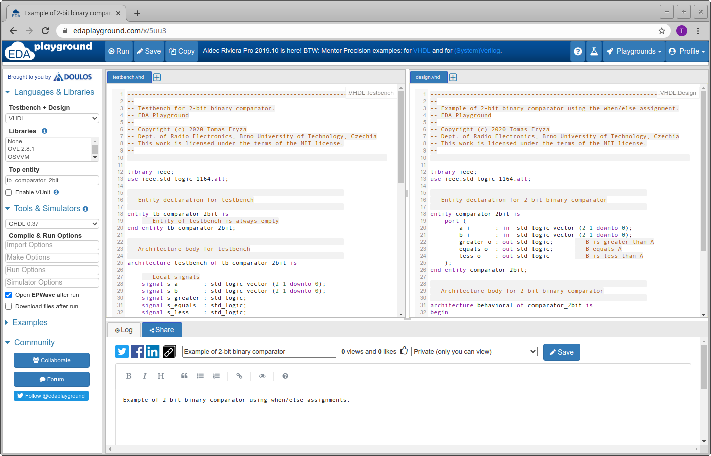
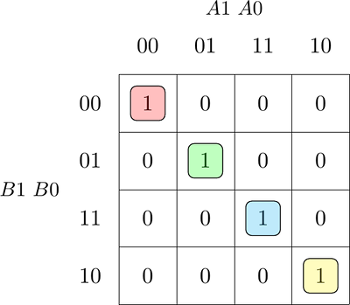

# Lab 2: Combinational logic

<!--

<p align="center">
  The Study of Modern and Developing Engineering BUT<br>
  CZ.02.2.69/0.0/0.0/18_056/0013325
</p>


-->

### Learning objectives

After completing this lab you will be able to:

* Use truth table, K-map, SoP/PoS forms of logic functions
* Minimize logic function
* Understand signal assignments in VHDL
* Use VHDL assertion statements for testing

The purpose of this laboratory exercise is to learn to use different ways of writing combination functions (truth table, K-map, SoP/PoS forms), their minimization, the use of signal assignments in VHDL, and assertion statements in VHDL testbench.

### Table of contents

* [Pre-Lab preparation](#preparation)
* [Part 1: Synchronize repositories and create a new folder](#part1)
* [Part 2: Logic function minimization](#part2)
* [Part 3: Binary comparator in VHDL language](#part3)
* [Part 4: Assertion statements in VHDL testbench](#part4)
* [Experiments on your own](#experiments)
* [Post-Lab report](#report)
* [References](#references)

<a name="preparation"></a>

## Pre-Lab preparation

*Digital* or *Binary comparator* compares the digital signals A, B presented at input terminal and produce outputs depending upon the condition of those inputs.

1. Complete the truth table for 2-bit *Identity comparator* (B equals A), and two *Magnitude comparators* (B is greater than A, B is less than A). Note that, such a digital device has four inputs and three outputs/functions.

   | **Dec. equivalent** | **B[1:0]** | **A[1:0]** | **B is greater than A** | **B equals A** | **B is less than A** |
   | :-: | :-: | :-: | :-: | :-: | :-: |
   |  0 | 0 0 | 0 0 | 0 | 1 | 0 |
   |  1 | 0 0 | 0 1 | 0 | 0 | 1 |
   |  2 | 0 0 | 1 0 | 0 | 0 | 1 |
   |  3 | 0 0 | 1 1 | 0 | 0 | 1 |
   |  4 | 0 1 | 0 0 |  | 0 |  |
   |  5 | 0 1 | 0 1 |  | 1 |  |
   |  6 | 0 1 | 1 0 |  | 0 |  |
   |  7 | 0 1 | 1 1 |  | 0 |  |
   |  8 | 1 0 | 0 0 |  | 0 |  |
   |  9 | 1 0 | 0 1 |  | 0 |  |
   | 10 | 1 0 | 1 0 |  | 1 |  |
   | 11 | 1 0 | 1 1 |  | 0 |  |
   | 12 | 1 1 | 0 0 |  | 0 |  |
   | 13 | 1 1 | 0 1 |  | 0 |  |
   | 14 | 1 1 | 1 0 |  | 0 |  |
   | 15 | 1 1 | 1 1 |  | 1 |  |

<a name="part1"></a>

## Part 1: Synchronize repositories and create a new folder

When you start working, always synchronize the contents of your working folder and local repository with remote version at GitHub. This way you are sure that you will not lose any of your changes.

1. Run Git Bash (Windows) of Terminal (Linux) in your working directory, and update local repository.

   > **Help:** Useful bash and git commands are `cd` - Change working directory. `mkdir` - Create directory. `ls` - List information about files in the current directory. `pwd` - Print the name of the current working directory. `git status` - Get state of working directory and staging area. `git pull` - Update local repository and working folder.

   ```bash
   ## Windows Git Bash or Linux:
   $ git pull
   ```

2. Create a new working folder `02-logic` for this exercise.

   ```bash
   ## Windows Git Bash or Linux:
   $ mkdir 02-logic
   ```

3. Use your favorite text editor, such as VS Code, Notepad, etc. and create a new file `README.md` in your `02-logic/` folder. Copy/paste [report template](https://raw.githubusercontent.com/tomas-fryza/digital-electronics-1/master/labs/02-logic/report.md) to your `02-logic/README.md` file.

<a name="part2"></a>

## Part 2: Logic function minimization

*[Karnaugh Maps](https://learnabout-electronics.org/Digital/dig24.php) (or K-maps) offer a graphical method of reducing a digital circuit to its minimum number of gates. The map is a simple table containing 1s and 0s that can express a truth table or complex Boolean expression describing the operation of a digital circuit.*

The K-map for the "equals" function is as follows:

   

1. Create K-maps for other two functions.

    &nbsp;  &nbsp;  &nbsp;  &nbsp;
   

2. Use K-maps to create a simplified SoP form of the "greater than" function and a simplified PoS form of the "less than" function.

   

<a name="part3"></a>

## Part 3: Binary comparator in VHDL language

1. Log in to your [EDA Playground](https://www.edaplayground.com/login) account, open [template](https://www.edaplayground.com/x/5uu3) project, use **Copy** button, and **Save** the project under a different name.

2. In VHDL, define an [entity](https://github.com/tomas-fryza/digital-electronics-1/wiki/Entity) for a 2-bit binary comparator (`comparator_2bit`) according to the following table.

   | **Port name** | **Direction** | **Type** | **Description** |
   | :-: | :-: | :-- | :-- |
   | `b_i`       | input  | [`std_logic_vector(2 - 1 downto 0)`](https://github.com/tomas-fryza/digital-electronics-1/wiki/Data-types) | Data B |
   | `a_i`       | input  | `std_logic_vector(2 - 1 downto 0)` | Data A |
   | `B_greater_A_o` | output | `std_logic` | B is greater than A |
   | `B_equals_A_o`  | output | `std_logic` | B equals A |
   | `B_less_A_o`    | output | `std_logic` | B is less than A |

3. In VHDL, define an [architecture](https://github.com/tomas-fryza/digital-electronics-1/wiki/Architecture) for a 2-bit binary comparator. The combination logic can be written using low-level operators (`and`, `or`, etc.) as in the previous laboratory exercise. However, it is more efficient to use a higher notation with [signal assignments](https://github.com/tomas-fryza/digital-electronics-1/wiki/Signal-assignments). Use the **conditional signal assignment** `when`,`else` (outside process) to describe the three output functions, such as:

   ```vhdl
      B_less_A_o    <= '1' when (b_i < a_i) else '0';
   ```

   Write all three functions in signal-assignments style and one function also with low-level operators.

<a name="part4"></a>

## Part 4: Assertion statements in VHDL testbench

You can write any information to the console using the report statement. The basic syntax in VHDL is:

   ```vhdl
   report <message_string> [severity <severity_level>];
   ```

where possible values for `severity_level` are: `note`, `warning`, `error`, `failure`. If the severity level is omitted, then the default value is `note`. The following two statements are therefore equivalent:

   ```vhdl
   report "Stimulus process started" severity note;
   report "Stimulus process started";
   ```

An assertion statement checks that a specified condition is true and reports an error if it is not. It is combined with a report statement as follows:

   ```vhdl
   assert (<condition>)
   report <message_string> [severity <severity_level>];
   ```

The message is displayed to the console when the condition is NOT met, therefore the message should be an opposite to the condition.

   ```vhdl
    --------------------------------------------------------------------
    -- Data generation process
    --------------------------------------------------------------------
    p_stimulus : process
    begin
        -- Report a note at the beginning of stimulus process
        report "Stimulus process started";

        -- First test case ...
        s_b <= "00"; s_a <= "00"; wait for 100 ns;
        -- ... and its expected outputs
        assert ((s_B_greater_A = '0') and
                (s_B_equals_A  = '1') and
                (s_B_less_A    = '0'))
        -- If false, then report an error
        -- If true, then do not report anything
        report "Input combination 00, 00 FAILED" severity error;


        -- WRITE OTHER TEST CASES HERE


        -- Report a note at the end of stimulus process
        report "Stimulus process finished";
        wait; -- Data generation process is suspended forever
    end process p_stimulus;
   ```

1. In VHDL, write a testbench and verify the correct functionality of the comparator for all input combinations.

2. When you finish, always synchronize the contents of your working folder with the local and remote versions of your repository. This way you are sure that you will not lose any of your changes. To do that, use git commands to add, commit, and push all local changes to your remote repository. Check GitHub web page for changes.

   > **Help:** Useful git commands are `git status` - Get state of working directory and staging area. `git add` - Add new and modified files to the staging area. `git commit` - Record changes to the local repository. `git push` - Push changes to remote repository. `git pull` - Update local repository and working folder. Note that, a brief description of useful git commands can be found [here](https://github.com/tomas-fryza/digital-electronics-1/wiki/Useful-Git-commands) and detailed description of all commands is [here](https://github.com/joshnh/Git-Commands).

<a name="experiments"></a>

## Experiments on your own

1. In EDA Playground, define entity and architecture for a 4-bit binary comparator (`comparator_4bit`).

   | **Port name** | **Direction** | **Type** | **Description** |
   | :-: | :-: | :-- | :-- |
   | `b_i`       | input  | `std_logic_vector(4 - 1 downto 0)` | Data B |
   | `a_i`       | input  | `std_logic_vector(4 - 1 downto 0)` | Data A |
   | `B_greater_A_o` | output | `std_logic` | B is greater than A |
   | `B_equals_A_o`  | output | `std_logic` | B equals A |
   | `B_less_A_o`    | output | `std_logic` | B is less than A |

2. In VHDL, define a testbench for a 4-bit binary comparator and verify several input combinations. Make one intentional mistake when automatically verifying expected values using the `assert` command.

<a name="report"></a>

## Post-Lab report

*Complete all parts of `02-logic/README.md` file (see Part 1.3) in Czech, Slovak, or English, push it to your GitHub repository, and submit a link to this file via [BUT e-learning](https://moodle.vutbr.cz/). The deadline for submitting the task is the day before the next lab, i.e. in one week.*

*Vypracujte všechny části ze souboru `02-logic/README.md` (viz Část 1.3) v českém, slovenském, nebo anglickém jazyce, uložte je na váš GitHub repozitář a odevzdejte link na tento soubor prostřednictvím [e-learningu VUT](https://moodle.vutbr.cz/). Termín odevzdání úkolu je den před dalším laboratorním cvičením, tj. za jeden týden.*

<a name="references"></a>

## References

1. Eric Coates. [Karnaugh Maps](https://learnabout-electronics.org/Digital/dig24.php)

2. Tomas Fryza. [Example of 2-bit binary comparator using the when/else assignments](https://www.edaplayground.com/x/5uu3)
