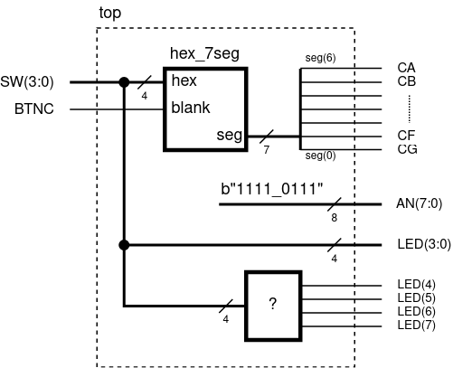

# Lab 3: Seven-segment display decoder

<!--

<p align="center">
  The Study of Modern and Developing Engineering BUT<br>
  CZ.02.2.69/0.0/0.0/18_056/0013325
</p>
-->

* [Pre-Lab preparation](#preparation)
* [Part 1: VHDL code for seven-segment display decoder](#part1)
* [Part 3: Top level VHDL code](#part3)
* [Challenges](#challenges)
* [References](#references)

### Learning objectives

After completing this lab you will be able to:

* Use 7-segment display
* Use VHDL processes
* Understand the structural VHDL description

The purpose of this laboratory exercise is to design a 7-segment display decoder and to become familiar with the VHDL structural description that allows you to build a larger system from simpler or predesigned components.

<a name="preparation"></a>

## Pre-Lab preparation

The Nexys A7 board provides two four-digit common anode seven-segment LED displays (configured to behave like a single eight-digit display).

1. See [schematic](https://github.com/tomas-fryza/vhdl-course/blob/master/docs/nexys-a7-sch.pdf) or [reference manual](https://reference.digilentinc.com/reference/programmable-logic/nexys-a7/reference-manual) of the Nexys A7 board and find out the connection of 7-segment displays, ie to which FPGA pins are connected and how.

2. Complete the decoder truth table for **common anode** 7-segment display.

   | **Symbol** | **Inputs** | **a** | **b** | **c** | **d** | **e** | **f** | **g** |
   | :-: | :-: | :-: | :-: | :-: | :-: | :-: | :-: | :-: |
   | 0 | 0000 | 0 | 0 | 0 | 0 | 0 | 0 | 1 |
   | 1 | 0001 | 1 | 0 | 0 | 1 | 1 | 1 | 1 |
   | 2 |      |   |   |   |   |   |   |   |
   | 3 |      |   |   |   |   |   |   |   |
   | 4 |      |   |   |   |   |   |   |   |
   | 5 |      |   |   |   |   |   |   |   |
   | 6 |      |   |   |   |   |   |   |   |
   | 7 |      |   |   |   |   |   |   |   |
   | 8 | 1000 | 0 | 0 | 0 | 0 | 0 | 0 | 0 |
   | 9 |      |   |   |   |   |   |   |   |
   | A |      |   |   |   |   |   |   |   |
   | b |      |   |   |   |   |   |   |   |
   | C |      |   |   |   |   |   |   |   |
   | d |      |   |   |   |   |   |   |   |
   | E | 1110 | 0 | 1 | 1 | 0 | 0 | 0 | 0 |
   | F | 1111 | 0 | 1 | 1 | 1 | 0 | 0 | 0 |

   > 
   >
   > The image above was used from website: [How Seven Segment Display Works & Interface it with Arduino](https://lastminuteengineers.com/seven-segment-arduino-tutorial/).
   >

<a name="part1"></a>

## Part 1: VHDL code for seven-segment display decoder

The Bin to 7-Segment Decoder converts 4-bit binary data to 7-bit control signal which can be displayed on 7-segment display. A display consist of 7 LED segments to display the decimal digits `0` to `9` and letters `A` to `F`.


1. Perform the following steps to simulate the seven-segment display decoder in Vivado.

   1. Create a new Vivado RTL project `display`.
   2. Create a VHDL source file `bin2seg` for the decoder.
   3. Choose default board: `Nexys A7-50T`.
   4. Use **Define Module** dialog and define I/O ports as follows.

      | **Port name** | **Direction** | **Type** | **Description** |
      | :-: | :-: | :-- | :-- |
      | `blank` | input | `std_logic` | Display is clear if blank = 1 |
      | `bin` | input   | `std_logic_vector(3 downto 0)` | Binary representation of one hexadecimal symbol |
      | `seg` | output  | `std_logic_vector(6 downto 0)` | Seven active-low segments in the order: a, b, ..., g |

<!--
      
-->

   5. Copy/paste the archtitecture [template](https://www.edaplayground.com/x/Vdpu). Use [combinational process](https://github.com/tomas-fryza/vhdl-course/wiki/Processes) and complete an architecture of the decoder. Note that, the process `p_7seg_decoder` is "executed" only when `bin` or `blank` value is changed. Inside a process, `case`-`when` [assignments](https://github.com/tomas-fryza/vhdl-course/wiki/Signal-assignments) can be used.

   6. Create a VHDL simulation source `tb_bin2seg`, copy/paste the [template](https://www.edaplayground.com/x/Vdpu), complete all test cases, and verify the functionality of your decoder.

   7. Use **Flow** > **Open Elaborated design** and see the schematic after RTL analysis. Note that RTL (Register Transfer Level) represents digital circuit at the abstract level.

<a name="part3"></a>

## Part 3: Top level VHDL code

VHDL provides a mechanism how to build a larger system from simpler or predesigned components. It is called an instantiation. Each instantiation statement creates an instance (copy) of a design entity.

VHDL-93 and later offers two methods of instantiation: **direct instantiation** and **component instantiation**. In direct instantiation, the entity itself is directly instantiated in an architecture. Its ports are connected using the port map. Let the top-level design `top.vhd`, implements an instance of the module defined in `hex_7seg.vhd`.

1. Perform the following steps to implement the seven-segment display decoder on the Nexys A7 board.

   1. Create a new VHDL design source `top` in your project.
   2. Use **Define Module** dialog and define I/O ports of entity `top` as follows.

      | **Port name** | **Direction** | **Type** | **Description** |
      | :-: | :-: | :-- | :-- |
      | `SW` | in  | `std_logic_vector(3 downto 0)` | Input binary data |
      | `LED` | out | `std_logic_vector(7 downto 0)` | LED indicators |
      | `CA` | out | `std_logic` | Cathod A |
      | `CB` | out | `std_logic` | Cathod B |
      | `CC` | out | `std_logic` | Cathod C |
      | `CD` | out | `std_logic` | Cathod D |
      | `CE` | out | `std_logic` | Cathod E |
      | `CF` | out | `std_logic` | Cathod F |
      | `CG` | out | `std_logic` | Cathod G |
      | `AN` | out | `std_logic_vector(7 downto 0)` | Common anode signals to individual displays |
      | `BTNC` | in | `std_logic` | Blank (clear) display |

   3. Use [direct instantiation](https://github.com/tomas-fryza/vhdl-course/wiki/Direct-instantiation) and define an architecture of the top level.

```vhdl
------------------------------------------------------------
-- Architecture body for top level
------------------------------------------------------------

architecture behavioral of top is

begin

  ----------------------------------------------------------
  -- Instance (copy) of hex_7seg entity
  ----------------------------------------------------------
  hex2seg : entity work.hex_7seg
    port map (
      blank  => BTNC,
      hex    => SW,
      seg(6) => CA,
      seg(5) => CB,
      seg(4) => CC,
      seg(3) => CD,
      seg(2) => CE,
      seg(1) => CF,
      seg(0) => CG
    );

  -- Connect one common anode to 3.3V
  AN <= b"1111_0111";

  -- Display input value on LEDs
  LED(3 downto 0) <= SW;

  ----------------------------------------------------------
  -- Experiments on your own: LED(7:4) indicators
  ----------------------------------------------------------

  -- Turn LED(4) on if input value is equal to 0,
  -- ie "0000"
  LED(4) <= '0'; -- WRITE YOUR CODE HERE

  -- Turn LED(5) on if input value is greater than "1001",
  -- ie 10, 11, 12, ...
  LED(5) <= '0'; -- WRITE YOUR CODE HERE

  -- Turn LED(6) on if input value is odd,
  -- ie 1, 3, 5, 7, ...
  LED(6) <= '0'; -- WRITE YOUR CODE HERE

  -- Turn LED(7) on if input value is a power of two,
  -- ie 1, 2, 4, or 8
  LED(7) <= '0'; -- WRITE YOUR CODE HERE

end architecture behavioral;
```

   

   4. Create a new [constraints XDC](https://raw.githubusercontent.com/Digilent/digilent-xdc/master/Nexys-A7-50T-Master.xdc) file: `nexys-a7-50t` and uncomment used pins according to the `top` entity.
   5. Compile the project and download the generated bitstream `YOUR_FOLDER/display/display.runs/impl_1/top.bit` into the FPGA chip.
   6. Test the functionality of the seven-segment display decoder by toggling the switches and observing the display and LEDs. Change the binary value `AN <= b"0111_1111"` and observe its effect on the display selection.

      

   7. Use **IMPLEMENTATION > Open Implemented Design > Schematic** to see the generated structure.

<a name="challenges"></a>

## Challenges

1. Complete the truth table for LEDs according to comments in source code above.

   | **Hex** | **Inputs** | **LED4** | **LED5** | **LED6** | **LED7** |
   | :-: | :-: | :-: | :-: | :-: | :-: |
   | 0 | 0000 |  |  |  |  |
   | 1 | 0001 |  |  |  |  |
   | 2 |      |  |  |  |  |
   | 3 |      |  |  |  |  |
   | 4 |      |  |  |  |  |
   | 5 |      |  |  |  |  |
   | 6 |      |  |  |  |  |
   | 7 |      |  |  |  |  |
   | 8 | 1000 |  |  |  |  |
   | 9 |      |  |  |  |  |
   | A |      |  |  |  |  |
   | b |      |  |  |  |  |
   | C |      |  |  |  |  |
   | d |      |  |  |  |  |
   | E | 1110 |  |  |  |  |
   | F | 1111 |  |  |  |  |

2. Use VHDL construction `when`-`else` or low-level gates `and`, `or`, and `not` and write logic functions for LED(7:4) indicators in the simplest way possible.

<a name="references"></a>

## References

1. Digilent blog. [Nexys A7 Reference Manual](https://reference.digilentinc.com/reference/programmable-logic/nexys-a7/reference-manual)

2. LastMinuteEngineers. [How Seven Segment Display Works & Interface it with Arduino](https://lastminuteengineers.com/seven-segment-arduino-tutorial/)

3. Tomas Fryza. [Template for 7-segment display decoder](https://www.edaplayground.com/x/Vdpu)

4. Digilent. [General .xdc file for the Nexys A7-50T](https://github.com/Digilent/digilent-xdc/blob/master/Nexys-A7-50T-Master.xdc)
