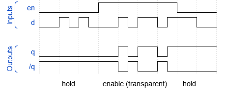

# Lab 5: Latches and Flip-flops

<!--

<p align="center">
  The Study of Modern and Developing Engineering BUT<br>
  CZ.02.2.69/0.0/0.0/18_056/0013325
</p>
-->

### Learning objectives

After completing this lab you will be able to:

* Use latches and flip-flops
* Use VHDL synchronous processes
* Understand the asynchronous and synchronous resets

In this laboratory exercise, you will study the differences between a statically controlled latch and flip-flops that are synchronized with a clock signal. In VHDL, combinational and synchronous processes will be used and the difference between asynchronous and synchronous reset will be illustrated.

### Table of contents

* [Preparation tasks](#preparation)
* [Part 1: Synchronize Git and create a new folder](#part1)
* [Part 2: D latch](#part2)
* [Part 3: VHDL code for flip-flops](#part3)
* [Experiments on your own](#experiments)
* [Lab assignment](#assignment)
* [References](#references)

<a name="preparation"></a>

## Preparation tasks (done before the lab at home)

1. Write characteristic equations and complete truth tables for D, JK, T flip-flops where `q(n)` represents main output value before the clock edge and `q(n+1)` represents output value after the clock edge.

   
   <!--
   https://editor.codecogs.com/
   \begin{align*}
       q_{n+1}^D =&~D \\
       q_{n+1}^{JK} =& \\
       q_{n+1}^T =& \\
   \end{align*}
   -->

   **D-type FF**
   | **clk** | **d** | **q(n)** | **q(n+1)** | **Comments** |
   | :-: | :-: | :-: | :-: | :-- |
   |  | 0 | 0 | 0 | `q(n+1)` has the same level as `d` |
   |  | 0 | 1 |  |  |
   |  | 1 |  |  |  |
   |  | 1 |  |  |  |

   **JK-type FF**
   | **clk** | **j** | **k** | **q(n)** | **q(n+1)** | **Comments** |
   | :-: | :-: | :-: | :-: | :-: | :-- |
   |  | 0 | 0 | 0 | 0 | Output did not change |
   |  | 0 | 0 | 1 | 1 | Output did not change |
   |  | 0 |  |  |  |  |
   |  | 0 |  |  |  |  |
   |  | 1 |  |  |  |  |
   |  | 1 |  |  |  |  |
   |  | 1 |  |  |  |  |
   |  | 1 |  |  |  |  |

   **T-type FF**
   | **clk** | **t** | **q(n)** | **q(n+1)** | **Comments** |
   | :-: | :-: | :-: | :-: | :-- |
   |  | 0 | 0 | 0 | Output did not change |
   |  | 0 | 1 |  |  |
   |  | 1 |  |  |  |
   |  | 1 |  |  |  |

<a name="part1"></a>

## Part 1: Synchronize repositories and create a new folder

1. Run Git Bash (Windows) of Terminal (Linux), navigate to your working directory, and update local repository.

   > Useful bash and git commands are: `cd` - Change working directory. `mkdir` - Create directory. `ls` - List information about files in the current directory. `pwd` - Print the name of the current working directory. `git status` - Get state of working directory and staging area. `git pull` - Update local repository and working folder.
   >

2. Create a new working folder `labs/05-ffs` for this laboratory exercise.

3. Create a new file `labs/05-ffs/assignment.md` and copy/paste [assignment template](https://raw.githubusercontent.com/tomas-fryza/digital-electronics-1/master/labs/05-ffs/assignment.md) into it.

<a name="part2"></a>

## Part 2: D latch

A latch is a level triggered element.
There are two types of memory elements based on the type of triggering that is suitable to operate it:

* Latches
* Flip-flops

Both are used as data storage elements. Latches operate with enable signal, which is level sensitive. Whereas, flip-flops are edge sensitive and operate with clock signal transitions.

A latch has two stable states (high and low) and it works like a storage device by holding the data through a feedback lane. It stores 1-bit of data. The latches can be classified into different types which include mainly S-R latch, Gated S-R latch, D latch but also JK latch, and T latch.

A D-type latch has two outputs Q and /Q and two inputs: data input D and enable. It consistes of Gated S-R latch but because the inputs are complements of each other, it eliminates the combinations of S & R are of same value.


As the output is same as the input D, D latch is also called as **Transparent latch**.


<!--
https://wavedrom.com/
{signal: [
  ["Inputs",
    {name: "en", wave: "l..h...l.", },
    {name: "d",  wave: "lp.lphnhl", },
  ],
  {},
  ["Outputs",
    {name: "q",  wave: "l...phnh.", },
    {name: "/q", wave: "h...nlpl.", },
  ],
],
  foot: {
    text: "     hold              enable (transparent)        hold    ",
  },
}
-->

A D-type latch can be modeled in VHDL as follows.

   ```vhdl
   library ieee;
   use ieee.std_logic_1164.all;
   -------------------------------------
   entity d_latch is
       port(
           en    : in  std_logic;
           d     : in  std_logic;
           q     : out std_logic;
           q_bar : out std_logic
       );
   end entity d_latch;
   -------------------------------------
   architecture Behavioral of d_latch is
   begin
       p_d_latch : process(en, d)
       begin
           if (en = '1') then
               q     <= d;
               q_bar <= not d;
           end if;
       end process p_d_latch;
   end architecture Behavioral;
   ```

<a name="part3"></a>

## Part 3: VHDL code for flip-flops

The basic difference between a latch and a flip-flop is a gating or clocking mechanism: flip-flop is edge-triggered and a latch is level triggered.

1. Perform the following steps to model at D-type flip-flop entity in Vivado.

   1. Create a new Vivado RTL project `flip_flops` in your `labs/05-ffs` working folder.
   2. Create a VHDL source file `d_ff_rst` for D-type flip-flop circuit with synchronous reset.
   3. Choose default board: `Nexys A7-50T`.
   4. Define entity with `clk`, `rst`, `d`, `q`, `q_bar` ports.

      | **Port name** | **Direction** | **Type** | **Description** |
      | :-: | :-: | :-- | :-- |
      | `clk`   | input  | `std_logic` | Clock |
      | `rst`   | input  | `std_logic` | High-active synchronous reset |
      | `d`     | input  | `std_logic` | Data input |
      | `q`     | output | `std_logic` | Main output |
      | `q_bar` | output | `std_logic` | Complementary output |

   5. Use the following architecture example and complete the synchronous reset [assignment](https://github.com/tomas-fryza/digital-electronics-1/wiki/Signal-assignments).

      ```vhdl
      architecture Behavioral of d_ff_rst is
      begin
          --------------------------------------------------------
          -- p_d_ff_rst:
          -- D type flip-flop with a high-active sync reset,
          -- rising-edge clk.
          -- q(n+1) = d
          --------------------------------------------------------
          p_d_ff_rst : process(clk)
          begin
              if rising_edge(clk) then  -- Synchronous process

                  -- USE HIGH-ACTIVE RESET HERE

                      q     <= d;
                      q_bar <= not d;
              end if;
          end process p_d_ff_rst;
      end architecture Behavioral;
      ```

   6. Create a VHDL simulation source `tb_ff_rst`, use the following testbench example, and simulate the circuit. Verify the synchronous reset.

      ```vhdl
      library ieee;
      use ieee.std_logic_1164.all;

      ------------------------------------------------------------
      -- Entity declaration for testbench
      ------------------------------------------------------------
      entity tb_ff_rst is
          -- Entity of testbench is always empty
      end entity tb_ff_rst;

      ------------------------------------------------------------
      -- Architecture body for testbench
      ------------------------------------------------------------
      architecture testbench of tb_ff_rst is

          constant c_CLK_100MHZ_PERIOD : time := 10 ns;

          --Local signals
          signal s_clk_100MHz : std_logic;
          signal s_rst        : std_logic;
          signal s_data       : std_logic;
          signal s_d_q        : std_logic;
          signal s_d_q_bar    : std_logic;

      begin
          -- Connecting testbench signals with d_ff_rst entity
          -- (Unit Under Test)
          uut_d_ff_rst : entity work.d_ff_rst
              port map(
                  clk   => s_clk_100MHz,
                  rst   => s_rst,
                  d     => s_data,
                  q     => s_d_q,
                  q_bar => s_d_q_bar
              );

          --------------------------------------------------------
          -- Clock generation process
          --------------------------------------------------------
          p_clk_gen : process
          begin
              while now < 200 ns loop -- 20 periods of 100MHz clock
                  s_clk_100MHz <= '0';
                  wait for c_CLK_100MHZ_PERIOD / 2;
                  s_clk_100MHz <= '1';
                  wait for c_CLK_100MHZ_PERIOD / 2;
              end loop;
              wait;                -- Process is suspended forever
          end process p_clk_gen;

          --------------------------------------------------------
          -- Reset generation process
          --------------------------------------------------------
          p_reset_gen : process
          begin
              s_rst <= '0';

              -- ACTIVATE AND DEACTIVATE RESET HERE
              -- wait for XXX ns;
              -- s_rst <= XXX;
              -- wait for XXX ns;
              -- s_rst <= XXX;

              wait;
          end process p_reset_gen;

          --------------------------------------------------------
          -- Data generation process
          --------------------------------------------------------
          p_stimulus : process
          begin
              report "Stimulus process started" severity note;
              s_data <='0'; wait for 13 ns;

              -- DEFINE YOUR INPUT DATA HERE

              report "Stimulus process finished" severity note;
              wait;
          end process p_stimulus;

      end architecture testbench;
      ```

2. Create at least one other design source VHDL file and define a different type of flip-flop, such as flip-flop D with asynchronous reset, flip-flop JK with synchronization reset, or T flip-flop with synchronization reset. (Prefered combination is `d_ff_rst` and [`t_ff_rst`](https://github.com/tomas-fryza/digital-electronics-1/blob/master/labs/05-ffs/assignment.md)).

   | **Entity** | **Inputs** | **Outputs** | **Description** |
   | :-- | :-- | :-- | :-- |
   | `d_ff_arst` | `clk`, `arst`, `d` | `q`, `q_bar` | D type flip-flop with an async reset |
   | `d_ff_rst` | `clk`, `rst`, `d` | `q`, `q_bar` | D type flip-flop with a sync reset |
   | `jk_ff_rst` | `clk`, `rst`, `j`, `k` | `q`, `q_bar` | JK type flip-flop with a sync reset |
   | `t_ff_rst` | `clk`, `rst`, `t` | `q`, `q_bar` | T type flip-flop with a sync reset |

3. Try to simulate both flip-flops together in existing testbench  file `tb_ff_rst.vhd` with a maximum duration of 200 ns. Verify the synchronous reset as well.

4. Use **Flow** > **Open Elaborated design** and see the schematic after RTL analysis. Note that RTL (Register Transfer Level) represents digital circuit at the abstract level.

## Synchronize repositories

When you finish working, always synchronize the contents of your working folder with the local and remote versions of your repository. This way you are sure that you will not lose any of your changes.

   > Useful git commands are: `git status` - Get state of working directory and staging area. `git add` - Add new and modified files to the staging area. `git commit` - Record changes to the local repository. `git push` - Push changes to remote repository. `git pull` - Update local repository and working folder. Note that, a brief description of useful git commands can be found [here](https://github.com/tomas-fryza/digital-electronics-1/wiki/Useful-Git-commands) and detailed description of all commands is [here](https://github.com/joshnh/Git-Commands).
   >

<a name="experiments"></a>

## Experiments on your own

Use D type flip-flops with synchronous reset and perform the following steps to implement a 4-bit shift register on the Nexys A7 board.

   1. Create a new design source `top` in your project.
   2. Use **Define Module** dialog and set ports of `top` entity as follows.

      | **Port name** | **Direction** | **Type** | **Description** |
      | :-: | :-: | :-- | :-- |
      | `CLK100MHZ` | input  | `std_logic` | On-board clock |
      | `BTNC` | input  | `std_logic` | Synchronous reset |
      | `SW`   | input  | `std_logic_vector(1 - 1 downto 0)` | Shift register serial input |
      | `LED`  | output | `std_logic_vector(4 - 1 downto 0)` | Shift register parallel outputs |

   3. Use direct instantiation and define an architecture of the top level.

      ```vhdl
      ------------------------------------------------------------------------
      -- Architecture body for top level
      ------------------------------------------------------------------------
      architecture Behavioral of top is

        -- Internal signals between flip-flops
        signal s_ff0 : std_logic;

        -- WRITE YOUR CODE HERE

      begin

        --------------------------------------------------------------------
        -- Four instances (copies) of D-type FF entity
        d_ff_0 : entity work.d_ff_rst
            port map(
                clk   => CLK100MHZ,
                rst   => BTNC,
                -- WRITE YOUR CODE HERE
                
                q     => s_ff0
            );

        d_ff_1 : entity work.d_ff_rst
            port map(
                clk   => CLK100MHZ,
                rst   => BTNC,
                -- WRITE YOUR CODE HERE

            );

        -- PUT OTHER TWO FLIP-FLOP INSTANCES HERE

      end architecture Behavioral;
      ```

   4. Create a testbench file `tb_top` and simulate it or create a new [constraints XDC](https://raw.githubusercontent.com/Digilent/digilent-xdc/master/Nexys-A7-50T-Master.xdc) file: `nexys-a7-50t` and uncomment used pins according to the entity.
   5. Compile the project and download the generated bitstream `YOUR_FOLDER/flip_flops/flip_flops.runs/impl_1/top.bit` into the FPGA chip.
   6. Test the functionality of the shift register by pressing the push buttons and observing LEDs.
   7. Use **IMPLEMENTATION > Open Implemented Design > Schematic** to see the generated structure.

<a name="assignment"></a>

## Lab assignment

*Copy the [assignment template](assignment.md) to your GitHub repository. Complete all parts of this file in Czech, Slovak, or English and submit a link to it via [BUT e-learning](https://moodle.vutbr.cz/). The deadline for submitting the task is the day before the next computer exercise.*

*Vložte [šablonu úkolu](assignment.md) do vašeho GitHub repozitáře. Vypracujte všechny části z tohoto souboru v českém, slovenském, nebo anglickém jazyce a odevzdejte link na něj prostřednictvím [e-learningu VUT](https://moodle.vutbr.cz/). Termín odevzdání úkolu je den před dalším počítačovým cvičením.*

<a name="references"></a>

## References

1. GeeksforGeeks. [Latches in Digital Logic](https://www.geeksforgeeks.org/latches-in-digital-logic/)

2. Tutorials Point. [Digital Circuits - Latches](https://www.tutorialspoint.com/digital_circuits/digital_circuits_latches.htm)

3. Elprocus. [Basics of Latches in Digital Electronics](https://www.elprocus.com/basics-of-latches-in-digital-electronics/)

4. Eric Coates. [D Type Flip-flops](https://learnabout-electronics.org/Digital/dig53.php)

5. Digilent. [General .xdc file for the Nexys A7-50T](https://github.com/Digilent/digilent-xdc/blob/master/Nexys-A7-50T-Master.xdc)
