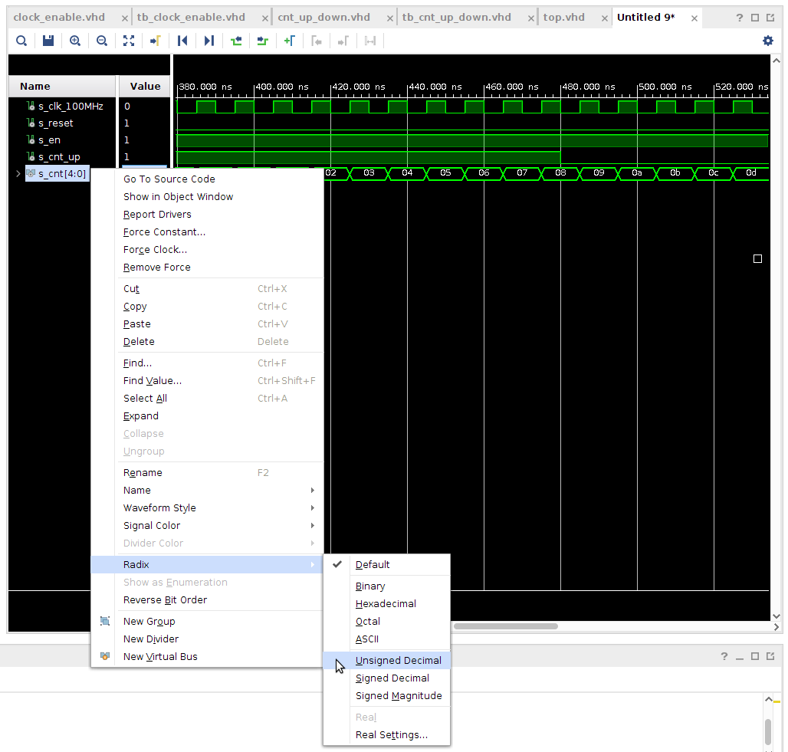
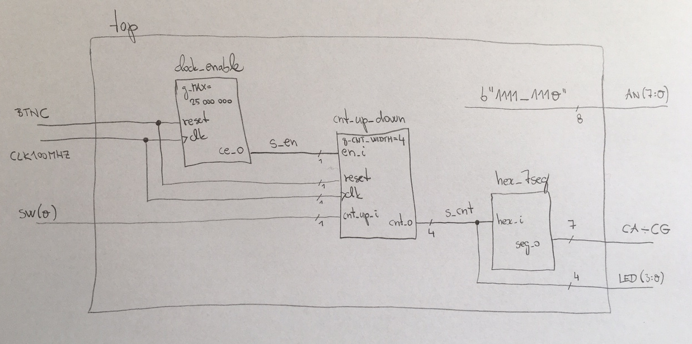
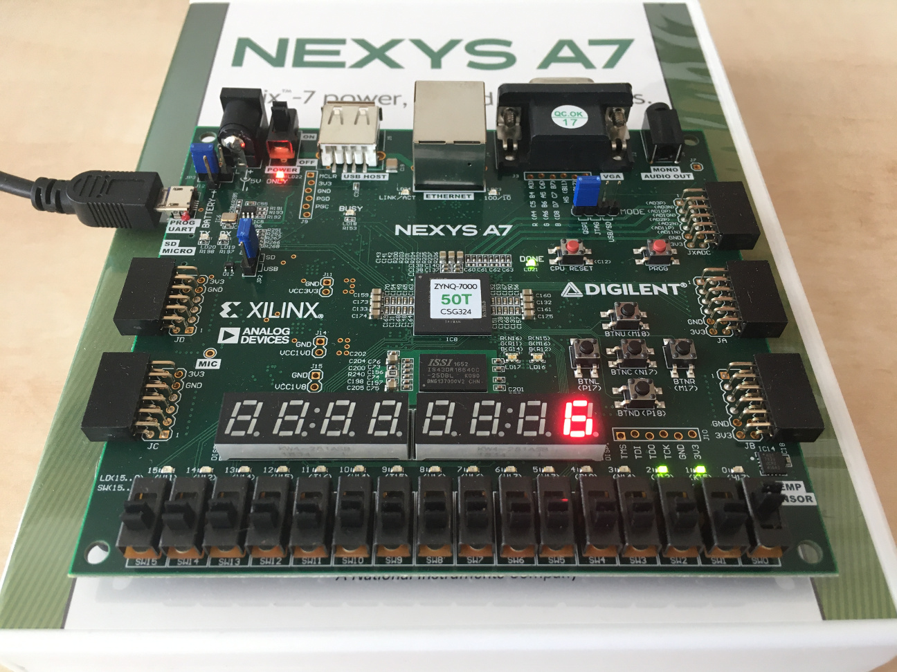

# Lab 6: Binary counter

<!--

<p align="center">
  The Study of Modern and Developing Engineering BUT<br>
  CZ.02.2.69/0.0/0.0/18_056/0013325
</p>
-->

### Learning objectives

After completing this lab you will be able to:

* Use VHDL generics and synchronous processes
* Use clock enable signal to drive another logic in the design (with slower clock)
* Understand binary counters

The purpose of this laboratory exercise is to become familiar with the creation of sequential processes in VHDL, next to implement a clock enable signal to drive another logic with slower clock, and to design a binary counter.

### Table of contents

* [Preparation tasks](#preparation)
* [Part 1: Synchronize Git and create a new folder](#part1)
* [Part 2: VHDL code for clock enable](#part2)
* [Part 3: VHDL code for bidirectional binary counter](#part3)
* [Part 4: Top level VHDL code](#part4)
* [Experiments on your own](#experiments)
* [Lab assignment](#assignment)
* [References](#references)

<a name="preparation"></a>

## Preparation tasks (done before the lab at home)

The Nexys A7 board provides five push buttons for user applications.

1. See [schematic](https://github.com/tomas-fryza/digital-electronics-1/blob/master/docs/nexys-a7-sch.pdf) or [reference manual](https://reference.digilentinc.com/reference/programmable-logic/nexys-a7/reference-manual) of the Nexys A7 board and find out the connection of these push buttons, ie to which FPGA pins are connected and how. What logic/voltage value do the buttons generate when not pressed and what value when the buttons are pressed? Draw the schematic with push buttons.

2. Calculate how many periods of clock signal with frequency of 100&nbsp;MHz contain time intervals 2&nbsp;ms, 4&nbsp;ms, 10&nbsp;ms, 250&nbsp;ms, 500&nbsp;ms, and 1&nbsp;s. Write values in decimal, binary, and hexadecimal forms.

   &nbsp;
   
   &nbsp;

   
   &nbsp;
   <!--
   https://editor.codecogs.com/
   T_{clk}=\frac{1}{f_{clk}}=
   \textup{number of clk period} = \frac{\textup{time interval}}{T_{clk}}=
   -->

   | **Time interval** | **Number of clk periods** | **Number of clk periods in hex** | **Number of clk periods in binary** |
   | :-: | :-: | :-: | :-: |
   | 2&nbsp;ms | 200 000 | `x"3_0d40"` | `b"0011_0000_1101_0100_0000"` |
   | 4&nbsp;ms |
   | 10&nbsp;ms |
   | 250&nbsp;ms |
   | 500&nbsp;ms |
   | 1&nbsp;sec | 100 000 000 | `x"5F5_E100"` | `b"0101_1111_0101_1110_0001_0000_0000"` |

<a name="part1"></a>

## Part 1: Synchronize repositories and create a new folder

1. Run Git Bash (Windows) of Terminal (Linux), navigate to your working directory, and update local repository.

   > Useful bash and git commands are: `cd` - Change working directory. `mkdir` - Create directory. `ls` - List information about files in the current directory. `pwd` - Print the name of the current working directory. `git status` - Get state of working directory and staging area. `git pull` - Update local repository and working folder.
   >

2. Create a new working folder `labs/06-counter` for this laboratory exercise.

3. Create a new file `labs/06-counter/assignment.md` and copy/paste [assignment template](https://raw.githubusercontent.com/tomas-fryza/digital-electronics-1/master/labs/06-counter/assignment.md) into it.

<a name="part2"></a>

## Part 2: VHDL code for clock enable

To drive another logic in the design (with slower clock), it is better to generate a **clock enable signal** (see figure bellow) instead of creating another clock domain (using clock dividers) that would cause timing issues or clock domain crossing problems such as metastability, data loss, and data incoherency.


> The figure above was created in [WaveDrom](https://wavedrom.com/) digital timing diagram online tool. The figure source code is as follows (ticks -2, -1, 10, 11 and 12 were manually adjusted afterwards):
>
```javascript
{
  signal: [
    {name: "clk",  wave: 'P.............'},
    {name: "ce_o", wave: 'lhl........hl.'},
  ],
  head: {
    tick: -2,
  },
  foot: {
    text:'g_MAX = 10',
  },
}
```

1. Perform the following steps to model clock enable circuit in Vivado.

   1. Create a new Vivado RTL project `counter` in your `labs/06-counter` working folder.
   2. Create a VHDL source file `clock_enable` for the clock enable circuit.
   3. Choose default board: `Nexys A7-50T`.
   4. Open the [Clock enable circuit example](https://www.edaplayground.com/x/5LiJ) and copy/paste the `design.vhd` code to your `clock_enable.vhd` file. Take a look at the new parts of the VHDL source code, such as package for arithmetic operations, `generic` part, internal signal, and [synchronous process](https://github.com/tomas-fryza/digital-electronics-1/wiki/Processes). **Generic** allows us to pass information into an entity and component. Since a generic cannot be modified inside the architecture, it is like a constant.
   5. Create a VHDL [simulation source](https://www.edaplayground.com/x/5LiJ) `tb_clock_enable` and run the simulation. Verify the meaning of the constant `c_MAX` and reset generation process.

   The default simulation run time is set to 1000&nbsp;ns in Vivado. Note that, you can change it in the menu **Tools > Settings...**

      

<a name="part3"></a>

## Part 3: VHDL code for bidirectional binary counter

[Bidirectional counters](https://www.electronics-tutorials.ws/counter/count_4.html), also known as Up/Down counters, are capable of counting in either direction through any given count sequence and they can be reversed at any point within their count sequence by using an additional control input as shown below.

1. Perform the following steps to simulate the bidirectional N-bit counter.

   1. Create a new VHDL [design source](https://www.edaplayground.com/x/5bgq) `cnt_up_down` in your project.
   2. Take a look at the new parts of the VHDL source code. Note that an internal `s_cnt_local` signal is used to implement the counter. This is because the **output** port `cnt_o` cannot be read and therefore the operation `cnt_o + 1` cannot be performed. Also note that local value must be retyped to the output port.
   3. Create a VHDL [simulation source](https://www.edaplayground.com/x/5bgq) `tb_cnt_up_down`.
   4. Change the testbench you want to simulate, right click to file name and select `Set as Top`. Run the simulation. Verify the meaning of the constant `c_CNT_WIDTH` and reset generation process.

     

   5. Complete architecture of the counter, make it bidirectional, and simulate again.

   Note that for any vector, it is possible to change the numeric system in the simulation which represents the current value. To do so, right-click the vector name (here `s_cnt[4:0]`) and select **Radix > Unsigned Decimal** from the context menu. You can change the vector color by **Signal Color** as well.

     

<a name="part4"></a>

## Part 4: Top level VHDL code

1. Perform the following steps to implement the 4-bit bidirectional counter on the Nexys A7 board.

   1. Create a new VHDL design source `top` in your project.
   2. Use **Define Module** dialog and define I/O ports of entity `top` as follows.

      | **Port name** | **Direction** | **Type** | **Description** |
      | :-: | :-: | :-- | :-- |
      | `CLK100MHZ` | in  | `std_logic` | Main clock |
      | `SW`        | in  | `std_logic` | Counter direction |
      | `LED`       | out | `std_logic_vector(3 downto 0)` | Counter value LED indicators |
      | `CA`        | out | `std_logic` | Cathod A |
      | `CB`        | out | `std_logic` | Cathod B |
      | `CC`        | out | `std_logic` | Cathod C |
      | `CD`        | out | `std_logic` | Cathod D |
      | `CE`        | out | `std_logic` | Cathod E |
      | `CF`        | out | `std_logic` | Cathod F |
      | `CG`        | out | `std_logic` | Cathod G |
      | `AN`        | out | `std_logic_vector(7 downto 0)` | Common anode signals to individual displays |
      | `BTNC`      | in  | `std_logic` | Synchronous reset |

   3. Use [direct instantiation](https://github.com/tomas-fryza/digital-electronics-1/wiki/Direct-instantiation) and define an architecture of the top level: complete instantiation (copy) of `clock_enable`, `cnt_up_down`, and `hex_7seg` entities. Copy source file `hex_7seg.vhd` from the previous laboratories to the `counter/counter.srcs/sources_1/new/` source folder and add it to the project.

      ```vhdl
      ------------------------------------------------------------------------
      -- Architecture body for top level
      ------------------------------------------------------------------------
      architecture Behavioral of top is

        -- Internal clock enable
        signal s_en  : std_logic;
        -- Internal counter
        signal s_cnt : std_logic_vector(4 - 1 downto 0);

      begin

        --------------------------------------------------------------------
        -- Instance (copy) of clock_enable entity
        clk_en0 : entity work.clock_enable
            generic map(
                g_MAX => 25000000
            )
            port map(
                clk   => --- WRITE YOUR CODE HERE
                reset => --- WRITE YOUR CODE HERE
                ce_o  => s_en
            );

        --------------------------------------------------------------------
        -- Instance (copy) of cnt_up_down entity
        bin_cnt0 : entity work.cnt_up_down
           generic map(
                --- WRITE YOUR CODE HERE
            )
            port map(
                --- WRITE YOUR CODE HERE
            );

        --------------------------------------------------------------------
        -- Instance (copy) of hex_7seg entity
        hex2seg : entity work.hex_7seg
            port map(
                hex_i    => s_cnt,
                seg_o(6) => CA,
                seg_o(5) => CB,
                seg_o(4) => CC,
                seg_o(3) => CD,
                seg_o(2) => CE,
                seg_o(1) => CF,
                seg_o(0) => CG
            );

        -- Connect one common anode to 3.3V
        AN <= b"1111_1110";

        -- Display counter values on LEDs
        LED(3 downto 0) <= s_cnt;

      end architecture Behavioral;
      ```
  
     

   4. Create a new [constraints XDC](https://raw.githubusercontent.com/Digilent/digilent-xdc/master/Nexys-A7-50T-Master.xdc) file: `nexys-a7-50t` and uncomment used pins according to the `top` entity.

      IMPORTANT: Because we defined `SW` as a single signal and not a bus, make sure you rename the selected port name in XDC file, for example `SW[0]` to `SW`.

   5. Compile the project and download the generated bitstream `counter/counter.runs/impl_1/top.bit` into the FPGA chip.
   6. Test the functionality of the 4-bit counter by toggling the switch, pressing the button and observing the display and LEDs.

      

   7. Use **IMPLEMENTATION > Open Implemented Design > Schematic** to see the generated structure.
   8. Use digital oscilloscope or logic analyser and display counter values via Pmod ports. See [schematic](https://github.com/tomas-fryza/digital-electronics-1/blob/master/docs/nexys-a7-sch.pdf) or [reference manual](https://reference.digilentinc.com/reference/programmable-logic/nexys-a7/reference-manual) of the Nexys A7 board and find out to which FPGA pins Pmod ports JA, JB, JC, and JD are connected.

      

      

## Synchronize repositories

When you finish working, always synchronize the contents of your working folder with the local and remote versions of your repository. This way you are sure that you will not lose any of your changes.

   > Useful git commands are: `git status` - Get state of working directory and staging area. `git add` - Add new and modified files to the staging area. `git commit` - Record changes to the local repository. `git push` - Push changes to remote repository. `git pull` - Update local repository and working folder. Note that, a brief description of useful git commands can be found [here](https://github.com/tomas-fryza/digital-electronics-1/wiki/Useful-Git-commands) and detailed description of all commands is [here](https://github.com/joshnh/Git-Commands).
   >

<a name="experiments"></a>

## Experiments on your own

1. Add a second instantiation (copy) of the counter and clock enable entities and make a 16-bit counter with a 10 ms time base. Therefore, the application will contain two independent binary counters (4-bit and 16-bit), each with a different counting speed.

   Display the second counter value on LED(15:0). Since it is not possible to control one output device with two different sources, the values of the first counter will no longer be displayed on the LED(3:0). All LEDs here are reserved for the second counter only!

<a name="assignment"></a>

## Lab assignment

*Copy the [assignment template](assignment.md) to your GitHub repository. Complete all parts of this file in Czech, Slovak, or English and submit a link to it via [BUT e-learning](https://moodle.vutbr.cz/). The deadline for submitting the task is the day before the next computer exercise.*

*Vložte [šablonu úkolu](assignment.md) do vašeho GitHub repozitáře. Vypracujte všechny části z tohoto souboru v českém, slovenském, nebo anglickém jazyce a odevzdejte link na něj prostřednictvím [e-learningu VUT](https://moodle.vutbr.cz/). Termín odevzdání úkolu je den před dalším počítačovým cvičením.*

<a name="references"></a>

## References

1. Digilent blog. [Nexys A7 Reference Manual](https://reference.digilentinc.com/reference/programmable-logic/nexys-a7/reference-manual)

2. [WaveDrom - Digital Timing Diagram everywhere](https://wavedrom.com/)

3. Tomas Fryza. [Template for clock enable module](https://www.edaplayground.com/x/Vdpu)

4. Tomas Fryza. [Template for bi-directional counter](https://www.edaplayground.com/x/5bgq)

5. Digilent. [General .xdc file for the Nexys A7-50T](https://github.com/Digilent/digilent-xdc/blob/master/Nexys-A7-50T-Master.xdc)
