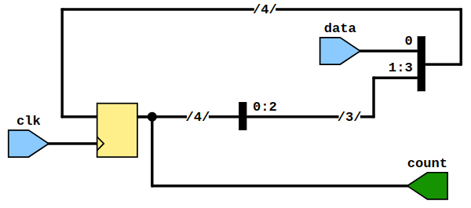

# Lab 6: Shift register and LFSR

* [Pre-Lab preparation](#preparation)
* [Part 1: VHDL code for shift register](#part1)
* [Part 2: 4-bit LFSR (Linear Feedback Shift Register)](#part2)
* [Part 3: n-bit LFSR counter](#part3)
* [Challenges](#challenges)
* [References](#references)

### Learning objectives

After completing this lab you will be able to:

* Understand shift registers
* Understand the pseudo-random generator using LFSR (Linear Feedback Shift Register)
* Use generate statements to replicate logic in VHDL or turning on/off blocks of logic

<a name="preparation"></a>

## Pre-Lab preparation


1. TBD: pochopení LFSR, tabulka pseudo random


<a name="part1"></a>

## Part 1: VHDL code for shift register

A binary **shift register** is a digital circuit that sequentially shifts data bits, either left or right, through a series of flip-flops controlled by a clock signal. It operates in parallel-in, serial-out (PISO) or serial-in, parallel-out (SIPO) modes. Shift registers are commonly used for serial-to-parallel and parallel-to-serial data conversion, data storage, and data transmission.

1. Run Vivado, create a new project and implement a 4-bit shift register with serial input and enable signal:

   1. Project name: `lfsr`
   2. Project location: your working folder, such as `Documents`
   3. Project type: **RTL Project**
   4. Create a VHDL source file: `lfsr`
   5. Do not add any constraints now
   6. Choose a default board: `Nexys A7-50T`
   7. Click **Finish** to create the project
   8. Define I/O ports of new module:

      | **Port name** | **Direction** | **Type** | **Description** |
      | :-: | :-: | :-- | :-- |
      | `clk`   | input  | `std_logic` | Main clock |
      | `en`    | input  | `std_logic` | Clock enable input |
      | `seed_en` | input  | `std_logic` | Enable signal to load seed data |
      | `seed_data` | input  | `std_logic_vector(3 downto 0)` | Seed data |
      | `count` | output | `std_logic_vector(3 downto 0)` | Register value |

2. Use VHDL templates in menu **Tools > Language Templates**, search for `parallel load`, copy/paste `w/ CE` template to the architecture and modify the code according to your I/O port names.

   > **Note:** The template is located in:
   > ```bash
   > VHDL
   > └── Synthesis Constructs
   >     └── Coding Examples
   >         └── Shift Registers
   >             └── Parallel Load, Serial In, Serial Out
   >                 └── w/ CE
   > ```

   ```vhdl
   -- Define a temporary signal that is of type std_logic_vector(<width>-1 downto 0).
   -- Where width is the number of bits to shift
   process (<clock>)
   begin
       if <clock>'event and <clock>='1' then
           if <load_enable> = '1' then
               <tmp_sig> <= <load_data>;
           elsif <clock_enable> = '1' then
               <tmp_sig> <= <tmp_sig>(<width>-2 downto 0) & <input>;
           end if;
       end if;
   end process;
   <output> <= <tmp_sig>(<width>-1);
   ```

   Hints:
      * Use `rising_edge(clk)` instead of `clk='1' and clk'event` to test clock edge
      * Define an internal signal `sig_reg` of data type `std_logic_vector(4-1 downto 0)` to implement the shift register
      * For now, use constant `1` instead of `<input>` signal
      * Notation `&` represents vector concatenation used to merge data. Notation `s <= s(2 downto 0) & '1';` creates `"s2 s1 s0 1"`.
      * Assign the whole internal register to the output `count <= sig_reg;` (The template here implements Serial out and not Parallel output.)

   > **Note:** The structure below implements a simplified 4-bit shift register without any enable inputs.
   >
   > ```vhdl
   > process (clk)
   > begin
   >     if rising_edge(clk) then
   >         sig_reg <= sig_reg(4-2 downto 0) & data;
   >         -- "sig_reg(2)  sig_reg(1)  sig_reg(0)  data"
   >     end if;
   > end process;
   >
   > count <= sig_reg;
   > ```
   >
   > **RTL level:**
   > 
   >
   >
   > **Gate level:**
   > 

<a name="part2"></a>

## Part 2: 4-bit LFSR (Linear Feedback Shift Register)

A **Linear Feedback Shift Register (LFSR)** is a shift register whose input bit is a linear function of its previous state using XOR or XNOR gates. The feedback taps determine the new bit entering the register. LFSRs are widely used for generating pseudo-random sequences in digital systems, cryptography, and communication protocols due to their simplicity, efficiency, and long periods before repeating sequences. They are also used for channel encoding and decoding, error detection, and testing digital systems.

1. To implement a linear feedback for an LFSR counter in VHDL, integrate an XNOR gate with a 4-bit shift register. Create an internal signal of type `std_logic`, utilizing feedback taps `sig_reg(3)` and `sig_reg(2)`, and connect it to the least significant bit (LSB) of the internal register.

2. Add a `done` signal of type `std_logic` into the LFSR entity. Outside the LFSR process, produce a pulse when the internal register matches the initial seed value.

   ```vhdl
   entity lfsr is
       port (
           ...
           done      : out std_logic;
           count     : out std_logic_vector(3 downto 0)
       );
   end lfsr;

   architecture behavioral of lfsr is
       ...
       signal sig_feedback : std_logic;
   begin

       process (clk)
       begin
           ...
           sig_reg <= sig_reg(4-2 downto 0) & sig_feedback;
           ...
       end process;

       ...
       -- Create feedback for 4-bit LFSR counter
       sig_feedback <= sig_reg(3) xnor sig_reg(2);

       -- Create a `done` output pulse
       done <= '1' when (sig_reg = seed_data) else
               '0';

   end behavioral;
   ```

3. Use **Flow > Open Elaborated design** and see the schematic after RTL analysis.

4. Generate a [simulation source](https://vhdl.lapinoo.net/testbench/) named `tb_lfsr`, execute the simulation, and validate the functionality of enable and seed values. Experiment with various tap configurations for XNOR gates and analyze the length of the generated pseudo-random sequence.

5. Optional: Create a VHDL design source named `top_level` and implement a 4-bit LFSR counter on the Nexys A7 board. Configure the counter to increment every 500 ms (component `enable_clock` from the previous lab is needed), displaying the count on the 7-segment display and LEDs. Set the initial seed value using four switches.


TBD: Fig of top level


<a name="part3"></a>

## Part 3: n-bit LFSR counter


TBD: Add generic `NBIT = 4` to design and simulation sources.


TBD: generovat zpětnou vazbbu podle `NBIT`


TBD: simulace odlišných `NBIT`


TBD: implementace na Nexys

