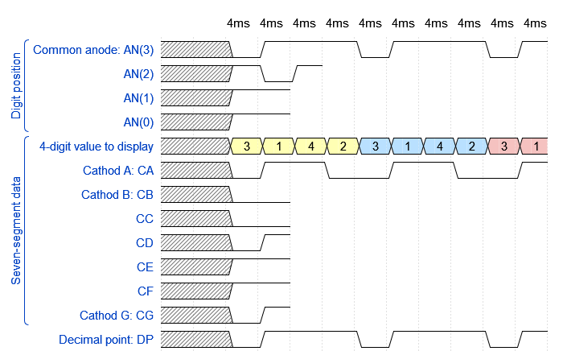

# Lab 7: Driver for multiple seven-segment displays

<!--

<p align="center">
  The Study of Modern and Developing Engineering BUT<br>
  CZ.02.2.69/0.0/0.0/18_056/0013325
</p>
-->

### Learning objectives

After completing this lab you will be able to:

* Use several 7-segment displays
* Use previously created modules in a new design
* Understand how to use the multiplexer to switch between displays

In this laboratory exercise, you will study the creation of a sequential circuit for multiplexing 7-segment displays. This allows you to display four or even eight-digit values, including the decimal point on the display.

### Table of contents

* [Preparation tasks](#preparation)
* [Part 1: Synchronize Git and create a new folder](#part1)
* [Part 2: VHDL code for display driver](#part2)
* [Part 3: Top level VHDL code](#part3)
* [Experiments on your own](#experiments)
* [Lab assignment](#assignment)
* [References](#references)

<a name="preparation"></a>

## Preparation tasks (done before the lab at home)

A common way to control multiple displays is to gradually switch between them. We control (connect to supply voltage) only one of the displays at a time, as can be seen [here](https://engineeringtutorial.com/seven-segment-display-working-principle/).

Due to the physiological properties of human vision, it is necessary that the time required to display the whole value is a maximum of 16&nbsp;ms. If we display four digits, then the duration of one of them is 4&nbsp;ms. If we display eight digits, the time is reduced to 2&nbsp;ms, etc.

1. See [schematic](https://github.com/tomas-fryza/Digital-electronics-1/blob/master/docs/nexys-a7-sch.pdf) or [reference manual](https://reference.digilentinc.com/reference/programmable-logic/nexys-a7/reference-manual) of the Nexys A7 board, find out the connection of 7-segment displays, and complete the signal timing to display four-digit value `3.142`.

  

  

  > The figure above was created in [WaveDrom](https://wavedrom.com/) digital timing diagram online tool. The figure source code is as follows:
  >
  ```javascript
  {
    signal:
    [
      ['Digit position',
        {name: 'Common anode: AN(3)', wave: 'xx01..01..01'},
        {name: 'AN(2)', wave: 'xx101'},
        {name: 'AN(1)', wave: 'xx1.'},
        {name: 'AN(0)', wave: 'xx1.'},
      ],
      ['Seven-segment data',
        {name: '4-digit value to display', wave: 'xx3333555599', data: ['3','1','4','2','3','1','4','2','3','1']},
        {name: 'Cathod A: CA', wave: 'xx01.0.1.0.1'},
        {name: 'Cathod B: CB', wave: 'xx0.'},
        {name: 'CC', wave: 'xx0.'},
        {name: 'CD', wave: 'xx01'},
        {name: 'CE', wave: 'xx1.'},
        {name: 'CF', wave: 'xx1.'},
        {name: 'Cathod G: CG', wave: 'xx01'},
      ],
      {name: 'Decimal point: DP', wave: 'xx01..01..01'},
    ],
    head:
    {
      text: '                    4ms   4ms   4ms   4ms   4ms   4ms   4ms   4ms   4ms   4ms',
    },
  }
  ```

<a name="part1"></a>

## Part 1: Synchronize repositories and create a new folder

1. Run Git Bash (Windows) of Terminal (Linux), navigate to your working directory, and update local repository.

   > Useful bash and git commands are: `cd` - Change working directory. `mkdir` - Create directory. `ls` - List information about files in the current directory. `pwd` - Print the name of the current working directory. `git status` - Get state of working directory and staging area. `git pull` - Update local repository and working folder.
   >

2. Create a new working folder `labs/07-display_driver` for this laboratory exercise.

3. Create a new file `labs/07-display_driver/assignment.md` and copy/paste [assignment template](https://raw.githubusercontent.com/tomas-fryza/digital-electronics-1/master/labs/07-display_driver/assignment.md) into it.

<a name="part2"></a>

## Part 2: VHDL code for display driver

A display drive is able to control several 7-segment displays. Using the multiplexer, we only select one display at a time. Multiplexer or MUX is a digital switch which allows to route binary information from several input lines or sources to one output line or channel.

1. Perform the following steps to model the driver for group of four displays in Vivado.

   1. Create a new Vivado RTL project `display_driver` in your `labs/07-display_driver` working folder.
   2. Create a VHDL source file `driver_7seg_4digits` for the driver circuit.
   3. Choose default board: `Nexys A7-50T`.
   4. Open the [Driver for 7-segment display example](https://www.edaplayground.com/x/3f_A) and copy/paste the `design.vhd` code to your `driver_7seg_4digits.vhd` file.
   5. Copy source files of clock enable, binary counter, 7-segment decoder modules from previous labs to `display_driver/display_driver.srcs/sources_1/new/` folder and add them to the project.
   6. Complete the driver code according to the following block diagram.

      

   7. Create a VHDL [simulation source](https://www.edaplayground.com/x/3f_A) `tb_driver_7seg_4digits`, complete the code, set conditions to display value `3.142` and run the simulation. Compare simulated timing diagram with yours in Preparation tasks. Verify reset as well.

      **Important note:** Change the `g_MAX` parameter of `clock_enable` entity in the driver architecture to **4**! Then each clock period will be equivalent to 1 ms and not 10 ns. For implementation, do sure to change back the correct value to 400,000.

   8. Use **Flow** > **Open Elaborated design** and see the schematic after RTL analysis. Note that RTL (Register Transfer Level) represents digital circuit at the abstract level.

<a name="part3"></a>

## Part 3: Top level VHDL code

Perform the following steps to implement the 4-digit 7-segment display driver on the Nexys A7 board.

   1. Create a new VHDL design source `top` in your project.
   2. Use **Define Module** dialog and define I/O ports of entity `top` as follows.

      | **Port name** | **Direction** | **Type** | **Description** |
      | :-: | :-: | :-- | :-- |
      | `CLK100MHZ` | in | `std_logic` | Main clock |
      | `SW` | in  | `std_logic_vector(15 downto 0)` | Four 4-bit data values |
      | `CA` | out | `std_logic` | Cathod A |
      | `CB` | out | `std_logic` | Cathod B |
      | `CC` | out | `std_logic` | Cathod C |
      | `CD` | out | `std_logic` | Cathod D |
      | `CE` | out | `std_logic` | Cathod E |
      | `CF` | out | `std_logic` | Cathod F |
      | `CG` | out | `std_logic` | Cathod G |
      | `DP` | out | `std_logic` | Decimal point |
      | `AN` | out | `std_logic_vector(7 downto 0)` | Common anode signals to individual displays |
      | `BTNC` | in | `std_logic` | Synchronous reset |

   3. Use [direct instantiation](https://github.com/tomas-fryza/digital-electronics-1/wiki/Direct-instantiation) and define an architecture of the top level.

      ```vhdl
      ------------------------------------------------------------
      -- Architecture body for top level
      ------------------------------------------------------------
      architecture Behavioral of top is
        -- No internal signals are needed today:)
      begin

        --------------------------------------------------------
        -- Instance (copy) of driver_7seg_4digits entity
        driver_seg_4 : entity work.driver_7seg_4digits
            port map(
                clk        => CLK100MHZ,
                reset      => BTNC,
                data0_i(3) => SW(3),
                data0_i(2) => SW(2),
                data0_i(1) => SW(1),
                data0_i(0) => SW(0),

                -- MAP DATA INPUTS TO ON-BOARD SWITCHES

                data3_i(3) => SW(15),
                data3_i(2) => SW(14),
                data3_i(1) => SW(13),
                data3_i(0) => SW(12),
                dp_i       => "0111",

                -- MAP DECIMAL POINT AND DISPLAY SEGMENTS

                dig_o(3 downto 0) => AN(3 downto 0)
            );

        -- Disconnect the top four digits of the 7-segment display
        AN(7 downto 4) <= b"1111";

      end architecture Behavioral;
      ```

   4. Create a new [constraints XDC](https://raw.githubusercontent.com/Digilent/digilent-xdc/master/Nexys-A7-50T-Master.xdc) file: `nexys-a7-50t` and uncomment used pins according to top entity.
   5. Compile the project and download the generated bitstream `display_driver/display_driver.runs/impl_1/top.bit` into the FPGA chip.
   6. Test the functionality of the driver by toggling the switches and observing the display.

      

   7. Use **IMPLEMENTATION > Open Implemented Design > Schematic** to see the generated structure.

## Synchronize repositories

When you finish working, always synchronize the contents of your working folder with the local and remote versions of your repository. This way you are sure that you will not lose any of your changes.

   > Useful git commands are: `git status` - Get state of working directory and staging area. `git add` - Add new and modified files to the staging area. `git commit` - Record changes to the local repository. `git push` - Push changes to remote repository. `git pull` - Update local repository and working folder. Note that, a brief description of useful git commands can be found [here](https://github.com/tomas-fryza/digital-electronics-1/wiki/Useful-Git-commands) and detailed description of all commands is [here](https://github.com/joshnh/Git-Commands).
   >

<a name="experiments"></a>

## Experiments on your own

1. If you have the option, set slow motion video recording on your smartphone and watch the behavior of the seven-segment display:)
2. Extend the duration of one symbol on the 7-segment display ie. generic `g_MAX` in `driver_7seg_4digit.vhd` file and experimentally determine the maximum value at which switching by the human eye is not yet observable.
3. Design the structure of `driver_7seg_8digits` module, which controls all eight 7-segment displays.

<a name="assignment"></a>

## Lab assignment

*Copy the [assignment template](assignment.md) to your GitHub repository. Complete all parts of this file in Czech, Slovak, or English and submit a link to it via [BUT e-learning](https://moodle.vutbr.cz/). The deadline for submitting the task is the day before the next computer exercise.*

*Vložte [šablonu úkolu](assignment.md) do vašeho GitHub repozitáře. Vypracujte všechny části z tohoto souboru v českém, slovenském, nebo anglickém jazyce a odevzdejte link na něj prostřednictvím [e-learningu VUT](https://moodle.vutbr.cz/). Termín odevzdání úkolu je den před dalším počítačovým cvičením.*

<a name="references"></a>

## References

1. Bharadwaj. [Seven Segment Display Working Principle](https://engineeringtutorial.com/seven-segment-display-working-principle/)

2. Digilent blog. [Nexys A7 Reference Manual](https://reference.digilentinc.com/reference/programmable-logic/nexys-a7/reference-manual)

3. [WaveDrom - Digital Timing Diagram everywhere](https://wavedrom.com/)

4. Tomas Fryza. [Driver for 7-segment display](https://www.edaplayground.com/x/3f_A)

5. Digilent. [General .xdc file for the Nexys A7-50T](https://github.com/Digilent/digilent-xdc/blob/master/Nexys-A7-50T-Master.xdc)
