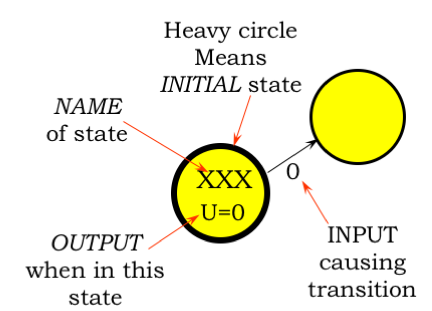
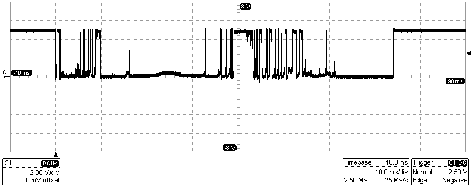
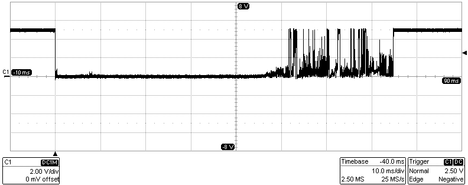
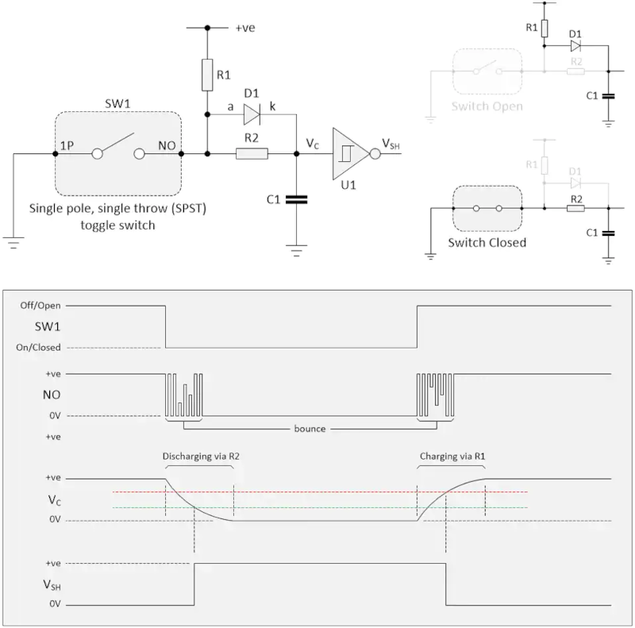
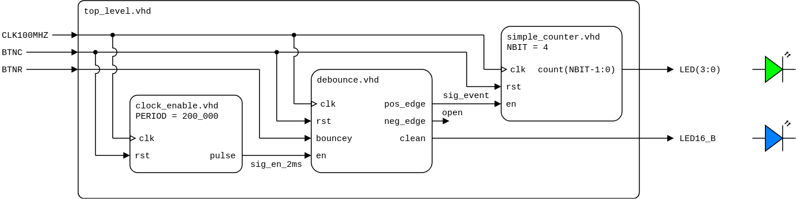

# Lab 8: FSM debouncer

* [Pre-Lab preparation](#preparation)
* [Part 1: Finite State Machine (FSM)](#part1)
* [Part 2: Button bounce](#part2)
* [Part 3: FSM debouncer in VHDL](#part3)
* [Part 4: Edge detector](#part4)


* [Challenges](#challenges)
* [References](#references)

### Learning objectives

After completing this lab you will be able to:

* Understand the philosophy and use of finite state machines
* Use state diagrams
* Understand the difference between Mealy and Moore type of FSM in VHDL
* Understand the button bounce effect and how to debounce it


<a name="preparation"></a>

## Pre-Lab preparation

1. TBD


<a name="part1"></a>

## Part 1: Finite State Machine (FSM)

A **Finite State Machine (FSM)** is a mathematical model used to describe and represent the behavior of systems that can be in a finite number of states at any given time. It consists of a set of states, transitions between these states, and actions associated with these transitions.

The main properties of using FSMs include:

   1. **Determinism**: FSMs are deterministic if, for each state and input, there is exactly one transition to a next state. This property simplifies analysis and implementation.

   2. **State Memory**: FSMs inherently have memory as they retain information about their current state. This allows them to model systems with sequential behavior.

   3. **Simplicity**: FSMs are relatively simple and intuitive to understand, making them useful for modeling and designing systems with discrete and sequential behavior.

   4. **Parallelism**: FSMs can represent parallelism by having multiple state machines working concurrently, each handling different aspects of the system.

The main types of FSMs include Moore Machine and Mealy Machine. In a **Moore machine**, outputs are associated with states (see [figure](https://www.allaboutcircuits.com/technical-articles/implementing-a-finite-state-machine-in-vhdl/) bellow), while in a **Mealy machine**, outputs are associated with transitions between states. This means that Moore machines produce outputs only after transitioning to a new state, while Mealy machines can produce outputs immediately upon receiving an input.

   

One widely used method to illustrate a finite state machine is through a **state diagram**, comprising circles connected by directed arcs. Each circle denotes a machine state labeled with its name, and, in the case of a Moore machine, an [output value](https://ocw.mit.edu/courses/electrical-engineering-and-computer-science/6-004-computation-structures-spring-2017/c6/c6s1/) associated with the state.

   

Directed arcs signify the transitions between states in a finite state machine (FSM). For a Mealy machine, these arcs are labeled with input/output pairs, while for a Moore machine, they are labeled solely with inputs.

   

<a name="part2"></a>

## Part 2: Button bounce

A **bouncy button**, also known as a "bouncing switch" or "switch bounce," refers to the phenomenon where the electrical contacts in a mechanical switch make multiple, rapid transitions between open and closed states when pressed or released. This can lead to multiple erroneous signals being sent to a circuit.

   

   

   

The main methods to debounce a bouncy button are:

   1. **[Hardware Debouncing](https://www.digikey.ee/en/articles/how-to-implement-hardware-debounce-for-switches-and-relays)**: Hardware debouncing involves adding additional circuitry or components to the switch or input signal path to eliminate or reduce the effects of bouncing, such as capacitors, resistors, and Schmitt triggers.

      

   2. **Software Debouncing**: This method involves using software algorithms to filter out the noise and ensure that only a single, stable signal transition is recognized. Common techniques include implementing delay-based algorithms, state machines, or using timers.

   3. **Combination Approach**: Often, a combination of software and hardware debouncing methods is employed to achieve robust debouncing.

<a name="part3"></a>

## Part 3: FSM debouncer in VHDL

1. Run Vivado, create a new project and implement an FSM version of software debouncer with clock enable and reset:

   1. Project name: `fsm`
   2. Project location: your working folder, such as `Documents`
   3. Project type: **RTL Project**
   4. Create a VHDL source file: `debounce`
   5. Do not add any constraints now
   6. Choose a default board: `Nexys A7-50T`
   7. Click **Finish** to create the project
   8. Define I/O ports of new module:

      | **Port name** | **Direction** | **Type** | **Description** |
      | :-: | :-: | :-- | :-- |
      | `clk`   | input  | `std_logic` | Main clock |
      | `rst`   | input  | `std_logic` | High-active synchronous reset |
      | `en`    | input  | `std_logic` | Clock enable input |
      | `bouncey` | input  | `std_logic` | Button input |
      | `clean` | output | `std_logic` | Debounced button output |

2. Sample the button signal using a clock enable signal every 2 milliseconds. If the sampled value is high, begin counting a sequence of consecutive high values. If there is an uninterrupted sequence of `DEB_COUNT = 4` high values, consider the button pressed. The counter resets to zero whenever a low sample is received. When releasing the button, the FSM counts the same number of low-value samples before considering the button released.

   

   In the architecture declaration section, define four states for the FSM and an internal counter for counting a sequence of unchanged button signal values.

      ```vhdl
      architecture behavioral of debouncer_fsm is
          -- Define states for the FSM
          type   state_type is (RELEASED, PRE_PRESSED, PRESSED, PRE_RELEASED);
          signal state : state_type;

          -- Define number of periods for debounce counter
          constant DEB_COUNT : integer := 4;

          -- Define signals for debounce counter
          signal sig_count : integer range 0 to DEB_COUNT;
      begin
          ...
      ```

3. Complete the architecture body section according to the state diagram above.

   ```vhdl
   begin

       --! FSM process
       p_fsm : process (clk) is
       begin

           if rising_edge(clk) then
               -- Active-high reset
               if (rst = '1') then
                   state <= RELEASED;
               -- Clock enable
               elsif (en = '1') then

                   -- Define transitions between states
                   case state is

                       when RELEASED =>
                           -- If button = 1 then clear counter and change to PRE_PRESSED;

                       when PRE_PRESSED =>
                           -- If button = 1 increment counter

                               -- if counter = DEB_PERIODS-1 change to PRESSED

                           -- else change to RELEASED

                       when PRESSED =>
                           -- If button = 0 then clear counter and change to PRE_RELEASED;

                       when PRE_RELEASED =>
                           -- If button = 0 then increment counter

                               -- if counter = DEB_PERIODS-1 change to RELEASED;

                           -- else clear counter and change to PRESSED;

                       when others =>
                           null;
                   end case;
               end if;
           end if;

       end process p_fsm;

       -- Debounced button value = 1 when states PRESSED or PRE_RELEASED


   end architecture behavioral;
   ```

4. Use **Flow > Open Elaborated design** and see the schematic after RTL analysis.

5. Generate a [simulation source](https://vhdl.lapinoo.net/testbench/) named `tb_fsm`, execute the simulation, and validate the functionality of enable, reset, and debouncing.

   > To display internal signal values, follow these steps:
   > 1. Select 'dut' in the **Scope** folder.
   > 2. Right-click on the 'state' signal name in the **Objects** folder.
   > 3. Add this signal by selecting the **Add to Wave Window** command.
   > 4. Click on the **Relaunch Simulation** icon.
   >
   >    

<a name="part4"></a>

## Part 4: Edge detector

A positive **edge detector** generates a single clock pulse when the input signal transitions from low to high, while a negative edge detector generates a pulse when the input transitions from high to low. This VHDL code captures these transitions by comparing the current signal state with the previous one using `and` gates, outputting single clock pulses accordingly.


TODO: Wavedrom figure

```javascript
{
  signal: [
    {name: "clk",      wave: 'P.................'},
    {name: "current",  wave: 'l...h.......l.....'},
    {name: "delayed",  wave: 'l....h.......l....'},
    {},
    {name: "pos_edge",  wave: 'l...hl............'},
    {name: "neg_edge",  wave: 'l...........hl....'},
  ],
}
```


1. TODO: Add edge detectors to `debounce` component.

2. TODO: Simulate it.


<a name="challenges"></a>

## Challenges

1. Use the debounce component and create a button-triggered 4-bit counter implementation according to the following figure.

   

TODO: instructions


<a name="references"></a>

## References

1. David Williams. [Implementing a Finite State Machine in VHDL](https://www.allaboutcircuits.com/technical-articles/implementing-a-finite-state-machine-in-vhdl/)

2. MIT OpenCourseWare. [L06: Finite State Machines](https://ocw.mit.edu/courses/electrical-engineering-and-computer-science/6-004-computation-structures-spring-2017/c6/c6s1/)

3. VHDLwhiz. [One-process vs two-process vs three-process state machine](https://vhdlwhiz.com/n-process-state-machine/)

4. Clive Maxfield. [How to Implement Hardware Debounce for Switches and Relays When Software Debounce Isn’t Appropriate](https://www.digikey.ee/en/articles/how-to-implement-hardware-debounce-for-switches-and-relays)
