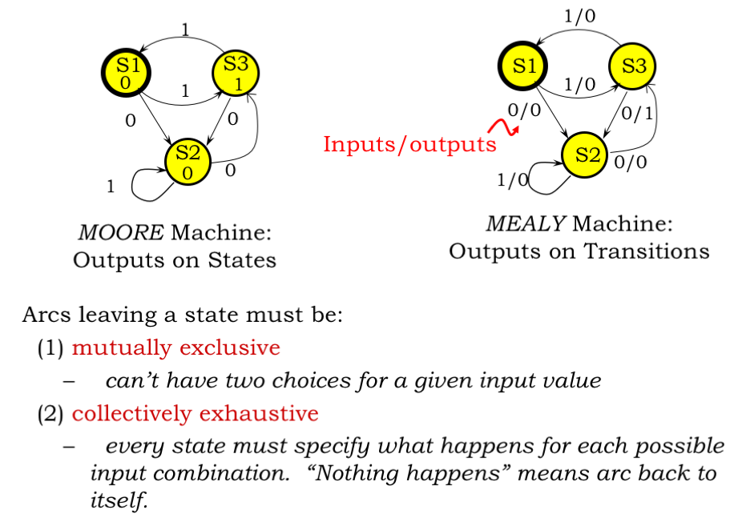
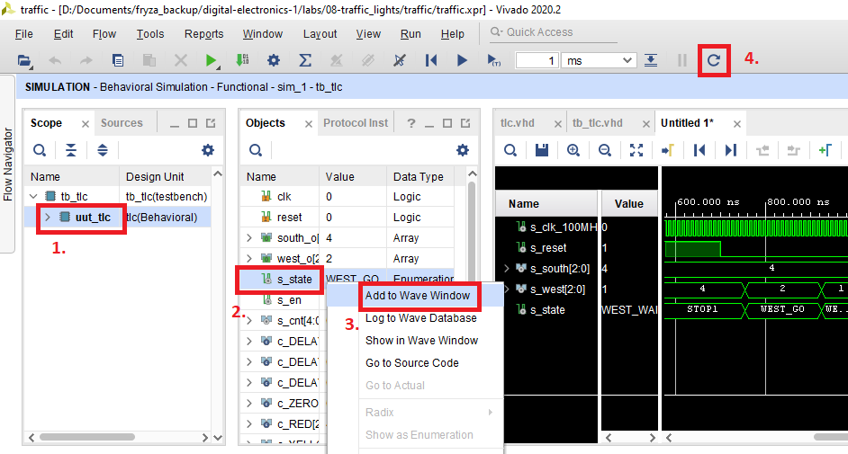

# Lab 8: Traffic light controller

<!--

<p align="center">
  The Study of Modern and Developing Engineering BUT<br>
  CZ.02.2.69/0.0/0.0/18_056/0013325
</p>
-->

### Learning objectives

After completing this lab you will be able to:

* Understand the philosophy and use of finite state machines
* Use state diagrams
* Understand the difference between Mealy and Moore type of FSM
* Use FSM in VHDL

In this laboratory exercise you will implement a finite state machine (FSM) in VHDL, specifically a traffic light controller at a junction. At first, the intersection will contain only two one-way streets with a fixed time control system in which traffic lights are configured to turn on the green, yellow, and red color after a given period. Subsequently, the system will be extended with a smarter way of driving.

### Table of contents

* [Pre-Lab preparation](#preparation)
* [Part 1: Synchronize Git and create a new folder](#part1)
* [Part 2: Finite State Machine (FSM)](#part2)
* [Part 3: VHDL code for traffic light controller](#part3)
* [Part 4: Traffic light controller simulation](#part4)
* [Part 5: Top level VHDL code](#part5)
* [Experiments on your own](#experiments)
* [Post-Lab report](#report)
* [References](#references)

<a name="preparation"></a>

## Pre-Lab preparation

1. See [schematic](https://github.com/tomas-fryza/digital-electronics-1/blob/master/docs/nexys-a7-sch.pdf) or [reference manual](https://reference.digilentinc.com/reference/programmable-logic/nexys-a7/reference-manual) of the Nexys A7 board and find out the connection of two RGB LEDs, ie to which FPGA pins are connected and how. How you can control them to get red, yellow, or green colors? Draw the schematic with RGB LEDs.

   | **RGB LED** | **Artix-7 pin names** | **Red** | **Yellow** | **Green** |
   | :-: | :-: | :-: | :-: | :-: |
   | LD16 | N15, M16, R12 | `1,0,0` |  |  |
   | LD17 |  |  |  |  |

2. See [schematic](https://github.com/tomas-fryza/digital-electronics-1/blob/master/docs/nexys-a7-sch.pdf) or [reference manual](https://reference.digilentinc.com/reference/programmable-logic/nexys-a7/reference-manual) of the Nexys A7 board and find out to which FPGA pins Pmod ports JA, JB, JC, and JD are connected.

<a name="part1"></a>

## Part 1: Synchronize Git and create a new folder

1. Run Git Bash (Windows) of Terminal (Linux), navigate to your working directory, and update local repository.

   > Useful bash and git commands are: `cd` - Change working directory. `mkdir` - Create directory. `ls` - List information about files in the current directory. `pwd` - Print the name of the current working directory. `git status` - Get state of working directory and staging area. `git pull` - Update local repository and working folder.
   >

2. Create a new working folder `labs/08-traffic_lights` for this laboratory exercise.

3. Create a new file `labs/08-traffic_lights/report.md` and copy/paste [report template](https://raw.githubusercontent.com/tomas-fryza/digital-electronics-1/master/labs/08-traffic_lights/report.md) into it.

<a name="part2"></a>

## Part 2: Finite State Machine (FSM)

A finite state machine (FSM) is a computation model that can be implemented with hardware or software and can be used to simulate sequential logic. There are two main types of finite state machines: the Mealy FSM and the Moore FSM. The fundamental difference between these two types lies in the management of the outputs:

* The output of the **Mealy** machine depends on the present state and inputs.
* The outputs of a **Moore** machine depend only on the present state and not on the inputs, as shown in the [figure](https://www.allaboutcircuits.com/technical-articles/implementing-a-finite-state-machine-in-vhdl/).

   

A common way how to represent a finite state machine is a **state diagram** which contains of:

* Circles and
* Directed arcs to the next state circles.

Circles represent the machine states labelled with a reflecting state and for a Moore machine also with the [output value](https://ocw.mit.edu/courses/electrical-engineering-and-computer-science/6-004-computation-structures-spring-2017/c6/c6s1/).


Directed arcs represent the transitions between states and they are labelled with input/output pair for a Mealy machine and with input for a Moore machine.



<a name="part3"></a>

## Part 3: VHDL code for traffic light controller

Let an intersection contains two one-way streets with a fixed time control system in which traffic lights are configured to turn on the green, yellow, and red color after a given period. If it is red in one direction on the traffic light, it is green in the other, and green in the first direction can only occur when it is red in the other direction, etc.

> The exercise is inspired by the references [[3]](https://www.youtube.com/watch?v=6_Rotnw1hFM), [[1]](https://www.allaboutcircuits.com/technical-articles/implementing-a-finite-state-machine-in-vhdl/), [[4]](https://vhdlwhiz.com/n-process-state-machine/), while several changes have been made to preserve the programming style from the previous exercises, such as:
>
>* Use `numeric_std` package instead of `IEEE.STD_LOGIC_unsigned`,
>* Types for internal signal/constants changed from `STD_LOGIC_VECTOR(3 downto 0)` to `unsigned`,
>* Edge detector `clk'event and clk = '1'` changed to `rising_edge(clk)`.
>

1. Perform the following steps to model the traffic light controller in Vivado.

   1. Create a new Vivado RTL project `traffic` in your `labs/08-traffic_lights` working folder.
   2. Create a VHDL source file `tlc` for the traffic light controller circuit.
   3. Choose default board: `Nexys A7-50T`.
   4. Open the [Traffic light controller](https://www.edaplayground.com/x/5HBi) example and copy/paste the `design.vhd` code to your `tlc.vhd` file.
   5. Copy source file of clock enable circuit from previous labs to `traffic/traffic.srcs/sources_1/new/` folder and add it to the project.
   6. Complete the traffic light code according to the following description.

      The controller contains six states and sets the semaphore outputs according to the following table. It remains in each of the states for a certain time.

      | **Current state** | **Direction South** | **Direction West** | **Delay** |
      | :-- | :-: | :-: | :-: |
      | `WEST_STOP`  | red    | red    | 2 sec |
      | `WEST_GO`    | red    | green  | 4 sec |
      | `WEST_WAIT`  | red    | yellow | 1 sec |
      | `SOUTH_STOP` | red    | red    | 2 sec |
      | `SOUTH_GO`   | green  | red    | 4 sec |
      | `SOUTH_WAIT` | yellow | red    | 1 sec |

2. Draw Moore-based state diagram according to the table.

3. In VHDL it is possible to define a new data type, which contains the names of our states.

   ```vhdl
       -- Define the states
       type t_state is (
           WEST_STOP,
           WEST_GO,
           WEST_WAIT,
           SOUTH_STOP,
           SOUTH_GO,
           SOUTH_WAIT
       );
       -- Define the signal that uses different states
       signal s_state : t_state;
   ```

   The FSM function is divided into two processes, where the first is sequential and it entirely controls state changes by CASE statement. The second is a combinatorial process, it is sensitive to state changes, and sets the output signals accordingly. This is an example of a Moore state machine because the output is set based on the active state. FSM behavior can be written in one to three processes. The differences between these approaches are described in [detail here](https://vhdlwhiz.com/n-process-state-machine/).

4. Complete CASE/WHEN statements in both sequential and combinatorial processes.

   **Sequential process:**

    ```vhdl
        --------------------------------------------------------
        -- p_traffic_fsm:
        -- The sequential process with synchronous reset and 
        -- clock_enable entirely controls the s_state signal by 
        -- CASE statement.
        --------------------------------------------------------
        p_traffic_fsm : process(clk)
        begin
            if rising_edge(clk) then
                if (reset = '1') then      -- Synchronous reset
                    s_state <= WEST_STOP;  -- Init state
                    s_cnt   <= c_ZERO;     -- Clear delay counter

                elsif (s_en = '1') then
                    -- Every 250 ms, CASE checks the value of the s_state 
                    -- variable and changes to the next state according 
                    -- to the delay value.
                    case s_state is
                        when WEST_STOP =>
                            -- Count up to c_DELAY_2SEC
                            if (s_cnt < c_DELAY_2SEC) then
                                s_cnt <= s_cnt + 1;
                            else
                                -- Move to the next state
                                s_state <= WEST_GO;
                                -- Reset local counter value
                                s_cnt <= c_ZERO;
                            end if;

                        when WEST_GO =>
                            -- WRITE OTHER STATES HERE


                        -- It is a good programming practice to use the 
                        -- OTHERS clause, even if all CASE choices have 
                        -- been made.
                        when others =>
                            s_state <= WEST_STOP;
                            s_cnt   <= c_ZERO;
                    end case;
                end if; -- Synchronous reset
            end if; -- Rising edge
        end process p_traffic_fsm;
    ```

   **Combinatorial process:**

    ```vhdl
        --------------------------------------------------------
        -- p_output_fsm:
        -- The combinatorial process is sensitive to state
        -- changes and sets the output signals accordingly.
        -- This is an example of a Moore state machine and
        -- therefore the output is set based on the active state.
        --------------------------------------------------------
        p_output_fsm : process(s_state)
        begin
            case s_state is
                when WEST_STOP =>
                    south_o <= c_RED;
                    west_o  <= c_RED;
                when WEST_GO =>
                    -- WRITE OTHER STATES HERE


                when others =>
                    south_o <= c_RED;
                    west_o  <= c_RED;
            end case;
        end process p_output_fsm;
    ```

<a name="part4"></a>

## Part 4: Traffic light controller simulation

1. Perform the following steps to simulate traffic light controller.

   1. Create a VHDL [simulation source](https://www.edaplayground.com/x/5HBi) `tb_tlc`. Note that the maximum value of clock enable circuit is set to 1 for the simulation, ie the traffic light controller changes its state with a frequency of 100&nbsp;MHz and not 4&nbsp;Hz.
   2. Change the duration of simulation to `2000ns` in Vivado menu **Tools > Settings... > Simulation > Simulation**.
   3. Run the simulation, and verify that the controller works correctly (reset, timing, output lights, states).

      > To display internal signal values perform the followings:
      >
      > 1. Select `uut_tlc` in **Scope** folder.
      > 2. Right click to `s_state` signal name in **Objects** folder.
      > 3. Add this signal by selecting **Add to Wave Window** command.
      > 4. Click to **Relaunch Simulation** icon.
      >
      >    
      >

<a name="part5"></a>

## Part 5: Top level VHDL code

1. Perform the following steps to implement the traffic light controller on the Nexys A7 board.

   1. Create a new design source `top` in your project.
   2. Use **Define Module** dialog and define I/O ports of entity `top` as follows.

      | **Port name** | **Direction** | **Type** | **Description** |
      | :-: | :-: | :-- | :-- |
      | `CLK100MHZ` | in | `std_logic` | Main clock |
      | `LED16_R` | out | `std_logic` | Red1 |
      | `LED16_G` | out | `std_logic` | Green1 |
      | `LED16_B` | out | `std_logic` | Blue1 |
      | `LED17_R` | out | `std_logic` | Red2 |
      | `LED17_G` | out | `std_logic` | Green2 |
      | `LED17_B` | out | `std_logic` | Blue2 |
      | `BTNC` | in | `std_logic` | Synchronous reset |

   3. Use direct instantiation and define an architecture of the top level.

      ```vhdl
      ------------------------------------------------------------
      -- Architecture body for top level
      ------------------------------------------------------------
      architecture Behavioral of top is

      begin
          --------------------------------------------------------
          -- Instance (copy) of tlc entity
          tlc : entity work.tlc
              port map(
                  clk   => CLK100MHZ,
                  reset => BTNC,
                  -- MAP TWO RGB LEDS HERE

              );

      end architecture Behavioral;
      ```

   4. Create a new [constraints XDC](https://raw.githubusercontent.com/Digilent/digilent-xdc/master/Nexys-A7-50T-Master.xdc) file: `nexys-a7-50t` and uncomment used pins according to top entity.
   5. Compile the project and download the generated bitstream `traffic/traffic.runs/impl_1/top.bit` into the FPGA chip.
   6. Observe the functionality of the traffic light controller.

      

   7. Use **IMPLEMENTATION > Open Implemented Design > Schematic** to see the generated structure.

## Synchronize repositories

When you finish working, always synchronize the contents of your working folder with the local and remote versions of your repository. This way you are sure that you will not lose any of your changes.

   > Useful git commands are: `git status` - Get state of working directory and staging area. `git add` - Add new and modified files to the staging area. `git commit` - Record changes to the local repository. `git push` - Push changes to remote repository. `git pull` - Update local repository and working folder. Note that, a brief description of useful git commands can be found [here](https://github.com/tomas-fryza/digital-electronics-1/wiki/Useful-Git-commands) and detailed description of all commands is [here](https://github.com/joshnh/Git-Commands).
   >

<a name="experiments"></a>

## Experiments on your own

1. Add a *speed button* to your design to ensure a synchronous transition to the `WEST_GO` state.

2. Follow the [exercise inspired by prof. Jon Valvano](https://arduining.com/2015/09/18/traffic-light-states-machine-with-arduino/) from University of Texas and desing an enhanced traffic light controller for the intersection of two equally busy one-way streets. The controller using two sensors and two traffic lights in three colors. Two sensors detects the presence of cars in each direction and the goal is to maximize traffic flow, minimize waiting time at a red light, and avoid accidents.

   

3. Propose your own state table and draw a state diagram of this smart controller including delays. Use on-board slide switches to emulate two sensors and implement the traffic light controller on the Nexys A7 board.

<a name="report"></a>

## Post-Lab report

*Copy the [report template](report.md) to your GitHub repository. Complete all parts of this file in Czech, Slovak, or English and submit a link to it via [BUT e-learning](https://moodle.vutbr.cz/). The deadline for submitting the task is the day before the next computer exercise.*

*Vložte [šablonu úkolu](report.md) do vašeho GitHub repozitáře. Vypracujte všechny části z tohoto souboru v českém, slovenském, nebo anglickém jazyce a odevzdejte link na něj prostřednictvím [e-learningu VUT](https://moodle.vutbr.cz/). Termín odevzdání úkolu je den před dalším počítačovým cvičením.*

<a name="references"></a>

## References

1. David Williams. [Implementing a Finite State Machine in VHDL](https://www.allaboutcircuits.com/technical-articles/implementing-a-finite-state-machine-in-vhdl/)

2. MIT OpenCourseWare. [L06: Finite State Machines](https://ocw.mit.edu/courses/electrical-engineering-and-computer-science/6-004-computation-structures-spring-2017/c6/c6s1/)

3. LBEbooks, Lesson 92 - Example 62: [Traffic Light Controller](https://www.youtube.com/watch?v=6_Rotnw1hFM)

4. VHDLwhiz, [One-process vs two-process vs three-process state machine](https://vhdlwhiz.com/n-process-state-machine/)

5. Jon Valvano. [Traffic Light , Finite State Machine with Arduino](https://arduining.com/2015/09/18/traffic-light-states-machine-with-arduino/)
