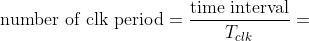
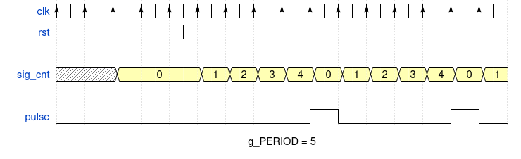

# Lab 5: Binary counter

* [Pre-Lab preparation](#preparation)
* [Part 1: VHDL code for simple counter](#part1)
* [Part 2: VHDL generics](#part2)
* [Part 3: VHDL code for clock enable](#part3)
* [Part 4: Top level VHDL code](#part4)
* [Challenges](#challenges)
* [References](#references)

### Learning objectives

After completing this lab you will be able to:

* Use VHDL generics and synchronous processes
* Use clock enable signal to drive another logic in the design (with slower clock)
* Understand binary counters

The purpose of this laboratory exercise is to become familiar with the creation of sequential processes in VHDL, next to implement a clock enable signal to drive another logic with slower clock, and to design a binary counter.

<a name="preparation"></a>

## Pre-Lab preparation

1. Calculate how many periods of clock signal with frequency of 100&nbsp;MHz contain time intervals 2&nbsp;ms, 4&nbsp;ms, 10&nbsp;ms, 250&nbsp;ms, 500&nbsp;ms, and 1&nbsp;s. Write values in decimal, binary, and hexadecimal forms.

   &nbsp;
   
   &nbsp;

   
   &nbsp;

<!--
https://editor.codecogs.com/
T_{clk}=\frac{1}{f_{clk}}=
\textup{number of clk period} = \frac{\textup{time interval}}{T_{clk}}=
-->

   | **Time interval** | **Number of clk periods** | **Number of clk periods in hex** | **Number of clk periods in binary** |
   | :-: | :-: | :-: | :-: |
   | 2&nbsp;ms | 200_000 | `x"3_0d40"` | `b"0011_0000_1101_0100_0000"` |
   | 4&nbsp;ms |  |  |  |
   | 10&nbsp;ms |  |  |  |
   | 250&nbsp;ms |  |  |  |
   | 500&nbsp;ms |  |  |  |
   | 1&nbsp;sec | 100_000_000 | `x"5F5_E100"` | `b"0101_1111_0101_1110_0001_0000_0000"` |

2. See [schematic](https://github.com/tomas-fryza/vhdl-course/blob/master/docs/nexys-a7-sch.pdf) or [reference manual](https://reference.digilentinc.com/reference/programmable-logic/nexys-a7/reference-manual) of the Nexys A7 board and find out the connection of Pmod connectors, ie to which FPGA pins are connected and how. How to use these connectors?

<a name="part1"></a>

## Part 1: VHDL code for simple counter

A simple **N-bit counter** is a digital circuit and has N output bits representing the count value. It counts up sequentially from 0 to 2^N-1, where N is the number of bits and then wraps around back to 0. When the reset signal is asserted, the counter is reset to 0. Many digital circuits have a **clock enable** input. This signal is used to enable or disable the counting operation of the counter. When the clock enable signal is active (typically high), the counter counts normally with the clock input. When the clock enable signal is inactive (typically low), the counter holds its current value and does not count.

1. Run Vivado and create a new project:

   1. Project name: `counter`
   2. Project location: your working folder, such as `Documents`
   3. Project type: **RTL Project**
   4. Create a VHDL source file: `simple_counter`
   5. Do not add any constraints now
   6. Choose a default board: `Nexys A7-50T`
   7. Click **Finish** to create the project
   8. Define I/O ports of new module:

      | **Port name** | **Direction** | **Type** | **Description** |
      | :-: | :-: | :-- | :-- |
      | `clk` | input | `std_logic` | Main clock |
      | `rst` | input   | `std_logic` | Synchronous reset |
      | `en` | input   | `std_logic` | Clock enable input |
      | `count` | output | `std_logic_vector (3 downto 0)` | Counter value |

2. Use VHDL templates in menu **Tools > Language Templates**, search for `up counters`, and select the one using clock enable (CE) and synchronous active-high reset. Copy/paste this template to the architecture and modify the code according to your I/O port names.

    ```vhdl
    architecture behavioral of simple_counter is
    
    begin

        process (<clock>)
        begin
        if <clock>='1' and <clock>'event then
            if <reset>='1' then
                <count> <= (others => '0');
            elsif <clock_enable>='1' then
                <count> <= <count> + 1;
            end if;
        end if;
        end process;

    end behavioral;
    ```

   Hint: Use the following parts:
      * `others => '0'` initializes all elements of the array to binary zero
      * `rising_edge(clk)` to test clock edge
      * internal signal of data type `std_logic_vector (3 downto 0)`
        > Note that an internal signal is used to implement the counter. This is because the **output** port `count` cannot be read and therefore the operation `count + 1` cannot be performed.
      * add `use ieee.std_logic_unsigned.all;` package to use arithmetic operations with `std_logic_vector`
      * connect internal signals to counter outputs
`
3. Create a testbench file `tb_simple_counter`, run the simulation, and test the functionality or `rst` and `en`.

4. Use **Flow** > **Open Elaborated design** and see the schematic after RTL analysis. Note that RTL (Register Transfer Level) represents digital circuit at the abstract level.

5. Use **Flow > Synthesis > Run Synthesis** and then see the schematic at the gate level.

<a name="part2"></a>

## Part 2: VHDL generics

TBD

<a name="part3"></a>

## Part 3: VHDL code for clock enable

TBD

<a name="part4"></a>

## Part 4: Top level VHDL code

TBD


1. Perform the following steps to simulate the bidirectional N-bit counter.

   1. Create a new VHDL [design source](https://www.edaplayground.com/x/5bgq) `cnt_up_down` in your project.
   2. Take a look at the new parts of the VHDL source code. Note that an internal `sig_cnt` signal is used to implement the counter. This is because the **output** port `cnt` cannot be read and therefore the operation `cnt + 1` cannot be performed. Also note that local value must be retyped to the output port.
   3. Create a VHDL [simulation source](https://www.edaplayground.com/x/5bgq) `tb_cnt_up_down`.
   4. Change the testbench you want to simulate, right click to file name and select `Set as Top`. Run the simulation. Verify the meaning of the constant `c_CNT_WIDTH` and reset generation process.

     

   5. Complete architecture of the counter, make it bidirectional, and simulate again.

   Note that for any vector, it is possible to change the numeric system in the simulation which represents the current value. To do so, right-click the vector name (here `sig_cnt[4:0]`) and select **Radix > Unsigned Decimal** from the context menu. You can change the vector color by **Signal Color** as well.

     


To drive another logic in the design (with slower clock), it is better to generate a **clock enable signal** (see figure bellow) instead of creating another clock domain (using clock dividers) that would cause timing issues or clock domain crossing problems such as metastability, data loss, and data incoherency.



> The figure above was created in [WaveDrom](https://wavedrom.com/) digital timing diagram online tool. The figure source code is as follows:
>
```javascript
{
  signal: [
    {name: "clk",     wave: 'P...............'},
    {name: "rst",     wave: 'lnh.pl..........'},
    {},
    {name: "sig_cnt", wave: 'x.3..33333333333', data: ["0","1","2","3","4","0","1","2","3","4","0","1"]},
    {},
    {name: "pulse",   wave: 'l........hl...hl'},
  ],
  head: {
  },
  foot: {
    text:'g_PERIOD = 5',
  },
}
```


2. Add **Generic** to `entity` declaration. It allows us to pass information into an entity and component. Since a generic cannot be modified inside the architecture, it is like a constant.

   ```vhdl
   entity clock_enable is
     generic (
       g_PERIOD : integer := 5 --! Number of clk periods to generate ouput pulse
     );                        -- Note that THERE IS a semicolon between generic
                               -- and port sections
     port (
       clk : in    std_logic;  --! Main clock
       rst : in    std_logic;  --! High-active synchronous reset
       ce  : out   std_logic   --! Clock enable pulse signal
     );
   end entity clock_enable;
   ```

3. Add package for arithmetic operations to the beginning of VHDL file.

   ```vhdl
   library ieee;
     use ieee.std_logic_1164.all;
     use ieee.numeric_std.all; -- Package for arithmetic operations
   ```

4. Copy/paste the [clock enable architecture](https://www.edaplayground.com/x/5LiJ) to your `clock_enable.vhd` file. Take a look at the new parts of the VHDL source code, such as internal signal declaration and [synchronous process](https://github.com/tomas-fryza/vhdl-course/wiki/Processes).

   ```vhdl
   architecture behavioral of clock_enable is

     -- Local counter
     signal sig_cnt : natural;

   begin

     --------------------------------------------------------
     -- p_clk_enable:
     -- Generate clock enable signal. By default, enable signal
     -- is low and generated pulse is always one clock long.
     --------------------------------------------------------
     p_clk_enable : process (clk) is
     begin

       if (rising_edge(clk)) then            -- Synchronous process
         if (rst = '1') then                 -- High-active reset
           sig_cnt <= 0;                     -- Clear local counter
           pulse   <= '0';                   -- Set output to low

         -- Test number of clock periods
         elsif (sig_cnt >= (g_PERIOD-1)) then
           sig_cnt <= 0;                     -- Clear local counter
           pulse   <= '1';                   -- Generate clock enable pulse
         else
           sig_cnt <= sig_cnt + 1;
           pulse   <= '0';
         end if;
       end if;

     end process p_clk_enable;

   end architecture behavioral;
   ```

5. [Generate](https://vhdl.lapinoo.net/testbench/) or copy/paste the VHDL [simulation source](https://www.edaplayground.com/x/5LiJ) `tb_clock_enable` and run the simulation. Verify the meaning of `g_PERIOD` and reset generation process.

   The default simulation run time is set to 1000&nbsp;ns in Vivado. Note that, you can change it in the menu **Tools > Settings...**

      


1. Perform the following steps to implement the 4-bit bidirectional counter on the Nexys A7 board.

   1. Create a new VHDL design source `top` in your project.
   2. Use **Define Module** dialog and define I/O ports of entity `top` as follows.

      | **Port name** | **Direction** | **Type** | **Description** |
      | :-: | :-: | :-- | :-- |
      | `CLK100MHZ` | in  | `std_logic` | Main clock |
      | `SW`        | in  | `std_logic` | Counter direction |
      | `CA`        | out | `std_logic` | Cathod A |
      | `CB`        | out | `std_logic` | Cathod B |
      | `CC`        | out | `std_logic` | Cathod C |
      | `CD`        | out | `std_logic` | Cathod D |
      | `CE`        | out | `std_logic` | Cathod E |
      | `CF`        | out | `std_logic` | Cathod F |
      | `CG`        | out | `std_logic` | Cathod G |
      | `AN`        | out | `std_logic_vector(7 downto 0)` | Common anode signals to individual displays |
      | `BTNC`      | in  | `std_logic` | Synchronous reset |

   3. Use [direct instantiation](https://github.com/tomas-fryza/vhdl-course/wiki/Direct-instantiation) and define an architecture of the top level: complete instantiation (copy) of `clock_enable`, `cnt_up_down`, and `hex_7seg` entities. Copy source file `hex_7seg.vhd` from the previous laboratories to the `counter/counter.srcs/sources_1/new/` source folder and add it to the project.

      ```vhdl
      ----------------------------------------------------------
      -- Architecture body for top level
      ----------------------------------------------------------
      
      architecture behavioral of top is
      
        -- 4-bit counter @ 250 ms
        signal sig_en_250ms : std_logic;                    --! Clock enable signal for Counter0
        signal sig_cnt_4bit : std_logic_vector(3 downto 0); --! Counter0

      begin

        --------------------------------------------------------
        -- Instance (copy) of clock_enable entity
        --------------------------------------------------------
        clk_en0 : entity work.clock_enable
            generic map (
                g_MAX => 25000000
            )
            port map (
                clk => -- WRITE YOUR CODE HERE
                rst => -- WRITE YOUR CODE HERE
                ce  => sig_en_250ms
            );

        --------------------------------------------------------
        -- Instance (copy) of cnt_up_down entity
        --------------------------------------------------------
        bin_cnt0 : entity work.cnt_up_down
           generic map (
                -- WRITE YOUR CODE HERE
            )
            port map (
                -- WRITE YOUR CODE HERE
            );

        --------------------------------------------------------
        -- Instance (copy) of hex_7seg entity
        --------------------------------------------------------
        hex2seg : entity work.hex_7seg
            port map (
                blank  => BTNC,
                hex    => sig_cnt_4bit,
                seg(6) => CA,
                seg(5) => CB,
                seg(4) => CC,
                seg(3) => CD,
                seg(2) => CE,
                seg(1) => CF,
                seg(0) => CG
            );

        --------------------------------------------------------
        -- Other settings
        --------------------------------------------------------
        -- Connect one common anode to 3.3V
        AN <= b"1111_1110";

      end architecture behavioral;
      ```
  
      

   4. Create a new [constraints XDC](https://raw.githubusercontent.com/Digilent/digilent-xdc/master/Nexys-A7-50T-Master.xdc) file: `nexys-a7-50t` and uncomment used pins according to the `top` entity.

      IMPORTANT: Because we defined `SW` as a single signal and not a bus, make sure you rename the selected port name in XDC file, for example `SW[0]` to `SW`.

   5. Compile the project and download the generated bitstream `counter/counter.runs/impl_1/top.bit` into the FPGA chip.

   6. Test the functionality of the 4-bit counter by toggling the switch, pressing the button and observing the display.

      

   7. Use **IMPLEMENTATION > Open Implemented Design > Schematic** to see the generated structure.

   8. Optional: Use digital oscilloscope or logic analyser and display counter values via Pmod ports. See [schematic](https://github.com/tomas-fryza/vhdl-course/blob/master/docs/nexys-a7-sch.pdf) or [reference manual](https://reference.digilentinc.com/reference/programmable-logic/nexys-a7/reference-manual) of the Nexys A7 board and find out to which FPGA pins Pmod ports JA, JB, JC, and JD are connected.

      

      

<a name="challenges"></a>

## Challenges

1. Add a second instantiation (copy) of the counter and clock enable entities and make a 12-bit counter with a 10 ms time base. Therefore, the application will contain two independent binary counters (4-bit and 12-bit), each with a different counting speed. Display the second counter value on LEDs.

<a name="references"></a>

## References

1. Digilent blog. [Nexys A7 Reference Manual](https://reference.digilentinc.com/reference/programmable-logic/nexys-a7/reference-manual)

2. [WaveDrom - Digital Timing Diagram everywhere](https://wavedrom.com/)

3. Tomas Fryza. [Template for clock enable module](https://www.edaplayground.com/x/Vdpu)

4. Tomas Fryza. [Template for bi-directional counter](https://www.edaplayground.com/x/5bgq)

5. Digilent. [General .xdc file for the Nexys A7-50T](https://github.com/Digilent/digilent-xdc/blob/master/Nexys-A7-50T-Master.xdc)
