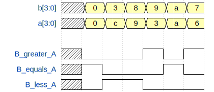

# Binary comparator

- **File**: comparator_4bit.vhd
- **Copyright:** (c) 2020 Tomas Fryza
 This work is licensed under the terms of the MIT license
- **Author:** Tomas Fryza
 Dept. of Radio Electronics, Brno Univ. of Technology, Czechia
## Diagram

## Description

 

 

 Four-bit binary comparator using when/else
 assignments. The comparator can distinguish three states
 between two 4-bit inputs: greater than, equal, and less than.

 Wavedrom example:
 
 

## Ports

| Port name   | Direction | Type                         | Description          |
| ----------- | --------- | ---------------------------- | -------------------- |
| b           | in        | std_logic_vector(3 downto 0) | Input data B[3:0]    |
| a           | in        | std_logic_vector(3 downto 0) | Input data A[3:0]    |
| b_greater_a | out       | std_logic                    | Output is `1` if B>A |
| b_equals_a  | out       | std_logic                    | Output is `1` if B=A |
| b_less_a    | out       | std_logic                    | Output is `1` if B<A |
